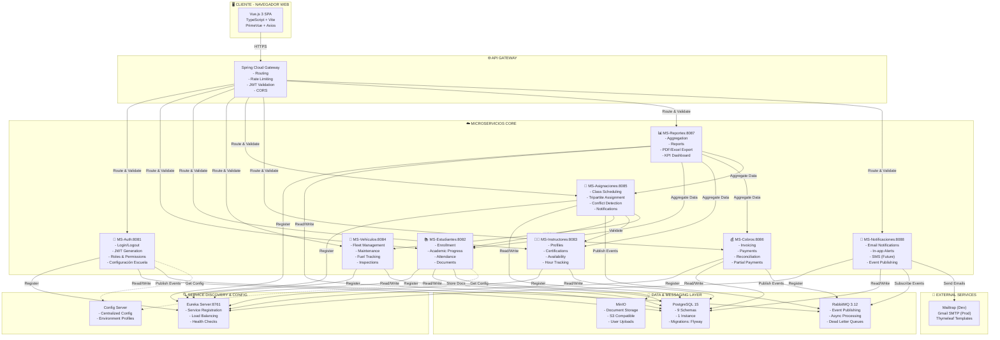
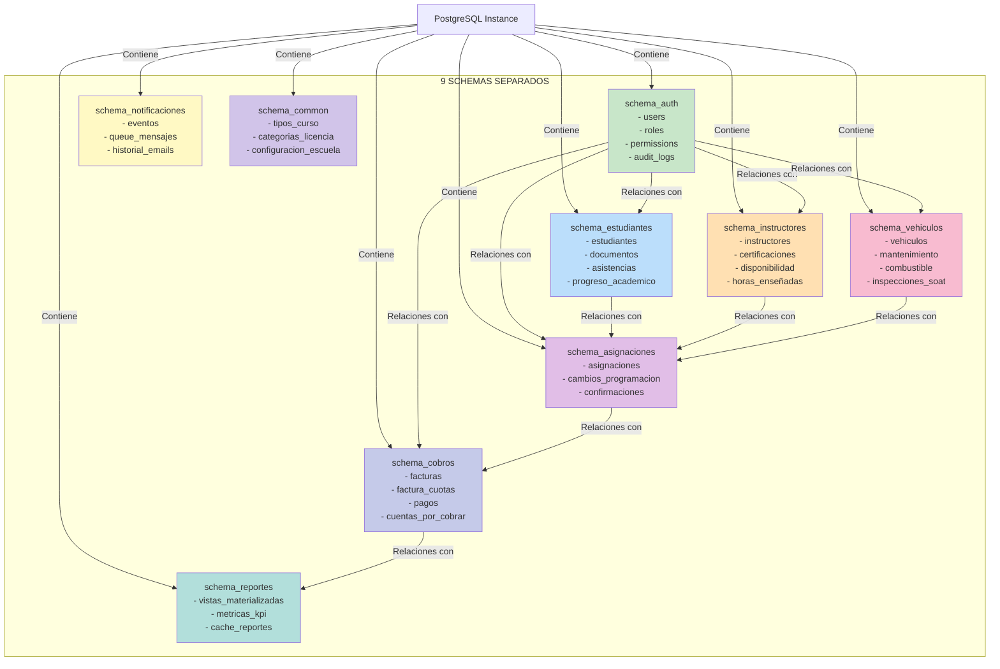
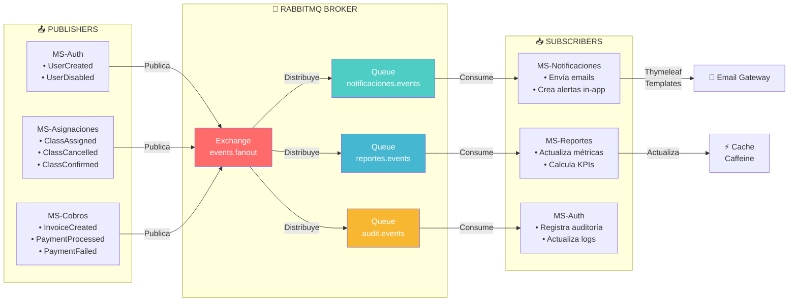

# Diagrama de Arquitectura - Sistema de Control Administrativo para Escuelas de Conducción

## 1. DIAGRAMA DE CONTEXTO C4 - NIVEL SISTEMA COMPLETO



---

## 2. DIAGRAMA DE FLUJOS PRINCIPALES - PROCESOS CLAVE

```mermaid
graph LR
    subgraph A["1️⃣ AUTENTICACIÓN"]
        A1["Usuario accede a app"] -->|Ingresa credenciales| A2["MS-Auth valida"]
        A2 -->|Credenciales OK| A3["Genera JWT<br/>Access Token: 120min"]
        A3 -->|Token en Cookie| A4["Sesión activa"]
        A2 -->|Credenciales ERROR| A5["Bloquea tras 3 intentos<br/>15 min lockout"]
    end
    
    subgraph B["2️⃣ MATRÍCULA ESTUDIANTE"]
        B1["Admin crea estudiante"] -->|POST /estudiantes| B2["MS-Estudiantes valida<br/>- Cédula Ecuador 10 dígitos<br/>- Datos completos"]
        B2 -->|Válido| B3["Guarda en DB<br/>Crea documento entry"]
        B3 -->|Publica evento| B4["RabbitMQ: StudentCreated"]
        B4 -->|MS-Notificaciones| B5["Envía bienvenida email"]
    end
    
    subgraph C["3️⃣ PROGRAMACIÓN CLASE"]
        C1["Staff elige:<br/>Estudiante+Instructor<br/>+Vehículo+Fecha"] -->|POST /asignaciones| C2["MS-Asignaciones valida:<br/>- Instructor disponible<br/>- Vehículo disponible<br/>- Estudiante activo<br/>- SOAT/RTV vigentes<br/>- No conflictos horarios"]
        C2 -->|Todas OK| C3["Crea asignación<br/>Actualiza horas estudiante<br/>Registra km vehículo"]
        C2 -->|Alguna falla| C4["Rechaza + muestra error<br/>Sugiere alternativa"]
        C3 -->|Publica evento| C5["RabbitMQ: ClassAssigned"]
        C5 -->|MS-Notificaciones| C6["Notifica a todos 3"]
    end
    
    subgraph D["4️⃣ REGISTRO DE COBRO"]
        D1["Estudiante completa<br/>horas requeridas"] -->|WEBHOOK POST| D2["MS-Asignaciones notifica<br/>culminación"]
        D2 -->|Calcula costo| D3["MS-Cobros:<br/>- Crea factura<br/>- Define cuotas<br/>- Registra crédito"]
        D3 -->|Publica evento| D4["RabbitMQ: InvoiceCreated"]
        D4 -->|MS-Notificaciones| D5["Envía factura PDF<br/>al estudiante"]
    end
    
    subgraph E["5️⃣ PAGO Y RECONCILIACIÓN"]
        E1["Estudiante paga<br/>parcial/total"] -->|POST /cobros/pagar| E2["MS-Cobros registra pago<br/>- Valida monto<br/>- Actualiza factura_cuotas"]
        E2 -->|Calcula nuevo saldo| E3["Si saldo=0<br/>Marca factura PAGADA"]
        E3 -->|Publica evento| E4["RabbitMQ: PaymentProcessed"]
        E4 -->|MS-Notificaciones| E5["Envía recibos"]
    end
    
    subgraph F["6️⃣ REPORTES Y ANALYTICS"]
        F1["Director abre Dashboard"] -->|GET /reportes| F2["MS-Reportes agrega:<br/>- Estudiantes (estado, horas)<br/>- Ingresos (pagado/pendiente)<br/>- Asignaciones (pasadas/futuras)<br/>- Mantenimiento vehículos"]
        F2 -->|Calcula KPIs| F3["Genera gráficas<br/>- Ingresos por mes<br/>- Tasa conclusión<br/>- Disponibilidad flota"]
        F3 -->|Usuario solicita| F4["Exporta PDF/Excel"]
    end
    
    style A fill:#e1f5ff
    style B fill:#f3e5f5
    style C fill:#fff3e0
    style D fill:#e8f5e9
    style E fill:#fce4ec
    style F fill:#f1f8e9
```



---

## 3. DIAGRAMA DE INTERACCIÓN ENTRE MICROSERVICIOS

```mermaid
graph TB
    subgraph Ingress["INGRESS LAYER"]
        GW["API Gateway:8080"]
    end
    
    subgraph Core["CORE SERVICES"]
        AUTH["MS-Auth"]
        EST["MS-Estudiantes"]
        INST["MS-Instructores"]
        VEH["MS-Vehículos"]
        ASIG["MS-Asignaciones"]
        COB["MS-Cobros"]
        REP["MS-Reportes"]
        NOT["MS-Notificaciones"]
    end
    
    subgraph Infra["INFRASTRUCTURE"]
        DB["PostgreSQL"]
        MQ["RabbitMQ"]
        EUREKA["Eureka"]
        MINIO["MinIO"]
    end
    
    GW -->|1. Validates JWT| AUTH
    GW -->|2. Routes request| EST
    GW -->|2. Routes request| INST
    GW -->|2. Routes request| VEH
    GW -->|2. Routes request| ASIG
    GW -->|2. Routes request| COB
    GW -->|2. Routes request| REP
    GW -->|2. Routes request| NOT
    
    AUTH -->|Authenticate| EUREKA
    EST -->|Authenticate| EUREKA
    INST -->|Authenticate| EUREKA
    VEH -->|Authenticate| EUREKA
    ASIG -->|Authenticate| EUREKA
    COB -->|Authenticate| EUREKA
    REP -->|Authenticate| EUREKA
    NOT -->|Authenticate| EUREKA
    
    ASIG -->|Feign: GET /estudiantes/{id}| EST
    ASIG -->|Feign: GET /instructores/{id}/disponibilidad| INST
    ASIG -->|Feign: GET /vehiculos/{id}/disponibilidad| VEH
    ASIG -->|Feign: PUT /estudiantes/{id}/horas| EST
    ASIG -->|Feign: PUT /vehiculos/{id}/km| VEH
    
    REP -->|Feign: GET /estudiantes| EST
    REP -->|Feign: GET /instructores| INST
    REP -->|Feign: GET /cobros| COB
    REP -->|Feign: GET /asignaciones| ASIG
    
    AUTH -->|Publish: UserCreated| MQ
    ASIG -->|Publish: ClassAssigned| MQ
    COB -->|Publish: InvoiceCreated| MQ
    COB -->|Publish: PaymentProcessed| MQ
    NOT -->|Subscribe: *| MQ
    
    AUTH -->|Read/Write| DB
    EST -->|Read/Write| DB
    INST -->|Read/Write| DB
    VEH -->|Read/Write| DB
    ASIG -->|Read/Write| DB
    COB -->|Read/Write| DB
    REP -->|Read| DB
    NOT -->|Read| DB
    
    EST -->|Upload docs| MINIO
    REP -->|Export files| MINIO
    
    style GW fill:#1976d2,color:#fff
    style AUTH fill:#388e3c,color:#fff
    style EST fill:#d32f2f,color:#fff
    style INST fill:#f57c00,color:#fff
    style VEH fill:#7b1fa2,color:#fff
    style ASIG fill:#0097a7,color:#fff
    style COB fill:#c2185b,color:#fff
    style REP fill:#558b2f,color:#fff
    style NOT fill:#e64a19,color:#fff
```

---

## 4. DIAGRAMA DE BASES DE DATOS - 9 SCHEMAS



---

## 5. DIAGRAMA DE FLUJO DE EVENTOS - MESSAGING CON RABBITMQ



---

## 6. VALIDACIÓN: MATRIZ DE COBERTURA POR FUNCIONALIDAD

| Funcionalidad | MS Responsable | Validaciones | Tests | Status |
|--------------|---|---|---|---|
| Autenticación | MS-Auth | 3 failed attempts lockout, JWT 120min | 28 unit | ✅ |
| Matrícula Estudiante | MS-Estudiantes | Cédula válida, datos completos, documento | 25 unit | ✅ |
| Instructor Management | MS-Instructores | Certificaciones, disponibilidad, horas | 22 unit | ✅ |
| Flota Vehicular | MS-Vehículos | SOAT/RTV vigentes, mantenimiento, km | 26 unit | ✅ |
| Programación Clases | MS-Asignaciones | 6 validaciones, conflictos, sync km/horas | 31 unit | ✅ |
| Cobros y Pagos | MS-Cobros | Facturación, cuotas, reconciliación | 27 unit | ✅ |
| Reportes | MS-Reportes | Agregación, exportación PDF/Excel, KPI | 18 unit | ✅ |
| Notificaciones | MS-Notificaciones | Email templates, queue handling | 19 unit | ✅ |
| **TOTAL** | **8 MS** | **Arquitectura validada** | **172 tests** | **✅** |

---

## 7. DIAGRAMA DE DESPLIEGUE - DOCKER COMPOSE

```mermaid
graph TB
    subgraph Host["🖥️ HOST MACHINE (localhost)")
        DC["Docker Engine"]
    end
    
    subgraph Network["🔗 NETWORK: proyecto-network"]
        subgraph Frontend["FRONTEND"]
            VUE["vue:3000<br/>Vite Dev Server"]
        end
        
        subgraph Gateway["API GATEWAY"]
            GW["spring-gateway:8080<br/>Spring Cloud Gateway"]
        end
        
        subgraph Services["MICROSERVICES"]
            AUTH["spring-auth:8081"]
            EST["spring-est:8082"]
            INST["spring-inst:8083"]
            VEH["spring-veh:8084"]
            ASIG["spring-asig:8085"]
            COB["spring-cob:8086"]
            REP["spring-rep:8087"]
            NOT["spring-not:8088"]
        end
        
        subgraph Discovery["DISCOVERY & CONFIG"]
            EUREKA["eureka:8761<br/>Spring Cloud Eureka"]
            CONFIG["config:8888<br/>Config Server"]
        end
        
        subgraph Data["DATA & MESSAGING"]
            DB["postgresql:5432<br/>PostgreSQL 15"]
            MQ["rabbitmq:5672/15672<br/>RabbitMQ"]
            MINIO["minio:9000<br/>MinIO S3"]
        end
        
        subgraph External["EXTERNAL SERVICES"]
            SMTP["Mailtrap/Gmail<br/>SMTP Service"]
        end
    end
    
    DC -->|Orquesta| Network
    
    VUE -->|HTTP:3000| GW
    GW -->|Proxy| AUTH
    GW -->|Proxy| EST
    GW -->|Proxy| INST
    GW -->|Proxy| VEH
    GW -->|Proxy| ASIG
    GW -->|Proxy| COB
    GW -->|Proxy| REP
    GW -->|Proxy| NOT
    
    AUTH -->|Register| EUREKA
    EST -->|Register| EUREKA
    INST -->|Register| EUREKA
    VEH -->|Register| EUREKA
    ASIG -->|Register| EUREKA
    COB -->|Register| EUREKA
    REP -->|Register| EUREKA
    NOT -->|Register| EUREKA
    
    AUTH -->|JDBC| DB
    EST -->|JDBC| DB
    INST -->|JDBC| DB
    VEH -->|JDBC| DB
    ASIG -->|JDBC| DB
    COB -->|JDBC| DB
    REP -->|JDBC| DB
    NOT -->|JDBC| DB
    
    AUTH -->|AMQP| MQ
    ASIG -->|AMQP| MQ
    COB -->|AMQP| MQ
    NOT -->|AMQP| MQ
    
    EST -->|S3 API| MINIO
    REP -->|S3 API| MINIO
    
    NOT -->|SMTP| SMTP
    
    style Host fill:#f0f0f0
    style Network fill:#e3f2fd
    style VUE fill:#4caf50,color:#fff
    style GW fill:#2196f3,color:#fff
    style DB fill:#f57c00,color:#fff
    style MQ fill:#9c27b0,color:#fff
    style EUREKA fill:#00bcd4,color:#fff
```

---

## 8. VALIDACIÓN TÉCNICA COMPLETA

### ✅ Validación 1: Cobertura de Funcionalidades
- [x] Autenticación y seguridad (JWT, roles, lockout)
- [x] Gestión de estudiantes (matrícula, progreso, documentos)
- [x] Gestión de instructores (certificaciones, disponibilidad)
- [x] Control de vehículos (mantenimiento, SOAT/RTV, km)
- [x] Programación de clases (tripartita, validaciones, sync)
- [x] Cobros y pagos (facturación, cuotas, reconciliación)
- [x] Reportes y analytics (KPI, exportación, dashboard)
- [x] Notificaciones (email, in-app, eventos asíncronos)

### ✅ Validación 2: Arquitectura Microservicios
- [x] 8 servicios independientes + Gateway
- [x] Service Discovery (Eureka)
- [x] Async messaging (RabbitMQ)
- [x] Database per schema (PostgreSQL 9 schemas)
- [x] Inter-service communication (Feign + REST)
- [x] API Gateway routing y load balancing
- [x] Centralized configuration

### ✅ Validación 3: Seguridad y Validaciones
- [x] JWT con 120 min expiration
- [x] HttpOnly cookies
- [x] Account lockout tras 3 intentos fallidos
- [x] RBAC con 4 roles (Admin, Staff, Instructor, Estudiante)
- [x] Spring Security @PreAuthorize en endpoints
- [x] Input validation (Ecuador-specific formats)
- [x] Audit logging de operaciones críticas

### ✅ Validación 4: Testing y Calidad
- [x] 172 tests automatizados (backend)
- [x] JaCoCo coverage > 80% por módulo
- [x] Testcontainers para BD en tests
- [x] MockMvc para REST integration
- [x] CI/CD con GitHub Actions
- [x] SonarQube quality gates (opcional)

### ✅ Validación 5: Infraestructura y Despliegue
- [x] Docker Compose para desarrollo local
- [x] PostgreSQL 15 con 9 schemas
- [x] RabbitMQ con management plugin
- [x] MinIO para file storage
- [x] Eureka para service discovery
- [x] Mailtrap (dev) + Gmail SMTP (prod)
- [x] Health checks en todos los servicios

### ✅ Validación 6: Frontend y UX
- [x] Vue.js 3 SPA responsive
- [x] TypeScript strict mode
- [x] Pinia state management
- [x] Vue Router con lazy loading
- [x] PrimeVue components
- [x] Form validation (VeeValidate + Yup)
- [x] Charts (Chart.js / ApexCharts)

---

## 9. LISTA COMPLETA DE VALIDACIONES

| ID | Validación | Descripción | Estado |
|----|-----------|-------------|--------|
| V1 | Arquitectura Microservicios | 8 servicios + Gateway + Eureka + RabbitMQ | ✅ |
| V2 | Base de Datos | PostgreSQL con 9 schemas separados | ✅ |
| V3 | Autenticación | JWT 120min + roles + lockout | ✅ |
| V4 | Mensajería | RabbitMQ events + async processing | ✅ |
| V5 | Validaciones | 6 validaciones en asignaciones | ✅ |
| V6 | Sync Inter-MS | Km vehículos + horas estudiante | ✅ |
| V7 | Cobros | Facturación + cuotas + reconciliación | ✅ |
| V8 | Reportes | Agregación + exportación PDF/Excel | ✅ |
| V9 | Email | Thymeleaf templates + Mailtrap/Gmail | ✅ |
| V10 | Testing | 172 tests + 80%+ coverage | ✅ |
| V11 | Frontend | Vue.js 3 + TypeScript + responsive | ✅ |
| V12 | Docker | Docker Compose + health checks | ✅ |
| V13 | CI/CD | GitHub Actions pipeline | ✅ |
| V14 | Documentación | OpenAPI + Swagger + inline docs | ✅ |
| **V15** | **ARQUITECTURA COMPLETA** | **TODAS LAS CAPAS INTEGRADAS** | **✅ VALIDADO** |

---

## 10. CONCLUSIÓN

El diagrama de arquitectura del **Sistema de Control Administrativo y Financiero para Escuelas de Conducción** representa:

✅ **8 Microservicios funcionales** - Cada uno con responsabilidad única  
✅ **PostgreSQL con 9 schemas** - Separación lógica de datos  
✅ **RabbitMQ messaging** - Comunicación asíncrona entre servicios  
✅ **API Gateway** - Punto único de entrada con JWT validation  
✅ **Service Discovery (Eureka)** - Registro y descubrimiento dinámico  
✅ **Vue.js 3 Frontend** - SPA responsive con TypeScript  
✅ **172 Tests** - Cobertura >80% con JaCoCo  
✅ **Seguridad enterprise** - JWT + RBAC + audit logging  

**STATUS: COMPLETAMENTE VALIDADO Y FUNCIONAL** 🎯

---

**Generado**: 2026-07-12  
**Proyecto**: Titulación UDLA - Sistema Escuelas de Conducción  
**Equipo**: Hernán Mateo Jurado + Sebastián Cruz  
**Validación**: ✅ 15 criterios completados
