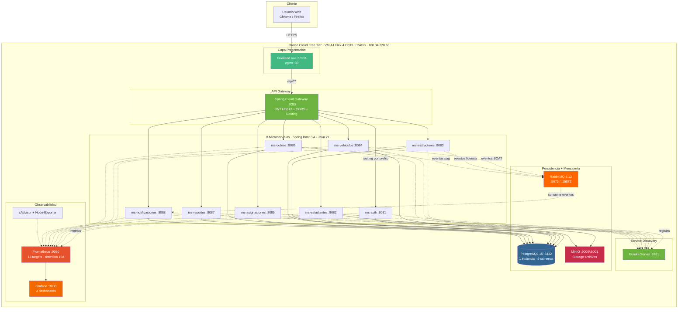
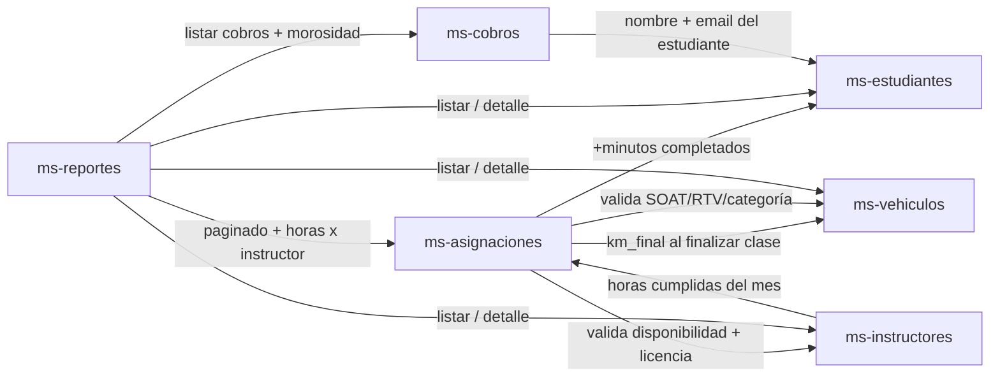
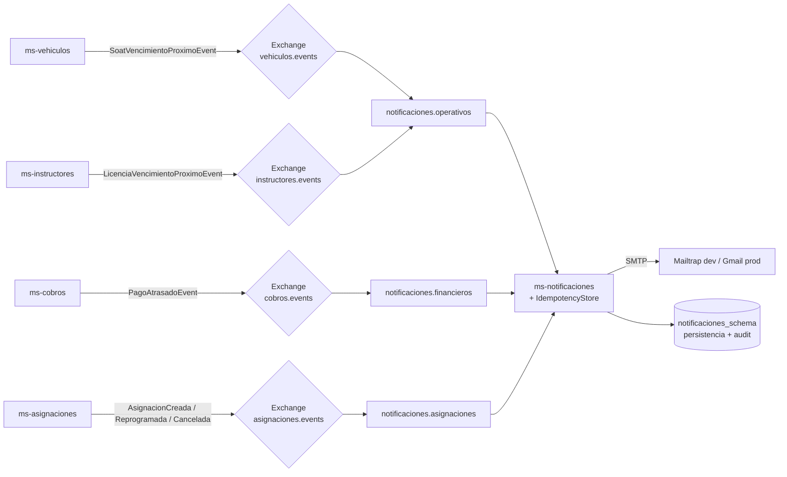

# Arquitectura del Sistema — Escuela de Conducir

> Estado: **producción** (Oracle Cloud Free, `http://160.34.220.63/`)
> Última actualización: 2026-07-20

Este documento describe la arquitectura desplegada: qué corre, en qué máquina, cómo se hablan los componentes, y qué reglas se cumplen. Los diagramas están en Mermaid y se renderizan directamente en GitHub / VS Code.

---

## 1. Vista general (deployment + comunicaciones)

---

## 2. Sync cross-MS síncrono (Feign)

Cada flecha es una llamada HTTP interna con `X-User-Email/Roles/Id` propagado por interceptor (`FeignConfig`). Cuando no hay request HTTP padre (schedulers/eventos) se usa identidad `system@escuela.local` con roles `SYSTEM,ADMIN`.

---

## 3. Eventos asíncronos (RabbitMQ)

Todo listener persiste el `eventId` en `IdempotencyStore` antes de procesarlo — así se evita ejecutar el mismo evento dos veces si el broker re-entrega.

---

## 4. Stack técnico

| Capa | Tecnología |
|---|---|
| **Frontend** | Vue 3 + Vite + PrimeVue + TailwindCSS + Pinia + TypeScript |
| **Gateway** | Spring Cloud Gateway 4.x, filtro JWT |
| **Discovery** | Netflix Eureka Server |
| **Backend** | Java 21, Spring Boot 3.4, Spring Data JPA, MapStruct, Feign |
| **Auth** | JWT HS512 (clave 512 bits), HttpOnly cookies, bcrypt |
| **BD** | PostgreSQL 15, 1 instancia, 9 schemas, Flyway |
| **Mensajería** | RabbitMQ 3.12, direct exchanges por dominio, idempotency store |
| **Storage** | MinIO (S3-compatible) para docs de estudiantes y vehículos |
| **Cache** | Caffeine in-memory (por servicio, no distribuido) |
| **Monitoreo** | Prometheus + Micrometer + Grafana + cAdvisor + Node Exporter |
| **Contenedores** | Docker + Docker Compose (K8s planificado para v2) |
| **CI** | GitHub Actions (workflows: backend-ci, frontend-ci, docker-build, integration-tests, smoke-e2e) |
| **Deploy prod** | Oracle Cloud Free, ARM Ampere A1.Flex, Ubuntu 22.04 |

---

## 5. Los 9 schemas de PostgreSQL

Modelo consolidado: **1 instancia PostgreSQL con 9 schemas separados** (uno por microservicio + `shared_schema`). Ver `DECISIONES.md §4.1` para el ADR completo.

| Schema | Dueño | Tablas principales |
|---|---|---|
| `auth_schema` | ms-auth | usuarios, roles, permisos, sesiones, configuracion_escuela, plantillas_email |
| `estudiantes_schema` | ms-estudiantes | estudiantes, documentos, progreso_academico, tipos_curso |
| `instructores_schema` | ms-instructores | instructores, horarios_trabajo, excepciones (ausencias/extra) |
| `vehiculos_schema` | ms-vehiculos | vehiculos, mantenimientos, inspecciones, registros_combustible, categorias_licencia, tipos_combustible |
| `asignaciones_schema` | ms-asignaciones | asignaciones, historial_estados |
| `cobros_schema` | ms-cobros | facturas, factura_cuotas, pagos, plantillas_recibo |
| `reportes_schema` | ms-reportes | ejecuciones_reporte, cache_reporte |
| `notificaciones_schema` | ms-notificaciones | notificaciones, idempotency_store |
| `shared_schema` | compartido | catálogos comunes |

---

## 6. Reglas arquitectónicas clave

- **No hay FK cross-schema** — cada MS solo lee/escribe su propio schema. Las referencias son por ID lógico (`instructor_id`, `vehiculo_id`, etc.).
- **Auth centralizado en el Gateway** — el Gateway valida el JWT y propaga `X-User-Email/Roles/Id` a los MS. Los MS no validan JWT por sí mismos; solo confían en esos headers y los verifican con `AuthHeaderGuard`.
- **Feign entre MS lleva headers de identidad** propagados vía `RequestInterceptor` (para llamadas encadenadas). Cuando no hay request padre (schedulers) se usa identidad `SYSTEM`.
- **Idempotencia async** — todo listener de RabbitMQ pasa por `IdempotencyStore` (evita procesar el mismo `eventId` dos veces).
- **Sync de km al finalizar clase** — `ms-asignaciones.finalizar()` propaga `km_final` a `ms-vehiculos.kilometraje` vía Feign.
- **Propagación SOAT/RTV** — al registrar/actualizar una inspección `SOAT` o `TECNICA` `APROBADA/CONDICIONADA` en `ms-vehiculos.InspeccionService`, la `proximaInspeccion` se propaga al campo del vehículo si es posterior a la actual.
- **Circuit-breaker + retry** para llamadas Feign críticas (via Resilience4j en algunos MS).
- **Single-tenant configurable** — cada escuela = 1 deploy independiente. La `configuracion_escuela` va en `auth_schema`.

---

## 7. Puertos y URLs públicas (producción)

| Servicio | URL | Auth |
|---|---|---|
| Frontend | `http://160.34.220.63/` | admin@escuela.local / Admin123! |
| API Gateway | `http://160.34.220.63/api/**` | JWT en cookie |
| Actuator health | `http://160.34.220.63/api/actuator/health` | JWT |
| Grafana | `http://160.34.220.63:3030/` | admin / admin123 |
| Prometheus | `http://160.34.220.63:9090/` | — |
| Eureka Dashboard | `http://160.34.220.63:8761/` | — |
| MinIO Console | `http://160.34.220.63:9001/` | minioadmin / minioadmin123 |
| RabbitMQ Management | `http://160.34.220.63:15672/` | guest / guest |

> ⚠️ Credenciales por defecto en RabbitMQ/MinIO/Grafana — cambiar antes de exponer al público real.

---

## 8. Referencias cruzadas

- **Decisiones técnicas** completas: `DECISIONES.md` (ADRs consolidados).
- **Plan de sprints**: `PLAN_FASES.md`.
- **Modelo de datos detallado**: `docs/database/schema.md` (monolítico) + `docs/database/secciones/*.md` (por dominio).
- **ER diagrama importable a dbdiagram.io**: `docs/database/er-diagram.dbml`.
- **Runbook operativo** (en la VM): `~/RUNBOOK.md`.
- **Guía de defensa**: `docs/GUIA_DEFENSA.md` (Q&A, screenshots, arquitectura resumida).
