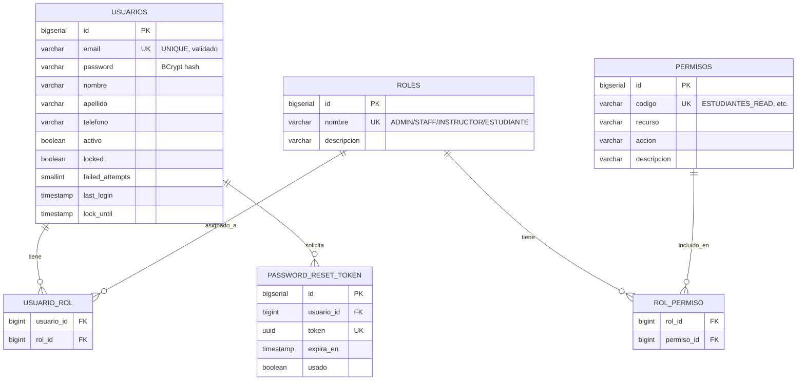
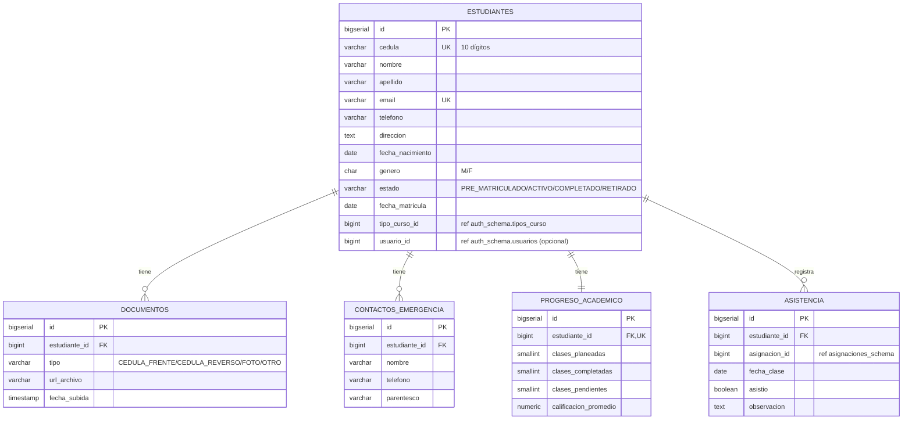
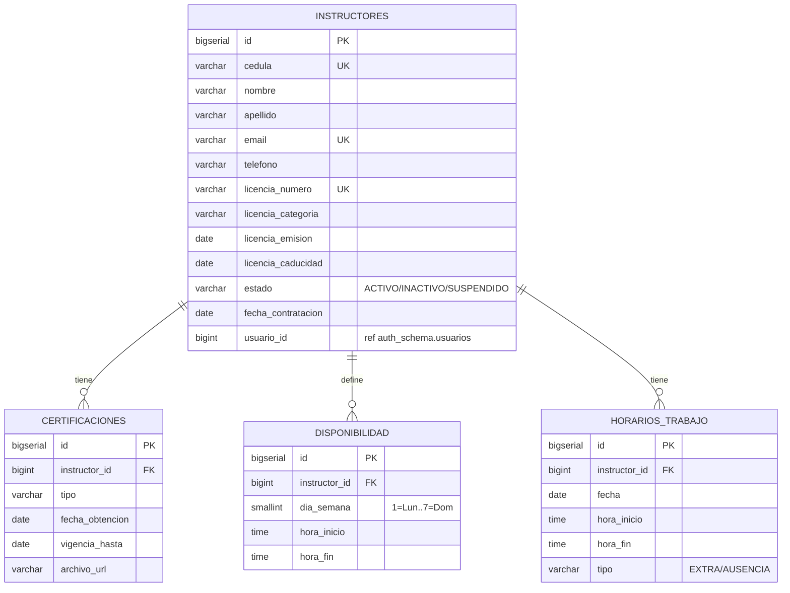
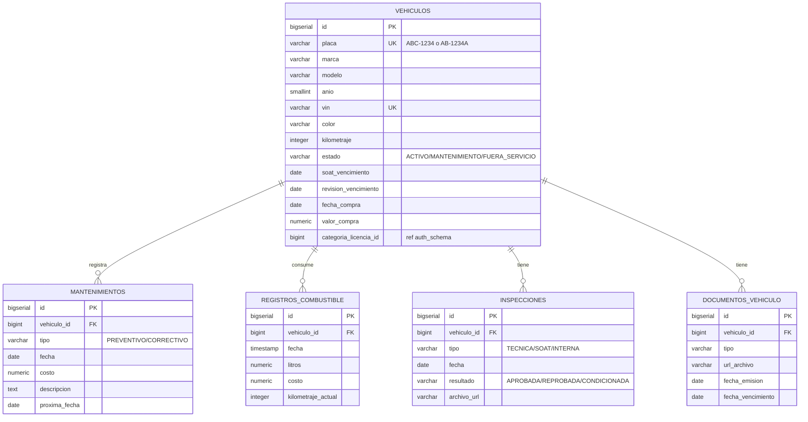
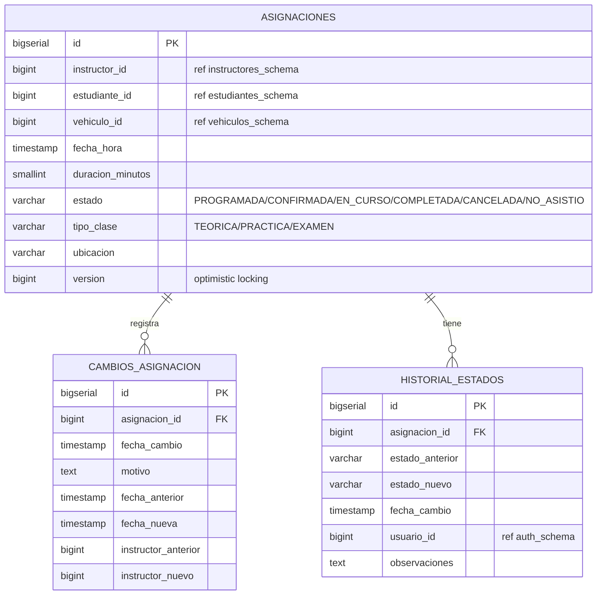
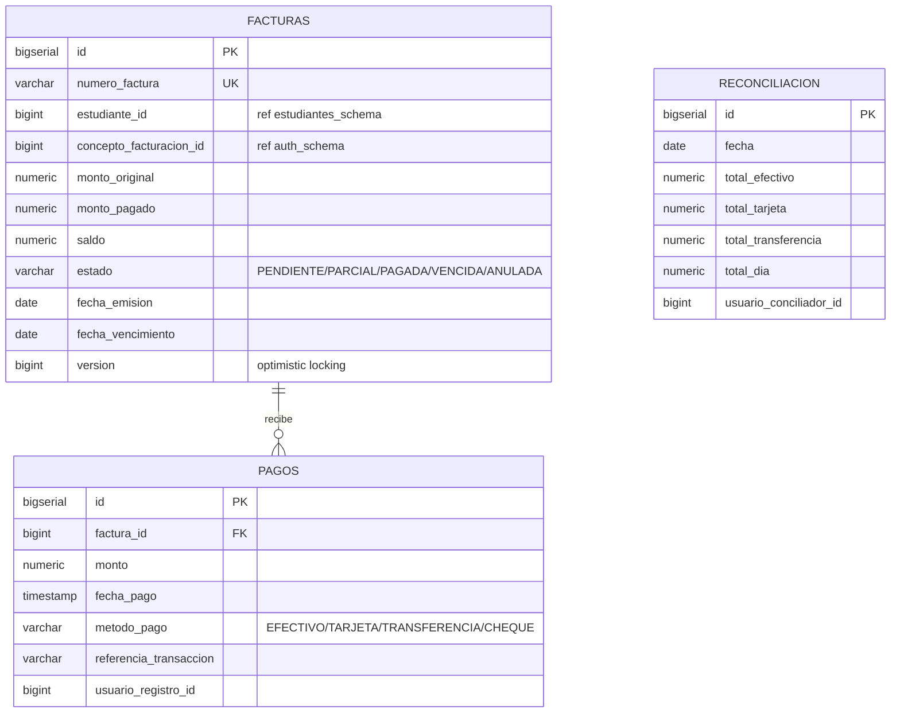
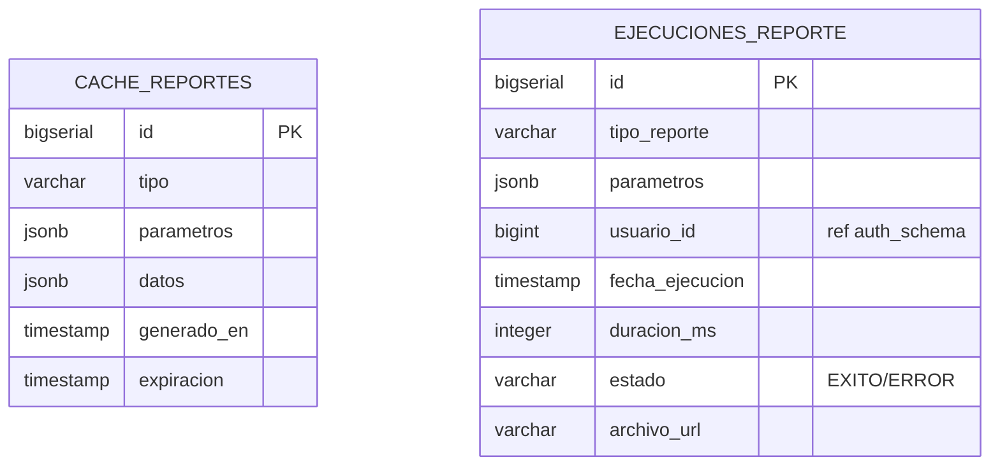
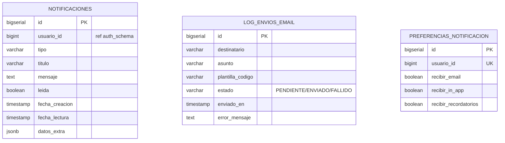
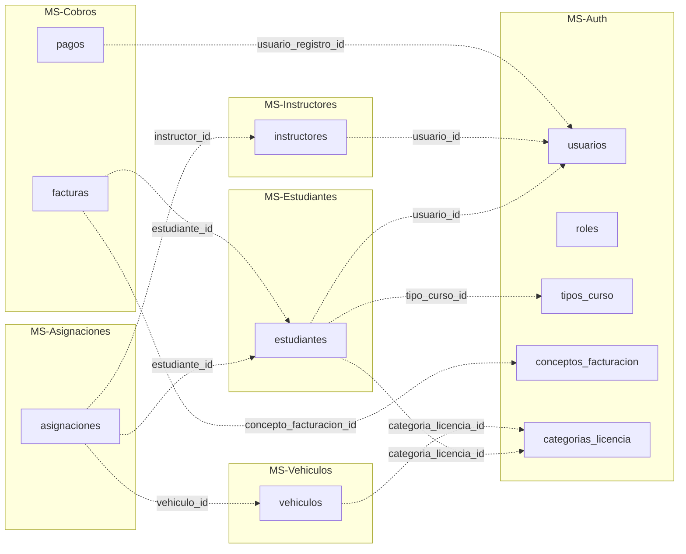

# Schema de Base de Datos

**Sistema de Control Administrativo y Financiero para Escuelas de Conducción**

> Documento de diseño de la base de datos PostgreSQL del sistema. Define todas las tablas, columnas, tipos, constraints, índices y relaciones para los 8 microservicios + schema compartido.
>
> **Versión:** 1.0 (Sprint 2.1 — diseño inicial)
> **Database:** `escuela_db` (PostgreSQL 15)
> **Estrategia:** 1 instancia, 9 schemas separados (1 por microservicio + `shared_schema`)
> **Próximo paso:** Sprint 2.2 — implementar como migraciones Flyway V1

---

## Índice

1. [Convenciones generales](#1-convenciones-generales)
2. [Audit fields y soft delete](#2-audit-fields-y-soft-delete)
3. [Validaciones específicas Ecuador](#3-validaciones-específicas-ecuador)
4. [Lista de schemas](#4-lista-de-schemas)
5. [Schema: `auth_schema`](#5-schema-auth_schema)
6. [Schema: `estudiantes_schema`](#6-schema-estudiantes_schema)
7. [Schema: `instructores_schema`](#7-schema-instructores_schema)
8. [Schema: `vehiculos_schema`](#8-schema-vehiculos_schema)
9. [Schema: `asignaciones_schema`](#9-schema-asignaciones_schema)
10. [Schema: `cobros_schema`](#10-schema-cobros_schema)
11. [Schema: `reportes_schema`](#11-schema-reportes_schema)
12. [Schema: `notificaciones_schema`](#12-schema-notificaciones_schema)
13. [Schema: `shared_schema`](#13-schema-shared_schema)
14. [Relaciones cross-microservicio](#14-relaciones-cross-microservicio)
15. [Datos seed iniciales](#15-datos-seed-iniciales)

---

## 1. Convenciones generales

### Naming
- **Tablas:** `snake_case`, plural (`estudiantes`, `instructores`, `facturas`)
- **Columnas:** `snake_case` (`fecha_matricula`, `id_estudiante`)
- **Primary keys:** `id` tipo `BIGSERIAL` (auto-increment)
- **Foreign keys:** `{tabla_singular}_id` (ej: `estudiante_id`, `instructor_id`)
- **Constraints:** `{tipo}_{tabla}_{campo}` (ej: `uq_estudiantes_cedula`, `fk_asignaciones_instructor`)
- **Índices:** `idx_{tabla}_{campo(s)}` (ej: `idx_estudiantes_estado`)

### Tipos estándar

| Concepto | Tipo PostgreSQL | Notas |
|----------|-----------------|-------|
| Identificador (PK) | `BIGSERIAL` | Auto-increment 64-bit |
| Texto corto | `VARCHAR(N)` | Tamaño explícito |
| Texto largo | `TEXT` | Sin límite |
| Booleano | `BOOLEAN` | TRUE/FALSE |
| Entero pequeño | `SMALLINT` o `INTEGER` | |
| Monto monetario | `NUMERIC(10,2)` | USD con 2 decimales |
| Fecha y hora | `TIMESTAMP` | Sin timezone (siempre UTC en BD) |
| Fecha sola | `DATE` | |
| UUID | `UUID` | Para tokens, event IDs, etc. |
| JSON | `JSONB` | Binary JSON (más performante que JSON) |
| Enum (lista cerrada) | `VARCHAR(N) CHECK (col IN (...))` | Más flexible que tipo ENUM nativo |

### FKs cross-schema (entre microservicios): NO

> **Regla estricta:** las foreign keys SOLO existen entre tablas del MISMO schema. Entre microservicios, se almacenan IDs de referencia pero **sin** restricción FK a nivel BD.
>
> **Razón:** mantener desacoplamiento. Cada microservicio puede evolucionar su schema independientemente. La consistencia eventual entre MS se maneja vía eventos (RabbitMQ).

---

## 2. Audit fields y soft delete

### Audit fields obligatorios en TODAS las tablas

```sql
created_at  TIMESTAMP   NOT NULL DEFAULT NOW(),
updated_at  TIMESTAMP,
created_by  VARCHAR(50),
updated_by  VARCHAR(50)
```

- `created_at` y `created_by` se establecen una sola vez al crear el registro
- `updated_at` y `updated_by` se actualizan en cada modificación (manejado por JPA `@LastModifiedDate` + `@LastModifiedBy`)
- `created_by` / `updated_by` guardan el email o user-id del usuario autenticado (vía `AuditorAware` con SecurityContextHolder)

### Soft delete

> **Política (DECISIONES.md sección 11):** soft delete en TODAS las entidades EXCEPTO `pagos` y `audit_log` (estos nunca se borran).

```sql
deleted_at  TIMESTAMP NULL  -- NULL = registro activo, valor = registro borrado
```

Las queries siempre deben filtrar por `deleted_at IS NULL` (manejado vía Hibernate Filters o `@Where` annotation).

### Versionado optimista (donde se requiere)

Para tablas con alta concurrencia (ej: `facturas`, `asignaciones`):

```sql
version  BIGINT NOT NULL DEFAULT 0
```

Mapeado con `@Version` en JPA para optimistic locking.

---

## 3. Validaciones específicas Ecuador

Validaciones implementadas a nivel BD con `CHECK` constraints (la lógica completa de validación está en backend con custom validators):

| Dato | Constraint BD |
|------|---------------|
| **Cédula** | `LENGTH(cedula) = 10 AND cedula ~ '^[0-9]{10}$'` |
| **RUC** | `LENGTH(ruc) = 13 AND ruc ~ '^[0-9]{13}$'` |
| **Placa vehículo** | `placa ~ '^[A-Z]{3}-[0-9]{4}$\|^[A-Z]{2}-[0-9]{4}[A-Z]$'` |
| **Email** | `email ~* '^[A-Za-z0-9._%+-]+@[A-Za-z0-9.-]+\.[A-Za-z]{2,}$'` |
| **Teléfono móvil** | `LENGTH(telefono) = 10 AND telefono ~ '^09[0-9]{8}$'` |
| **Monto USD** | `monto > 0` (validación de positividad) |

> El **dígito verificador de cédula** (algoritmo módulo 10) se valida en backend, no en BD (lógica compleja).

---

## 4. Lista de schemas

| Schema | Microservicio | Propósito | Tablas |
|--------|---------------|-----------|--------|
| `auth_schema` | MS-Auth | Autenticación + Configuración del sistema | 11 |
| `estudiantes_schema` | MS-Estudiantes | Gestión de estudiantes | 5 |
| `instructores_schema` | MS-Instructores | Gestión de instructores | 4 |
| `vehiculos_schema` | MS-Vehículos | Gestión de flota | 5 |
| `asignaciones_schema` | MS-Asignaciones | Programación de clases | 3 |
| `cobros_schema` | MS-Cobros | Facturación y pagos | 3 |
| `reportes_schema` | MS-Reportes | Cache y ejecuciones de reportes | 2 |
| `notificaciones_schema` | MS-Notificaciones | In-app + email | 3 |
| `shared_schema` | Compartido | Auditoría centralizada + idempotencia | 2 |
| **TOTAL** | — | — | **38 tablas** |

---

## 5. Schema: `auth_schema`

**Microservicio:** MS-Auth (puerto 8081)
**Responsabilidad:** Autenticación, autorización, gestión de usuarios/roles/permisos, recuperación de contraseña, **configuración del sistema** (single-tenant configurable), audit log centralizado.

### 5.1 Diagrama ER



### 5.2 Tablas

#### `usuarios`

| Columna | Tipo | Constraints | Notas |
|---------|------|-------------|-------|
| `id` | BIGSERIAL | PK | |
| `email` | VARCHAR(255) | UNIQUE, NOT NULL | Validar formato |
| `password` | VARCHAR(60) | NOT NULL | BCrypt produce hashes de 60 chars |
| `nombre` | VARCHAR(100) | NOT NULL | |
| `apellido` | VARCHAR(100) | NOT NULL | |
| `telefono` | VARCHAR(10) | | Móvil Ecuador 09XXXXXXXX |
| `activo` | BOOLEAN | NOT NULL DEFAULT TRUE | |
| `locked` | BOOLEAN | NOT NULL DEFAULT FALSE | Tras 3 intentos fallidos |
| `failed_attempts` | SMALLINT | NOT NULL DEFAULT 0 | Reset al login exitoso |
| `last_login` | TIMESTAMP | | |
| `lock_until` | TIMESTAMP | | Hasta cuándo está bloqueado (15 min) |
| `created_at` | TIMESTAMP | NOT NULL DEFAULT NOW() | Audit |
| `updated_at` | TIMESTAMP | | Audit |
| `created_by` | VARCHAR(50) | | Audit |
| `updated_by` | VARCHAR(50) | | Audit |
| `deleted_at` | TIMESTAMP | | Soft delete |

**Índices:**
- `idx_usuarios_email` ON `email` (búsqueda en login)
- `idx_usuarios_activo_locked` ON `(activo, locked) WHERE deleted_at IS NULL`

#### `roles`

| Columna | Tipo | Constraints |
|---------|------|-------------|
| `id` | BIGSERIAL | PK |
| `nombre` | VARCHAR(50) | UNIQUE, NOT NULL |
| `descripcion` | VARCHAR(255) | |
| (audit fields + deleted_at) | | |

**Datos seed:** ADMIN, STAFF, INSTRUCTOR, ESTUDIANTE

#### `permisos`

| Columna | Tipo | Constraints |
|---------|------|-------------|
| `id` | BIGSERIAL | PK |
| `codigo` | VARCHAR(100) | UNIQUE, NOT NULL |
| `recurso` | VARCHAR(50) | NOT NULL |
| `accion` | VARCHAR(50) | NOT NULL |
| `descripcion` | VARCHAR(255) | |
| (audit fields + deleted_at) | | |

**Ejemplos:** `ESTUDIANTES_READ`, `ESTUDIANTES_WRITE`, `COBROS_READ`, `REPORTES_FINANCIEROS_READ`

#### `usuario_rol` (tabla junction many-to-many)

| Columna | Tipo | Constraints |
|---------|------|-------------|
| `usuario_id` | BIGINT | PK, FK → usuarios(id) |
| `rol_id` | BIGINT | PK, FK → roles(id) |
| `created_at` | TIMESTAMP | NOT NULL DEFAULT NOW() |
| `created_by` | VARCHAR(50) | |

**PK compuesta:** `(usuario_id, rol_id)`

#### `rol_permiso` (tabla junction many-to-many)

Similar a `usuario_rol` pero entre `roles` y `permisos`.

#### `password_reset_token`

| Columna | Tipo | Constraints |
|---------|------|-------------|
| `id` | BIGSERIAL | PK |
| `usuario_id` | BIGINT | FK → usuarios(id), NOT NULL |
| `token` | UUID | UNIQUE, NOT NULL DEFAULT uuid_generate_v4() |
| `expira_en` | TIMESTAMP | NOT NULL |
| `usado` | BOOLEAN | NOT NULL DEFAULT FALSE |
| `created_at` | TIMESTAMP | NOT NULL DEFAULT NOW() |

**Índice:** `idx_password_reset_token_token` ON `token`

#### `configuracion_escuela` (single-tenant configurable)

> Tabla con UNA SOLA fila. Contiene los parámetros configurables de la escuela cliente.

| Columna | Tipo | Constraints | Notas |
|---------|------|-------------|-------|
| `id` | BIGSERIAL | PK | |
| `nombre` | VARCHAR(255) | NOT NULL | Nombre comercial de la escuela |
| `ruc` | VARCHAR(13) | UNIQUE, NOT NULL | RUC Ecuador |
| `direccion` | TEXT | | |
| `telefono` | VARCHAR(20) | | |
| `email` | VARCHAR(255) | | |
| `logo_url` | VARCHAR(500) | | URL en MinIO |
| `color_primario` | VARCHAR(7) | | Hex color (`#1f4e78`) |
| `color_secundario` | VARCHAR(7) | | Hex color |
| `duracion_clase_default_min` | SMALLINT | NOT NULL DEFAULT 60 | Duración estándar de clase |
| `horario_apertura` | TIME | | |
| `horario_cierre` | TIME | | |
| `horas_recordatorio_clase` | SMALLINT | NOT NULL DEFAULT 24 | Horas antes de clase |
| `dias_alerta_soat` | SMALLINT | NOT NULL DEFAULT 30 | Días antes vencimiento |
| (audit fields) | | | |

**Constraint:** `CHECK ((SELECT COUNT(*) FROM configuracion_escuela) <= 1)` — vía trigger o lógica de aplicación.

#### `tipos_curso`

| Columna | Tipo | Constraints |
|---------|------|-------------|
| `id` | BIGSERIAL | PK |
| `nombre` | VARCHAR(100) | UNIQUE, NOT NULL |
| `descripcion` | TEXT | |
| `duracion_total_horas` | SMALLINT | NOT NULL |
| `precio_base` | NUMERIC(10,2) | NOT NULL CHECK (precio_base > 0) |
| `categoria_licencia_id` | BIGINT | FK → categorias_licencia(id) |
| `activo` | BOOLEAN | NOT NULL DEFAULT TRUE |
| (audit fields + deleted_at) | | |

**Datos seed:** "Curso Básico Auto", "Curso Profesional", "Curso Moto"

#### `conceptos_facturacion`

| Columna | Tipo | Constraints |
|---------|------|-------------|
| `id` | BIGSERIAL | PK |
| `nombre` | VARCHAR(100) | UNIQUE, NOT NULL |
| `monto_base` | NUMERIC(10,2) | NOT NULL CHECK (monto_base > 0) |
| `descripcion` | TEXT | |
| `activo` | BOOLEAN | NOT NULL DEFAULT TRUE |
| (audit fields + deleted_at) | | |

**Datos seed:** "Curso Básico", "Examen", "Repetición de examen", "Material didáctico"

#### `categorias_licencia`

| Columna | Tipo | Constraints |
|---------|------|-------------|
| `id` | BIGSERIAL | PK |
| `codigo` | VARCHAR(20) | UNIQUE, NOT NULL |
| `descripcion` | VARCHAR(255) | NOT NULL |
| `activa` | BOOLEAN | NOT NULL DEFAULT TRUE |
| (audit fields + deleted_at) | | |

**Datos seed:** A, A1, B, C, C1, D, D1, E, F, PROFESIONAL_C, PROFESIONAL_D, PROFESIONAL_E

#### `plantillas_email`

| Columna | Tipo | Constraints |
|---------|------|-------------|
| `id` | BIGSERIAL | PK |
| `codigo` | VARCHAR(100) | UNIQUE, NOT NULL |
| `asunto` | VARCHAR(255) | NOT NULL |
| `cuerpo_html` | TEXT | NOT NULL |
| `variables` | JSONB | Variables disponibles: `{{nombre}}`, etc. |
| `activa` | BOOLEAN | NOT NULL DEFAULT TRUE |
| (audit fields + deleted_at) | | |

**Datos seed:** RECUPERAR_PASSWORD, MATRICULA_CONFIRMADA, RECIBO_PAGO, RECORDATORIO_CLASE, CLASE_REPROGRAMADA, CLASE_CANCELADA

---

## 6. Schema: `estudiantes_schema`

**Microservicio:** MS-Estudiantes (puerto 8082)
**Responsabilidad:** Gestión completa de estudiantes: matrícula, documentos, contactos, progreso, asistencia.

### 6.1 Diagrama ER



### 6.2 Tablas

#### `estudiantes`

| Columna | Tipo | Constraints | Notas |
|---------|------|-------------|-------|
| `id` | BIGSERIAL | PK | |
| `cedula` | VARCHAR(10) | UNIQUE, NOT NULL, CHECK formato | Cédula Ecuador |
| `nombre` | VARCHAR(100) | NOT NULL | |
| `apellido` | VARCHAR(100) | NOT NULL | |
| `email` | VARCHAR(255) | UNIQUE, NOT NULL | |
| `telefono` | VARCHAR(10) | NOT NULL | Móvil 09XXXXXXXX |
| `direccion` | TEXT | | |
| `fecha_nacimiento` | DATE | NOT NULL | |
| `genero` | CHAR(1) | CHECK (genero IN ('M', 'F', 'O')) | Masculino/Femenino/Otro |
| `estado` | VARCHAR(20) | NOT NULL CHECK (estado IN ('PRE_MATRICULADO','ACTIVO','COMPLETADO','RETIRADO')) | |
| `fecha_matricula` | DATE | | |
| `tipo_curso_id` | BIGINT | | Referencia a `auth_schema.tipos_curso` (sin FK cross-schema) |
| `categoria_licencia_id` | BIGINT | | Referencia a `auth_schema.categorias_licencia` |
| `usuario_id` | BIGINT | | Referencia a `auth_schema.usuarios` (si tiene login) |
| `observaciones` | TEXT | | |
| (audit fields + deleted_at) | | | |

**Índices:**
- `idx_estudiantes_cedula` ON `cedula`
- `idx_estudiantes_email` ON `email`
- `idx_estudiantes_estado` ON `estado WHERE deleted_at IS NULL`
- `idx_estudiantes_apellido_nombre` ON `(apellido, nombre)` (búsqueda por nombre)

#### `documentos`

| Columna | Tipo | Constraints |
|---------|------|-------------|
| `id` | BIGSERIAL | PK |
| `estudiante_id` | BIGINT | FK → estudiantes(id) ON DELETE CASCADE, NOT NULL |
| `tipo` | VARCHAR(30) | NOT NULL CHECK (tipo IN ('CEDULA_FRENTE','CEDULA_REVERSO','FOTO','EXAMEN_MEDICO','OTRO')) |
| `url_archivo` | VARCHAR(500) | NOT NULL |
| `fecha_subida` | TIMESTAMP | NOT NULL DEFAULT NOW() |
| `mime_type` | VARCHAR(100) | |
| `tamano_bytes` | BIGINT | |
| (audit fields + deleted_at) | | |

#### `contactos_emergencia`

| Columna | Tipo | Constraints |
|---------|------|-------------|
| `id` | BIGSERIAL | PK |
| `estudiante_id` | BIGINT | FK → estudiantes(id) ON DELETE CASCADE, NOT NULL |
| `nombre` | VARCHAR(200) | NOT NULL |
| `telefono` | VARCHAR(15) | NOT NULL |
| `parentesco` | VARCHAR(50) | |
| `es_principal` | BOOLEAN | NOT NULL DEFAULT FALSE |
| (audit fields + deleted_at) | | |

#### `progreso_academico`

> Una fila por estudiante. Se actualiza vía consumo de eventos `asignaciones.completada`.

| Columna | Tipo | Constraints |
|---------|------|-------------|
| `id` | BIGSERIAL | PK |
| `estudiante_id` | BIGINT | UNIQUE, FK → estudiantes(id) ON DELETE CASCADE, NOT NULL |
| `clases_planeadas` | SMALLINT | NOT NULL DEFAULT 0 |
| `clases_completadas` | SMALLINT | NOT NULL DEFAULT 0 |
| `clases_pendientes` | SMALLINT | NOT NULL DEFAULT 0 |
| `clases_canceladas` | SMALLINT | NOT NULL DEFAULT 0 |
| `calificacion_promedio` | NUMERIC(4,2) | CHECK (calificacion_promedio BETWEEN 0 AND 100) |
| `aprobado` | BOOLEAN | |
| (audit fields) | | |

#### `asistencia`

| Columna | Tipo | Constraints |
|---------|------|-------------|
| `id` | BIGSERIAL | PK |
| `estudiante_id` | BIGINT | FK → estudiantes(id), NOT NULL |
| `asignacion_id` | BIGINT | NOT NULL | Referencia a `asignaciones_schema.asignaciones` |
| `fecha_clase` | DATE | NOT NULL |
| `asistio` | BOOLEAN | NOT NULL |
| `justificacion` | TEXT | |
| `observaciones` | TEXT | |
| (audit fields) | | |

**Índices:**
- `idx_asistencia_estudiante_fecha` ON `(estudiante_id, fecha_clase)`
- `uq_asistencia_estudiante_asignacion` UNIQUE ON `(estudiante_id, asignacion_id)` (1 registro por clase)

---

## 7. Schema: `instructores_schema`

**Microservicio:** MS-Instructores (puerto 8083)
**Responsabilidad:** Gestión de instructores, certificaciones, disponibilidad horaria.

### 7.1 Diagrama ER



### 7.2 Tablas

#### `instructores`

| Columna | Tipo | Constraints |
|---------|------|-------------|
| `id` | BIGSERIAL | PK |
| `cedula` | VARCHAR(10) | UNIQUE, NOT NULL, CHECK formato |
| `nombre` | VARCHAR(100) | NOT NULL |
| `apellido` | VARCHAR(100) | NOT NULL |
| `email` | VARCHAR(255) | UNIQUE, NOT NULL |
| `telefono` | VARCHAR(10) | NOT NULL |
| `direccion` | TEXT | |
| `fecha_nacimiento` | DATE | |
| `licencia_numero` | VARCHAR(50) | UNIQUE, NOT NULL |
| `licencia_categoria` | VARCHAR(20) | NOT NULL |
| `licencia_emision` | DATE | NOT NULL |
| `licencia_caducidad` | DATE | NOT NULL |
| `estado` | VARCHAR(20) | NOT NULL CHECK (estado IN ('ACTIVO','INACTIVO','SUSPENDIDO')) |
| `fecha_contratacion` | DATE | |
| `salario_mensual` | NUMERIC(10,2) | CHECK (salario_mensual >= 0) |
| `usuario_id` | BIGINT | Ref a `auth_schema.usuarios` |
| `observaciones` | TEXT | |
| (audit fields + deleted_at) | | |

**Índices:**
- `idx_instructores_cedula` ON `cedula`
- `idx_instructores_licencia` ON `licencia_numero`
- `idx_instructores_estado` ON `estado WHERE deleted_at IS NULL`

#### `certificaciones`

| Columna | Tipo | Constraints |
|---------|------|-------------|
| `id` | BIGSERIAL | PK |
| `instructor_id` | BIGINT | FK → instructores(id), NOT NULL |
| `tipo` | VARCHAR(100) | NOT NULL |
| `fecha_obtencion` | DATE | NOT NULL |
| `vigencia_hasta` | DATE | |
| `entidad_emisora` | VARCHAR(255) | |
| `archivo_url` | VARCHAR(500) | |
| `observaciones` | TEXT | |
| (audit fields + deleted_at) | | |

#### `disponibilidad`

> Disponibilidad recurrente semanal del instructor.

| Columna | Tipo | Constraints |
|---------|------|-------------|
| `id` | BIGSERIAL | PK |
| `instructor_id` | BIGINT | FK → instructores(id), NOT NULL |
| `dia_semana` | SMALLINT | NOT NULL CHECK (dia_semana BETWEEN 1 AND 7) |
| `hora_inicio` | TIME | NOT NULL |
| `hora_fin` | TIME | NOT NULL CHECK (hora_fin > hora_inicio) |
| (audit fields + deleted_at) | | |

**Índice único:** `uq_disponibilidad_instructor_dia_hora` ON `(instructor_id, dia_semana, hora_inicio)` WHERE `deleted_at IS NULL`

#### `horarios_trabajo`

> Excepciones a la disponibilidad semanal: turnos extra o ausencias específicas.

| Columna | Tipo | Constraints |
|---------|------|-------------|
| `id` | BIGSERIAL | PK |
| `instructor_id` | BIGINT | FK → instructores(id), NOT NULL |
| `fecha` | DATE | NOT NULL |
| `hora_inicio` | TIME | |
| `hora_fin` | TIME | |
| `tipo` | VARCHAR(20) | NOT NULL CHECK (tipo IN ('EXTRA','AUSENCIA')) |
| `motivo` | TEXT | |
| (audit fields + deleted_at) | | |

---

## 8. Schema: `vehiculos_schema`

**Microservicio:** MS-Vehículos (puerto 8084)
**Responsabilidad:** Flota vehicular, mantenimientos, combustible, inspecciones, documentación.

### 8.1 Diagrama ER



### 8.2 Tablas

#### `vehiculos`

| Columna | Tipo | Constraints |
|---------|------|-------------|
| `id` | BIGSERIAL | PK |
| `placa` | VARCHAR(8) | UNIQUE, NOT NULL, CHECK formato |
| `marca` | VARCHAR(50) | NOT NULL |
| `modelo` | VARCHAR(50) | NOT NULL |
| `anio` | SMALLINT | NOT NULL CHECK (anio BETWEEN 1990 AND 2050) |
| `vin` | VARCHAR(17) | UNIQUE |
| `color` | VARCHAR(30) | |
| `kilometraje` | INTEGER | NOT NULL DEFAULT 0 CHECK (kilometraje >= 0) |
| `estado` | VARCHAR(20) | NOT NULL CHECK (estado IN ('ACTIVO','MANTENIMIENTO','FUERA_SERVICIO')) |
| `soat_vencimiento` | DATE | |
| `revision_vencimiento` | DATE | |
| `fecha_compra` | DATE | |
| `valor_compra` | NUMERIC(10,2) | CHECK (valor_compra >= 0) |
| `categoria_licencia_id` | BIGINT | Ref a `auth_schema.categorias_licencia` |
| `observaciones` | TEXT | |
| (audit fields + deleted_at) | | |

**Índices:**
- `idx_vehiculos_placa` ON `placa`
- `idx_vehiculos_estado` ON `estado WHERE deleted_at IS NULL`
- `idx_vehiculos_soat_proximo` ON `soat_vencimiento WHERE deleted_at IS NULL` (alertas)

#### `mantenimientos`

| Columna | Tipo | Constraints |
|---------|------|-------------|
| `id` | BIGSERIAL | PK |
| `vehiculo_id` | BIGINT | FK → vehiculos(id), NOT NULL |
| `tipo` | VARCHAR(20) | NOT NULL CHECK (tipo IN ('PREVENTIVO','CORRECTIVO')) |
| `fecha` | DATE | NOT NULL |
| `costo` | NUMERIC(10,2) | NOT NULL CHECK (costo >= 0) |
| `descripcion` | TEXT | NOT NULL |
| `taller` | VARCHAR(255) | |
| `kilometraje_servicio` | INTEGER | |
| `proxima_fecha` | DATE | |
| `proximo_kilometraje` | INTEGER | |
| `archivo_factura_url` | VARCHAR(500) | |
| (audit fields + deleted_at) | | |

#### `registros_combustible`

| Columna | Tipo | Constraints |
|---------|------|-------------|
| `id` | BIGSERIAL | PK |
| `vehiculo_id` | BIGINT | FK → vehiculos(id), NOT NULL |
| `fecha` | TIMESTAMP | NOT NULL |
| `litros` | NUMERIC(8,2) | NOT NULL CHECK (litros > 0) |
| `costo_total` | NUMERIC(10,2) | NOT NULL CHECK (costo_total > 0) |
| `costo_por_litro` | NUMERIC(8,4) | GENERATED ALWAYS AS (costo_total / litros) STORED |
| `kilometraje_actual` | INTEGER | NOT NULL |
| `estacion` | VARCHAR(255) | |
| (audit fields) | | |

**Índice:** `idx_combustible_vehiculo_fecha` ON `(vehiculo_id, fecha DESC)`

#### `inspecciones`

| Columna | Tipo | Constraints |
|---------|------|-------------|
| `id` | BIGSERIAL | PK |
| `vehiculo_id` | BIGINT | FK → vehiculos(id), NOT NULL |
| `tipo` | VARCHAR(20) | NOT NULL CHECK (tipo IN ('TECNICA','SOAT','INTERNA')) |
| `fecha` | DATE | NOT NULL |
| `resultado` | VARCHAR(20) | NOT NULL CHECK (resultado IN ('APROBADA','REPROBADA','CONDICIONADA')) |
| `archivo_url` | VARCHAR(500) | |
| `observaciones` | TEXT | |
| `proxima_inspeccion` | DATE | |
| (audit fields + deleted_at) | | |

#### `documentos_vehiculo`

| Columna | Tipo | Constraints |
|---------|------|-------------|
| `id` | BIGSERIAL | PK |
| `vehiculo_id` | BIGINT | FK → vehiculos(id), NOT NULL |
| `tipo` | VARCHAR(50) | NOT NULL |
| `numero` | VARCHAR(100) | |
| `url_archivo` | VARCHAR(500) | NOT NULL |
| `fecha_emision` | DATE | |
| `fecha_vencimiento` | DATE | |
| (audit fields + deleted_at) | | |

---

## 9. Schema: `asignaciones_schema`

**Microservicio:** MS-Asignaciones (puerto 8085)
**Responsabilidad:** Programación tripartita de clases (instructor + estudiante + vehículo + horario), reprogramaciones, historial.

### 9.1 Diagrama ER



### 9.2 Tablas

#### `asignaciones`

| Columna | Tipo | Constraints |
|---------|------|-------------|
| `id` | BIGSERIAL | PK |
| `instructor_id` | BIGINT | NOT NULL | Ref a `instructores_schema.instructores` |
| `estudiante_id` | BIGINT | NOT NULL | Ref a `estudiantes_schema.estudiantes` |
| `vehiculo_id` | BIGINT | NOT NULL | Ref a `vehiculos_schema.vehiculos` |
| `fecha_hora` | TIMESTAMP | NOT NULL |
| `duracion_minutos` | SMALLINT | NOT NULL DEFAULT 60 CHECK (duracion_minutos > 0) |
| `estado` | VARCHAR(20) | NOT NULL CHECK (estado IN ('PROGRAMADA','CONFIRMADA','EN_CURSO','COMPLETADA','CANCELADA','NO_ASISTIO')) |
| `tipo_clase` | VARCHAR(20) | NOT NULL CHECK (tipo_clase IN ('TEORICA','PRACTICA','EXAMEN')) |
| `ubicacion` | VARCHAR(255) | |
| `observaciones` | TEXT | |
| `motivo_cancelacion` | TEXT | |
| `version` | BIGINT | NOT NULL DEFAULT 0 | Optimistic locking |
| (audit fields + deleted_at) | | |

**Índices:**
- `idx_asignaciones_instructor_fecha` ON `(instructor_id, fecha_hora)`
- `idx_asignaciones_estudiante_fecha` ON `(estudiante_id, fecha_hora)`
- `idx_asignaciones_vehiculo_fecha` ON `(vehiculo_id, fecha_hora)`
- `idx_asignaciones_estado_fecha` ON `(estado, fecha_hora)`

**Constraint para evitar conflictos:** validación de no-overlap se hace en aplicación (no en BD por complejidad), pero se podría agregar EXCLUDE constraint con `tstzrange` si se quiere a nivel BD.

#### `cambios_asignacion`

| Columna | Tipo | Constraints |
|---------|------|-------------|
| `id` | BIGSERIAL | PK |
| `asignacion_id` | BIGINT | FK → asignaciones(id), NOT NULL |
| `fecha_cambio` | TIMESTAMP | NOT NULL DEFAULT NOW() |
| `motivo` | TEXT | NOT NULL |
| `fecha_anterior` | TIMESTAMP | |
| `fecha_nueva` | TIMESTAMP | |
| `instructor_anterior` | BIGINT | |
| `instructor_nuevo` | BIGINT | |
| `vehiculo_anterior` | BIGINT | |
| `vehiculo_nuevo` | BIGINT | |
| `usuario_id` | BIGINT | NOT NULL | Quien hizo el cambio |
| (audit fields) | | |

#### `historial_estados`

| Columna | Tipo | Constraints |
|---------|------|-------------|
| `id` | BIGSERIAL | PK |
| `asignacion_id` | BIGINT | FK → asignaciones(id), NOT NULL |
| `estado_anterior` | VARCHAR(20) | |
| `estado_nuevo` | VARCHAR(20) | NOT NULL |
| `fecha_cambio` | TIMESTAMP | NOT NULL DEFAULT NOW() |
| `usuario_id` | BIGINT | |
| `observaciones` | TEXT | |
| (audit fields) | | |

---

## 10. Schema: `cobros_schema`

**Microservicio:** MS-Cobros (puerto 8086)
**Responsabilidad:** Facturación, pagos (incluye parciales), reconciliación diaria.

### 10.1 Diagrama ER



### 10.2 Tablas

#### `facturas`

| Columna | Tipo | Constraints |
|---------|------|-------------|
| `id` | BIGSERIAL | PK |
| `numero_factura` | VARCHAR(20) | UNIQUE, NOT NULL | Formato `YYYYMM-####` |
| `estudiante_id` | BIGINT | NOT NULL | Ref `estudiantes_schema.estudiantes` |
| `concepto_facturacion_id` | BIGINT | NOT NULL | Ref `auth_schema.conceptos_facturacion` |
| `descripcion` | VARCHAR(255) | |
| `monto_original` | NUMERIC(10,2) | NOT NULL CHECK (monto_original > 0) |
| `monto_pagado` | NUMERIC(10,2) | NOT NULL DEFAULT 0 CHECK (monto_pagado >= 0) |
| `saldo` | NUMERIC(10,2) | GENERATED ALWAYS AS (monto_original - monto_pagado) STORED |
| `estado` | VARCHAR(20) | NOT NULL CHECK (estado IN ('PENDIENTE','PARCIAL','PAGADA','VENCIDA','ANULADA')) |
| `fecha_emision` | DATE | NOT NULL DEFAULT CURRENT_DATE |
| `fecha_vencimiento` | DATE | NOT NULL |
| `motivo_anulacion` | TEXT | |
| `version` | BIGINT | NOT NULL DEFAULT 0 | Optimistic locking |
| (audit fields + deleted_at) | | |

**Constraint:** `CHECK (monto_pagado <= monto_original)`

**Índices:**
- `idx_facturas_numero` ON `numero_factura`
- `idx_facturas_estudiante` ON `estudiante_id`
- `idx_facturas_estado_vencimiento` ON `(estado, fecha_vencimiento) WHERE deleted_at IS NULL`

#### `pagos`

> **NO tiene `deleted_at`** — los pagos NO se borran (auditoría/contabilidad). Si hay error, se anula vía nota de crédito (futuro).

| Columna | Tipo | Constraints |
|---------|------|-------------|
| `id` | BIGSERIAL | PK |
| `factura_id` | BIGINT | FK → facturas(id), NOT NULL |
| `monto` | NUMERIC(10,2) | NOT NULL CHECK (monto > 0) |
| `fecha_pago` | TIMESTAMP | NOT NULL DEFAULT NOW() |
| `metodo_pago` | VARCHAR(20) | NOT NULL CHECK (metodo_pago IN ('EFECTIVO','TARJETA','TRANSFERENCIA','CHEQUE')) |
| `referencia_transaccion` | VARCHAR(100) | |
| `observaciones` | TEXT | |
| `usuario_registro_id` | BIGINT | NOT NULL | Ref `auth_schema.usuarios` |
| `created_at` | TIMESTAMP | NOT NULL DEFAULT NOW() |
| `created_by` | VARCHAR(50) | |

**Índices:**
- `idx_pagos_factura` ON `factura_id`
- `idx_pagos_fecha` ON `fecha_pago` (para reconciliación)

#### `reconciliacion`

> Cierre diario de caja. 1 fila por día.

| Columna | Tipo | Constraints |
|---------|------|-------------|
| `id` | BIGSERIAL | PK |
| `fecha` | DATE | UNIQUE, NOT NULL |
| `total_efectivo` | NUMERIC(10,2) | NOT NULL DEFAULT 0 |
| `total_tarjeta` | NUMERIC(10,2) | NOT NULL DEFAULT 0 |
| `total_transferencia` | NUMERIC(10,2) | NOT NULL DEFAULT 0 |
| `total_cheque` | NUMERIC(10,2) | NOT NULL DEFAULT 0 |
| `total_dia` | NUMERIC(10,2) | GENERATED ALWAYS AS (total_efectivo + total_tarjeta + total_transferencia + total_cheque) STORED |
| `cantidad_pagos` | INTEGER | NOT NULL DEFAULT 0 |
| `usuario_conciliador_id` | BIGINT | |
| `observaciones` | TEXT | |
| (audit fields) | | |

---

## 11. Schema: `reportes_schema`

**Microservicio:** MS-Reportes (puerto 8087)
**Responsabilidad:** Cache de reportes generados, log de ejecuciones.

### 11.1 Diagrama ER



### 11.2 Tablas

#### `cache_reportes`

| Columna | Tipo | Constraints |
|---------|------|-------------|
| `id` | BIGSERIAL | PK |
| `tipo` | VARCHAR(50) | NOT NULL |
| `parametros` | JSONB | NOT NULL |
| `datos` | JSONB | NOT NULL |
| `hash_parametros` | VARCHAR(64) | UNIQUE | Hash SHA-256 de parametros (para cache lookup) |
| `generado_en` | TIMESTAMP | NOT NULL DEFAULT NOW() |
| `expiracion` | TIMESTAMP | NOT NULL |
| (audit fields) | | |

**Índices:**
- `idx_cache_reportes_hash` ON `hash_parametros`
- `idx_cache_reportes_expiracion` ON `expiracion` (para limpieza)

#### `ejecuciones_reporte`

| Columna | Tipo | Constraints |
|---------|------|-------------|
| `id` | BIGSERIAL | PK |
| `tipo_reporte` | VARCHAR(50) | NOT NULL |
| `parametros` | JSONB | NOT NULL |
| `usuario_id` | BIGINT | NOT NULL | Ref `auth_schema.usuarios` |
| `fecha_ejecucion` | TIMESTAMP | NOT NULL DEFAULT NOW() |
| `duracion_ms` | INTEGER | |
| `estado` | VARCHAR(20) | NOT NULL CHECK (estado IN ('EXITO','ERROR')) |
| `archivo_url` | VARCHAR(500) | |
| `formato` | VARCHAR(10) | CHECK (formato IN ('PDF','EXCEL')) |
| `error_mensaje` | TEXT | |
| (audit fields) | | |

---

## 12. Schema: `notificaciones_schema`

**Microservicio:** MS-Notificaciones (puerto 8088)
**Responsabilidad:** Notificaciones in-app, log de emails enviados, preferencias de notificación.

### 12.1 Diagrama ER



### 12.2 Tablas

#### `notificaciones`

| Columna | Tipo | Constraints |
|---------|------|-------------|
| `id` | BIGSERIAL | PK |
| `usuario_id` | BIGINT | NOT NULL | Ref `auth_schema.usuarios` |
| `tipo` | VARCHAR(50) | NOT NULL |
| `titulo` | VARCHAR(255) | NOT NULL |
| `mensaje` | TEXT | NOT NULL |
| `leida` | BOOLEAN | NOT NULL DEFAULT FALSE |
| `fecha_creacion` | TIMESTAMP | NOT NULL DEFAULT NOW() |
| `fecha_lectura` | TIMESTAMP | |
| `datos_extra` | JSONB | Para deep-linking (ej: `{"asignacion_id": 42}`) |
| `prioridad` | VARCHAR(10) | NOT NULL DEFAULT 'NORMAL' CHECK (prioridad IN ('BAJA','NORMAL','ALTA')) |
| (audit fields + deleted_at) | | |

**Índices:**
- `idx_notificaciones_usuario_no_leidas` ON `(usuario_id, leida) WHERE leida = FALSE AND deleted_at IS NULL`
- `idx_notificaciones_fecha` ON `fecha_creacion DESC`

#### `log_envios_email`

| Columna | Tipo | Constraints |
|---------|------|-------------|
| `id` | BIGSERIAL | PK |
| `destinatario` | VARCHAR(255) | NOT NULL |
| `asunto` | VARCHAR(255) | NOT NULL |
| `plantilla_codigo` | VARCHAR(100) | |
| `estado` | VARCHAR(20) | NOT NULL CHECK (estado IN ('PENDIENTE','ENVIADO','FALLIDO')) |
| `enviado_en` | TIMESTAMP | |
| `intentos` | SMALLINT | NOT NULL DEFAULT 0 |
| `error_mensaje` | TEXT | |
| `usuario_id` | BIGINT | Si aplica |
| (audit fields) | | |

#### `preferencias_notificacion`

| Columna | Tipo | Constraints |
|---------|------|-------------|
| `id` | BIGSERIAL | PK |
| `usuario_id` | BIGINT | UNIQUE, NOT NULL | Ref `auth_schema.usuarios` |
| `recibir_email` | BOOLEAN | NOT NULL DEFAULT TRUE |
| `recibir_in_app` | BOOLEAN | NOT NULL DEFAULT TRUE |
| `recibir_recordatorios` | BOOLEAN | NOT NULL DEFAULT TRUE |
| `recibir_alertas_admin` | BOOLEAN | NOT NULL DEFAULT TRUE |
| (audit fields) | | |

---

## 13. Schema: `shared_schema`

**Microservicio:** Compartido entre todos
**Responsabilidad:** Auditoría centralizada del sistema completo, idempotencia de eventos.

### 13.1 Tablas

#### `audit_log`

> **NUNCA se borra ni se actualiza** — append-only.

| Columna | Tipo | Constraints |
|---------|------|-------------|
| `id` | BIGSERIAL | PK |
| `microservicio` | VARCHAR(50) | NOT NULL |
| `recurso` | VARCHAR(100) | NOT NULL |
| `recurso_id` | VARCHAR(50) | |
| `accion` | VARCHAR(50) | NOT NULL CHECK (accion IN ('CREATE','UPDATE','DELETE','READ','LOGIN','LOGOUT')) |
| `usuario_id` | BIGINT | |
| `usuario_email` | VARCHAR(255) | |
| `ip` | VARCHAR(45) | |
| `user_agent` | TEXT | |
| `datos_anteriores` | JSONB | Para UPDATE/DELETE |
| `datos_nuevos` | JSONB | Para CREATE/UPDATE |
| `fecha` | TIMESTAMP | NOT NULL DEFAULT NOW() |
| `correlation_id` | VARCHAR(100) | Trazabilidad cross-MS |

**Índices:**
- `idx_audit_log_microservicio_fecha` ON `(microservicio, fecha DESC)`
- `idx_audit_log_usuario_fecha` ON `(usuario_id, fecha DESC)`
- `idx_audit_log_recurso` ON `(recurso, recurso_id)`

#### `processed_events`

> Tabla de idempotencia para consumidores RabbitMQ. Antes de procesar un evento, validar que su `event_id` no esté en esta tabla.

| Columna | Tipo | Constraints |
|---------|------|-------------|
| `id` | BIGSERIAL | PK |
| `event_id` | UUID | UNIQUE, NOT NULL |
| `microservicio_consumidor` | VARCHAR(50) | NOT NULL |
| `tipo_evento` | VARCHAR(100) | NOT NULL |
| `processed_at` | TIMESTAMP | NOT NULL DEFAULT NOW() |

**Índice:** `idx_processed_events_microservicio_fecha` ON `(microservicio_consumidor, processed_at DESC)`

**Mantenimiento:** registros con `processed_at < NOW() - INTERVAL '30 days'` se pueden eliminar (limpieza periódica).

---

## 14. Relaciones cross-microservicio

### Principio

> Las foreign keys solo existen DENTRO del mismo schema. Entre microservicios se almacenan IDs de referencia **sin** restricción FK a nivel BD.
>
> La consistencia eventual entre microservicios se gestiona vía **eventos RabbitMQ**.

### Mapa de referencias entre MS



### Validación de existencia entre MS

Cuando un MS necesita validar que un ID en otro MS existe (ej: MS-Asignaciones validando que el `instructor_id` existe), usa:

1. **OpenFeign client** (síncrono): `instructorClient.existe(instructorId)` — devuelve 404 si no existe
2. **Cache local con eventos** (asíncrono): MS-Asignaciones mantiene una tabla local de instructores activos, actualizada vía eventos `instructores.creado` / `instructores.eliminado`

> En Sprint 5+ definiremos la estrategia exacta por caso de uso.

### Eventos críticos para consistencia

| Evento | Publica | Consume | Propósito |
|--------|---------|---------|-----------|
| `auth.usuario.creado` | MS-Auth | MS-Notificaciones (preferencias) | Crear preferencias default |
| `estudiantes.creado` | MS-Estudiantes | MS-Cobros (facturación auto), shared (audit) | Generar factura de matrícula |
| `estudiantes.matriculado` | MS-Estudiantes | MS-Cobros, MS-Notificaciones | Notificar matrícula |
| `asignaciones.creada` | MS-Asignaciones | MS-Estudiantes (progreso), MS-Notificaciones | Notificar nueva clase |
| `asignaciones.completada` | MS-Asignaciones | MS-Estudiantes (progreso) | Incrementar contador clases completadas |
| `cobros.pago.registrado` | MS-Cobros | MS-Notificaciones, MS-Reportes (cache) | Enviar recibo, invalidar cache |
| `cobros.factura.pagada` | MS-Cobros | MS-Notificaciones | Email de confirmación |

---

## 15. Datos seed iniciales

> A insertar en migraciones Flyway `V1.5__Seed_Data.sql` por cada MS.

### `auth_schema`

**roles:**
- ADMIN, STAFF, INSTRUCTOR, ESTUDIANTE

**permisos** (ejemplos):
- `USUARIOS_READ`, `USUARIOS_WRITE`
- `ESTUDIANTES_READ`, `ESTUDIANTES_WRITE`, `ESTUDIANTES_DELETE`
- `INSTRUCTORES_READ`, `INSTRUCTORES_WRITE`
- `VEHICULOS_READ`, `VEHICULOS_WRITE`
- `ASIGNACIONES_READ`, `ASIGNACIONES_WRITE`
- `COBROS_READ`, `COBROS_WRITE`
- `REPORTES_READ`, `REPORTES_FINANCIEROS_READ`
- `CONFIGURACION_READ`, `CONFIGURACION_WRITE`

**usuario admin inicial:**
- email: `admin@escuela.local`
- password: `Admin123!` (bcrypt hash precomputado)
- rol: ADMIN

**categorias_licencia:** A, A1, B, C, C1, D, D1, E, F, PROFESIONAL_C, PROFESIONAL_D, PROFESIONAL_E

**conceptos_facturacion:** Curso Básico, Examen, Repetición de examen, Material didáctico

**tipos_curso:** Curso Básico Auto, Curso Profesional, Curso Moto

**plantillas_email:** RECUPERAR_PASSWORD, MATRICULA_CONFIRMADA, RECIBO_PAGO, RECORDATORIO_CLASE, CLASE_REPROGRAMADA, CLASE_CANCELADA

**configuracion_escuela** (1 fila):
- nombre: "Escuela de Conducción Demo"
- ruc: "1791234567001"
- duracion_clase_default_min: 60
- horas_recordatorio_clase: 24

### Demo data (insertable opcionalmente con perfil `demo`)

- 2 usuarios staff
- 3 instructores demo
- 5 vehículos demo
- 10 estudiantes demo

---

## Próximos pasos

- **Sprint 2.2:** Implementar este diseño como **migraciones Flyway V1** en cada microservicio (`backend/<ms>/src/main/resources/db/migration/V1__Initial_Schema.sql`).
- **Sprint 2.3:** Crear **entidades JPA** correspondientes con `BaseEntity` (audit fields + soft delete) y MapStruct mappers.
- **Sprint 4:** Implementar la lógica de auth (incluye uso real de las tablas de `auth_schema`).
- **Sprint 5+:** Cada CRUD usa las tablas de su MS.

---

## Referencias

- [DECISIONES.md](../../DECISIONES.md) — Sección 4 (Bases de Datos), 11 (Validaciones Ecuador)
- [SPRINTS_PLAN.xlsx](../../SPRINTS_PLAN.xlsx) — Sprint 2 detallado
- [PostgreSQL 15 docs](https://www.postgresql.org/docs/15/) — Referencia oficial
