# Schema de Base de Datos

**Sistema de Control Administrativo y Financiero para Escuelas de Conducción**

> Documento monolítico completo del modelo de datos del sistema. Si preferís lectura por sección, también está disponible la versión partida en [`secciones/`](./secciones/) con un archivo por tema.
>
> **Versión:** 3.1 (Sprint 10 — vista monolítica reconsolidada)
> **Database:** `escuela_db` (PostgreSQL 15)
> **Estrategia:** 1 instancia, 9 schemas separados (1 por microservicio + `shared_schema`)
> **Última actualización:** 2026-05-26

---

## Índice

1. [Convenciones generales](#1-convenciones-generales)
2. [Audit fields y soft delete](#2-audit-fields-y-soft-delete)
3. [Validaciones específicas Ecuador](#3-validaciones-específicas-ecuador)
4. [Arquitectura de schemas](#4-arquitectura-de-schemas)
5. [Diagrama ER global](#5-diagrama-er-global)
6. [Migraciones Flyway aplicadas](#6-migraciones-flyway-aplicadas)
7. [Schema: `auth_schema`](#7-schema-auth_schema)
8. [Schema: `estudiantes_schema`](#8-schema-estudiantes_schema)
9. [Schema: `instructores_schema`](#9-schema-instructores_schema)
10. [Schema: `vehiculos_schema`](#10-schema-vehiculos_schema)
11. [Schema: `asignaciones_schema`](#11-schema-asignaciones_schema)
12. [Schema: `cobros_schema`](#12-schema-cobros_schema)
13. [Schema: `notificaciones_schema`](#13-schema-notificaciones_schema)
14. [Schema: `reportes_schema`](#14-schema-reportes_schema)
15. [Schema: `shared_schema`](#15-schema-shared_schema)
16. [Relaciones cross-microservicio](#16-relaciones-cross-microservicio)
17. [Validaciones obligatorias al crear asignación](#17-validaciones-obligatorias-al-crear-asignación)
18. [Datos seed iniciales](#18-datos-seed-iniciales)
19. [Referencias](#19-referencias)

**Total: 9 schemas, 41 tablas, 22 migraciones, 1 base de datos.**

---

## 1. Convenciones generales

> Convenciones de naming y tipos de datos comunes a todos los schemas del sistema.

### Naming

- **Tablas:** `snake_case`, plural (`estudiantes`, `instructores`, `facturas`)
- **Columnas:** `snake_case` (`fecha_matricula`, `id_estudiante`)
- **Primary keys:** `id` tipo `BIGSERIAL` (auto-increment)
- **Foreign keys:** `{tabla_singular}_id` (ej. `estudiante_id`, `instructor_id`)
- **Constraints:** `{tipo}_{tabla}_{campo}` (ej. `uq_estudiantes_cedula`, `fk_asignaciones_instructor`, `ck_estudiantes_estado`)
- **Índices:** `idx_{tabla}_{campo(s)}` (ej. `idx_estudiantes_estado`)

### Tipos estándar

| Concepto | Tipo PostgreSQL | Notas |
|----------|-----------------|-------|
| Identificador (PK) | `BIGSERIAL` | Auto-increment 64-bit |
| Texto corto | `VARCHAR(N)` | Tamaño explícito |
| Texto largo | `TEXT` | Sin límite |
| Booleano | `BOOLEAN` | TRUE/FALSE |
| Entero pequeño | `SMALLINT` o `INTEGER` | |
| Monto monetario | `NUMERIC(10,2)` | USD con 2 decimales |
| Fecha y hora | `TIMESTAMP` | Sin timezone (la JVM corre fija en `America/Guayaquil` por `Dockerfile.spring`) |
| Fecha sola | `DATE` | |
| UUID | `UUID` | Para JTI de refresh tokens, event IDs, etc. |
| JSON | `JSONB` | Binary JSON (más performante que JSON) |
| Enum (lista cerrada) | `VARCHAR(N) CHECK (col IN (...))` | Más flexible que tipo ENUM nativo |

### Foreign keys cross-schema: NO

> **Regla estricta:** las foreign keys SOLO existen entre tablas del MISMO schema. Entre microservicios, se almacenan IDs de referencia pero **sin** restricción FK a nivel BD.
>
> **Razón:** mantener desacoplamiento. Cada microservicio puede evolucionar su schema independientemente. La consistencia eventual entre MS se gestiona vía eventos RabbitMQ y/o llamadas Feign de validación cuando se necesita confirmación síncrona.

Ver [16. Relaciones cross-microservicio](#16-relaciones-cross-microservicio) para el mapa completo de referencias entre microservicios.

---

## 2. Audit fields y soft delete

> Política de auditoría temporal y borrado lógico aplicada a todas las tablas del sistema.

### Audit fields obligatorios (BaseEntity)

Todas las tablas que extienden `BaseEntity` incluyen:

```sql
created_at  TIMESTAMP   NOT NULL DEFAULT NOW(),
updated_at  TIMESTAMP,
created_by  VARCHAR(50),
updated_by  VARCHAR(50)
```

- `created_at` y `created_by` se establecen una sola vez al crear el registro.
- `updated_at` y `updated_by` se actualizan en cada modificación (gestionado vía JPA `@CreatedDate` / `@LastModifiedDate` / `@CreatedBy` / `@LastModifiedBy` con `AuditorAware` enlazado a `SecurityContextHolder`).
- `created_by` / `updated_by` guardan el email o user-id del usuario autenticado.

#### Excepciones documentadas

| Tabla | Excepción | Motivo |
|-------|-----------|--------|
| `auth_schema.refresh_tokens` | Solo `created_at` y `revocado_at` | No usa BaseEntity. Solo aplica INSERT + UPDATE de un único campo (`revocado`) |
| `cobros_schema.pagos` | Sin `updated_at` ni `deleted_at` | Append-only por auditoría contable |
| `shared_schema.audit_log` | Sin audit fields ni soft delete | Append-only puro |
| `shared_schema.processed_events` | Solo `processed_at` | Registro inmutable de idempotencia |

### Soft delete

> **Política:** soft delete (`deleted_at TIMESTAMP NULL`) en todas las entidades EXCEPTO `pagos`, `audit_log` y `processed_events`.

```sql
deleted_at  TIMESTAMP NULL  -- NULL = registro activo, valor = registro borrado
```

Las queries siempre filtran por `deleted_at IS NULL` (gestionado a nivel repositorio o vía `@Where` annotation en JPA).

### Versionado optimista

Para tablas con alta concurrencia (ej. `facturas`, `asignaciones`):

```sql
version  BIGINT NOT NULL DEFAULT 0
```

Mapeado con `@Version` en JPA para optimistic locking.

---

## 3. Validaciones específicas Ecuador

> Validaciones de formato aplicadas a campos con semántica ecuatoriana (cédula, RUC, placa, teléfono, etc.).

### Constraints a nivel BD

Validaciones implementadas con `CHECK` constraints. La validación completa (incluyendo dígito verificador de cédula) se ejecuta en backend con custom validators (`@CedulaEcuador`, `@PlacaEcuador`, etc.).

| Dato | Constraint BD |
|------|---------------|
| **Cédula** | `LENGTH(cedula) = 10 AND cedula ~ '^[0-9]{10}$'` |
| **RUC** | `LENGTH(ruc) = 13 AND ruc ~ '^[0-9]{13}$'` |
| **Placa vehículo** | `placa ~ '^[A-Z]{3}-[0-9]{4}$\|^[A-Z]{2}-[0-9]{4}[A-Z]$'` |
| **Email** | `email ~* '^[A-Za-z0-9._%+-]+@[A-Za-z0-9.-]+\.[A-Za-z]{2,}$'` |
| **Teléfono móvil** | `LENGTH(telefono) = 10 AND telefono ~ '^09[0-9]{8}$'` |
| **Monto USD** | `monto > 0` (validación de positividad) |

> El **dígito verificador de cédula** (algoritmo módulo 10) se valida en backend, no en BD (lógica compleja no expresable como CHECK).

### Formatos válidos por tipo

| Dato | Formato esperado | Ejemplo |
|------|------------------|---------|
| Cédula | 10 dígitos con dígito verificador módulo 10 | `1712345678` |
| RUC persona natural | 10 dígitos de cédula + `001` | `1712345678001` |
| RUC empresa | 13 dígitos terminando en `001` | `1791234567001` |
| Placa auto | 3 letras + guion + 4 dígitos | `ABC-1234` |
| Placa moto | 2 letras + guion + 4 dígitos + 1 letra | `AB-1234A` |
| Teléfono móvil | 10 dígitos iniciando con `09` | `0991234567` |
| Teléfono fijo Quito | 9 dígitos iniciando con `02` | `022345678` |
| Moneda | USD `NUMERIC(10,2)` formato `$1,234.56` | `1500.00` |
| Licencia conducir | Lista cerrada | A, A1, B, C, C1, D, D1, E, F, PROFESIONAL |

### Implementación

- **Backend:** Custom validators en `common-validation` (`@CedulaEcuador`, `@PlacaEcuador`, `@RucEcuador`, `@TelefonoEcuador`).
- **Frontend:** Funciones en `utils/validators.ts` + integración con VeeValidate + Yup.
- **BD:** Constraints `CHECK` para validación final defensiva.

---

## 4. Arquitectura de schemas

> Distribución de los 9 schemas dentro de la única instancia PostgreSQL `escuela_db`.

### Diagrama de schemas

```
+------------------------------------------------------------------+
|                       1 PostgreSQL DB                            |
|                         escuela_db                               |
+------------------------------------------------------------------+
|                                                                  |
|  +------------------------------------------------------------+  |
|  |  shared_schema (Auditoría centralizada + idempotencia)     |  |
|  |  - audit_log                                               |  |
|  |  - processed_events                                        |  |
|  +------------------------------------------------------------+  |
|                                                                  |
|  +------------------+  +------------------+  +-----------------+ |
|  | auth_schema      |  |estudiantes_schema|  |instructores_    | |
|  | (MS-Auth)        |  |(MS-Estudiantes)  |  |schema           | |
|  |                  |  |                  |  |(MS-Instructores)| |
|  | * usuarios       |  | * estudiantes    |  |                 | |
|  | * roles          |  | * documentos     |  | * instructores  | |
|  | * permisos       |  | * contactos_     |  | * certificaci.  | |
|  | * usuario_rol    |  |   emergencia     |  | * disponibilid. | |
|  | * rol_permiso    |  | * progreso_      |  | * horarios_     | |
|  | * password_reset_|  |   academico      |  |   trabajo       | |
|  |   token          |  | * asistencia     |  |                 | |
|  | * refresh_tokens |  |                  |  |                 | |
|  | * configuracion_ |  |                  |  |                 | |
|  |   escuela        |  |                  |  |                 | |
|  | * tipos_curso    |  |                  |  |                 | |
|  | * conceptos_     |  |                  |  |                 | |
|  |   facturacion    |  |                  |  |                 | |
|  | * categorias_    |  |                  |  |                 | |
|  |   licencia       |  |                  |  |                 | |
|  | * plantillas_    |  |                  |  |                 | |
|  |   email          |  |                  |  |                 | |
|  +------------------+  +------------------+  +-----------------+ |
|                                                                  |
|  +------------------+  +------------------+  +-----------------+ |
|  | vehiculos_schema |  |asignaciones_     |  | cobros_schema   | |
|  | (MS-Vehiculos)   |  |schema            |  | (MS-Cobros)     | |
|  |                  |  |(MS-Asignaciones) |  |                 | |
|  | * vehiculos      |  |                  |  | * facturas      | |
|  | * mantenimientos |  | * asignaciones   |  | * factura_      | |
|  | * registros_     |  | * cambios_       |  |   cuotas        | |
|  |   combustible    |  |   asignacion     |  | * pagos         | |
|  | * inspecciones   |  | * historial_     |  | * reconciliacion| |
|  | * documentos_    |  |   estados        |  |                 | |
|  |   vehiculo       |  |                  |  |                 | |
|  | * tipos_         |  |                  |  |                 | |
|  |   combustible    |  |                  |  |                 | |
|  +------------------+  +------------------+  +-----------------+ |
|                                                                  |
|  +-------------------------+  +-------------------------------+  |
|  | notificaciones_schema   |  | reportes_schema               |  |
|  | (MS-Notificaciones)     |  | (MS-Reportes)                 |  |
|  |                         |  |                               |  |
|  | * notificaciones        |  | * cache_reportes              |  |
|  | * log_envios_email      |  | * ejecuciones_reporte         |  |
|  | * preferencias_         |  |                               |  |
|  |   notificacion          |  |                               |  |
|  +-------------------------+  +-------------------------------+  |
+------------------------------------------------------------------+
```

### Tabla resumen de schemas

| Schema | Microservicio | Puerto | Tablas | Propósito |
|--------|---------------|--------|--------|-----------|
| `shared_schema` | Compartido (lo crea MS-Auth) | — | 2 | Auditoría centralizada + idempotencia eventos |
| `auth_schema` | MS-Auth | 8081 | 12 | Autenticación, autorización, configuración del sistema |
| `estudiantes_schema` | MS-Estudiantes | 8082 | 5 | Gestión de estudiantes |
| `instructores_schema` | MS-Instructores | 8083 | 4 | Gestión de instructores |
| `vehiculos_schema` | MS-Vehículos | 8084 | 6 | Gestión de flota |
| `asignaciones_schema` | MS-Asignaciones | 8085 | 3 | Programación tripartita de clases |
| `cobros_schema` | MS-Cobros | 8086 | 4 | Facturación, pagos, crédito a cuotas |
| `notificaciones_schema` | MS-Notificaciones | 8088 | 3 | Notificaciones in-app + emails |
| `reportes_schema` | MS-Reportes | 8087 | 2 | Cache y ejecuciones de reportes |

**Total: 9 schemas, 41 tablas, 1 base de datos.**

### Servicios de soporte

| Servicio | Puerto |
|----------|--------|
| Eureka Server | 8761 |
| RabbitMQ (broker) | 5672 |
| RabbitMQ Management UI | 15672 |
| MinIO (API) | 9000 |
| MinIO Console | 9001 |
| API Gateway | 8080 |
| Frontend Vue | 5173 |

---

## 5. Diagrama ER global

> Vista de conjunto: todas las entidades del sistema y sus relaciones. Para el detalle de atributos de cada entidad, ver la sección de su schema correspondiente.

### Diagrama Mermaid — Vista de núcleo (entidades principales)

> Diagrama simplificado con las 9 entidades centrales del sistema y sus relaciones principales. Para el detalle exhaustivo de tablas y FKs dentro de cada schema, ver la sección de cada schema individual.

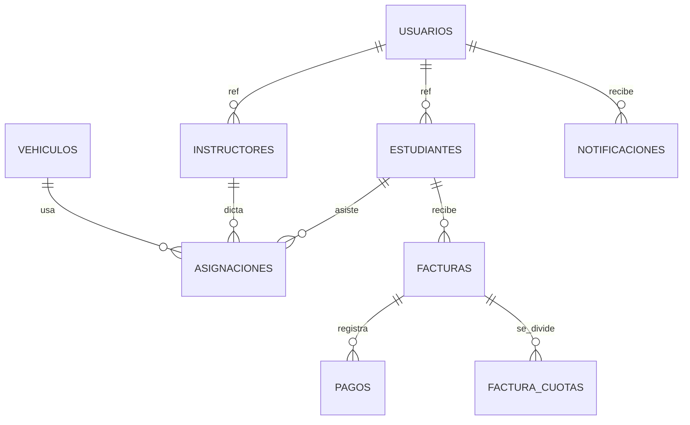

### Diagrama detallado por sub-dominio

Para no sobrecargar un solo diagrama (los renderers Mermaid tienen problemas con +30 nodos), el ER completo está dividido por sub-dominios:

**Sub-dominio Auth + Usuarios:**

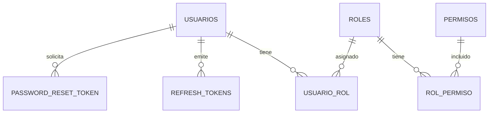

**Sub-dominio Estudiantes:**

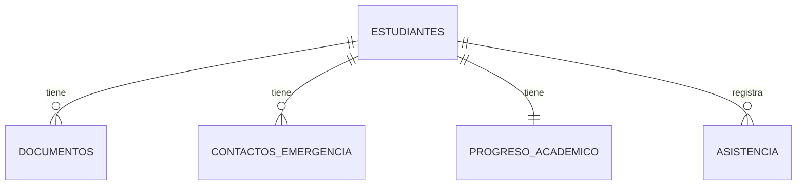

**Sub-dominio Instructores:**

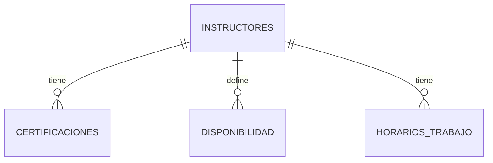

**Sub-dominio Vehículos:**

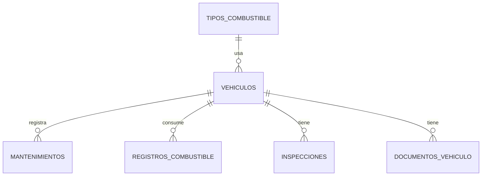

**Sub-dominio Asignaciones:**

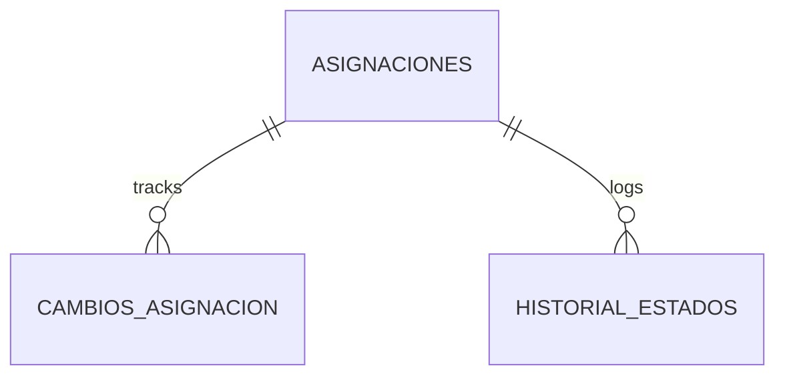

**Sub-dominio Cobros:**

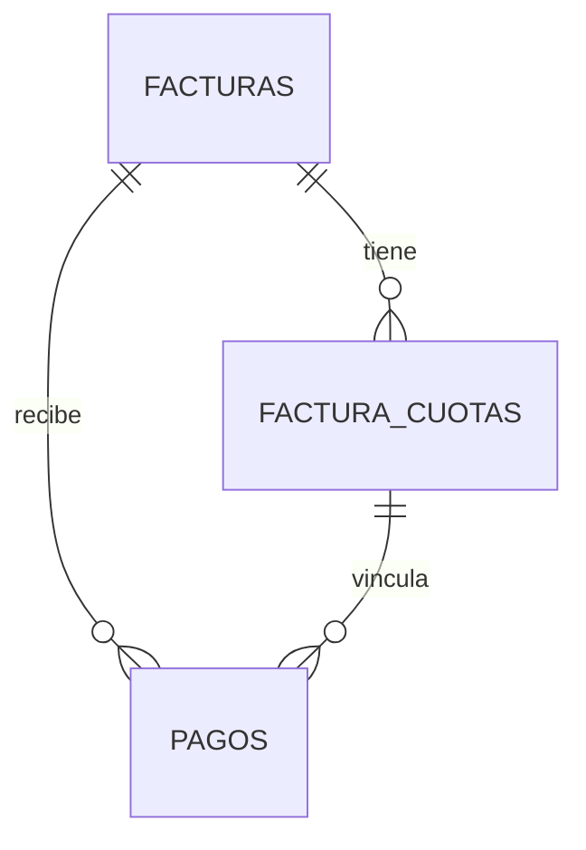

**Sub-dominio Notificaciones:**

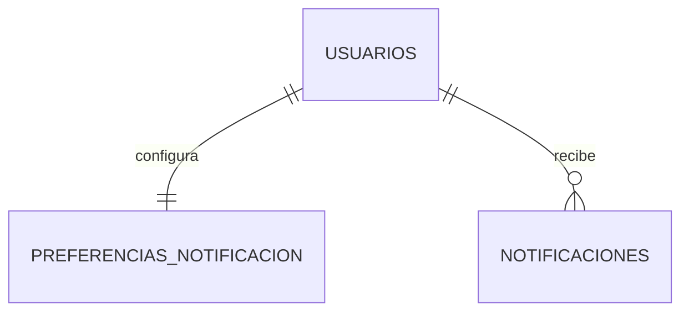

### Interpretación

- Las relaciones con label `ref_*` (ej. `ref_usuario_id`, `ref_estudiante_id`) representan **referencias cross-schema** entre microservicios. Estas relaciones NO tienen FK física a nivel BD; la consistencia se gestiona mediante eventos RabbitMQ y/o llamadas Feign.
- El resto de relaciones son **FKs reales** dentro del mismo schema, con `ON DELETE CASCADE` cuando aplica.
- Las cardinalidades usan notación crow's foot:
  - `||--||` uno a uno (ej. estudiante ↔ progreso académico)
  - `||--o{` uno a muchos (ej. estudiante → documentos)

### Versión alternativa en DBML

Si el renderer Mermaid local no funciona, está disponible el modelo equivalente en formato DBML para [dbdiagram.io](https://dbdiagram.io):

- Archivo: [`er-diagram.dbml`](./er-diagram.dbml)
- Uso: copiar contenido del archivo, pegar en dbdiagram.io, exportar a PNG/SVG/PDF.

---

## 6. Migraciones Flyway aplicadas

> Estado real de migraciones por microservicio al 2026-05-26. Cada MS versiona sus migraciones de forma independiente en `backend/<ms>/src/main/resources/db/migration/`. MS-Auth crea también `shared_schema` en su V1.

### Resumen global

| MS | Migraciones | Total |
|----|-------------|-------|
| `ms-auth` | V1, V1_5 (seed), V2, V3, V4, V5, V6 | 7 |
| `ms-estudiantes` | V1, V2, V3, V4, V5 | 5 |
| `ms-instructores` | V1, V2 | 2 |
| `ms-vehiculos` | V1, V2 | 2 |
| `ms-asignaciones` | V1, V2 | 2 |
| `ms-cobros` | V1, V2 | 2 |
| `ms-notificaciones` | V1 | 1 |
| `ms-reportes` | V1 | 1 |

**Total: 22 migraciones aplicadas.**

### Detalle por microservicio

#### ms-auth

| Migración | Descripción | Sprint |
|-----------|-------------|--------|
| `V1__Initial_Schema.sql` | Crea `shared_schema` + `auth_schema` (usuarios, roles, permisos, junctions, password_reset_token, configuracion_escuela, tipos_curso, conceptos_facturacion, categorias_licencia, plantillas_email, audit_log, processed_events) | Sprint 2 |
| `V1_5__Seed_Data.sql` | Datos seed: roles ADMIN/STAFF/INSTRUCTOR/ESTUDIANTE, permisos, admin@escuela.local, categorías licencia, conceptos facturación, tipos curso, plantillas email, configuración escuela default | Sprint 2 |
| `V2__refresh_tokens.sql` | Tabla `refresh_tokens` para refresh token rotation con JTI (UUID) | Sprint 4 |
| `V3__password_change_required.sql` | Columna `password_change_required` en `usuarios` para forzar cambio en primer login | Sprint 5 |
| `V4__seguridad_configurable.sql` | Parámetros de seguridad configurables en `configuracion_escuela`: `max_intentos_fallidos`, `duracion_bloqueo_minutos`, `expiracion_token_reset_minutos` | Sprint 5 |
| `V5__usuario_datos_personales.sql` | Campos personales en `usuarios`: `cedula`, `fecha_nacimiento`, `genero`, `direccion`, `ciudad`, `provincia` | Sprint 7 |
| `V6__fix_admin_password_hash.sql` | Corrección del hash bcrypt del admin seed para que coincida con `Admin123!` | Sprint 10 |

#### ms-estudiantes

| Migración | Descripción | Sprint |
|-----------|-------------|--------|
| `V1__Initial_Schema.sql` | Crea `estudiantes_schema` con `estudiantes`, `documentos`, `contactos_emergencia`, `progreso_academico`, `asistencia` | Sprint 2 |
| `V2__estados_extendidos.sql` | Estados académicos extendidos (`PRE_MATRICULADO/MATRICULADO/CURSANDO/COMPLETADO/RETIRADO`) + columna `situacion_pago` inicial | Sprint 10 |
| `V3__pendiente_matricula.sql` | Añade `PENDIENTE_MATRICULA` a `situacion_pago` y cambia DEFAULT | Sprint 10 |
| `V4__situacion_pago_simplificada.sql` | Simplifica `situacion_pago` a 4 valores (`PENDIENTE_FACTURACION/PENDIENTE_PAGO/PAGO_PARCIAL/PAGADO_TOTAL`), amplía la columna a `VARCHAR(30)` | Sprint 10 |
| `V5__Add_Horas_Completadas.sql` | Contador `minutos_completados` para auto-transición a `COMPLETADO` | Sprint 10 |

#### ms-instructores

| Migración | Descripción | Sprint |
|-----------|-------------|--------|
| `V1__Initial_Schema.sql` | Crea `instructores_schema` con `instructores`, `certificaciones`, `disponibilidad`, `horarios_trabajo` | Sprint 2 |
| `V2__Add_Contrato_Fields.sql` | Campos de contrato: `tipo_contrato`, `horas_contrato_semanales`, `tarifa_hora` | Sprint 10 |

#### ms-vehiculos

| Migración | Descripción | Sprint |
|-----------|-------------|--------|
| `V1__Initial_Schema.sql` | Crea `vehiculos_schema` con `vehiculos`, `mantenimientos`, `registros_combustible`, `inspecciones`, `documentos_vehiculo` | Sprint 2 |
| `V2__Add_Combustible_Y_Campos_Vehiculo.sql` | Nueva tabla `tipos_combustible` (con seed Ecuador) + campos `numero_motor`, `numero_chasis`, `capacidad_pasajeros`, `tipo_combustible_id` en `vehiculos` | Sprint 10 |

#### ms-asignaciones

| Migración | Descripción | Sprint |
|-----------|-------------|--------|
| `V1__Initial_Schema.sql` | Crea `asignaciones_schema` con `asignaciones`, `cambios_asignacion`, `historial_estados` | Sprint 2 |
| `V2__Add_Kilometraje_Asignacion.sql` | Campos `km_inicial`, `km_final`, `hora_inicio_real`, `hora_fin_real`, `observaciones_recorrido` en `asignaciones` | Sprint 10 |

#### ms-cobros

| Migración | Descripción | Sprint |
|-----------|-------------|--------|
| `V1__Initial_Schema.sql` | Crea `cobros_schema` con `facturas`, `pagos`, `reconciliacion` | Sprint 2 |
| `V2__credito_y_cuotas.sql` | Ampliación de `facturas` (tipo_pago, numero_cuotas, frecuencia_cuota, etc.) + nueva tabla `factura_cuotas` + campos `numero_cuota` y `factura_cuota_id` en `pagos` | Sprint 10 |

#### ms-notificaciones

| Migración | Descripción | Sprint |
|-----------|-------------|--------|
| `V1__Initial_Schema.sql` | Crea `notificaciones_schema` con `notificaciones`, `log_envios_email`, `preferencias_notificacion` | Sprint 2 |

#### ms-reportes

| Migración | Descripción | Sprint |
|-----------|-------------|--------|
| `V1__Initial_Schema.sql` | Crea `reportes_schema` con `cache_reportes`, `ejecuciones_reporte` | Sprint 2 |

### Estrategia Flyway

- Cada microservicio se versiona independientemente.
- MS-Auth crea también `shared_schema` (no es un MS independiente porque solo contiene 2 tablas de uso compartido).
- No hay dependencias entre migraciones de distintos MS.
- Cada servicio puede desplegarse sin esperar a otros.
- Cada PR a `main` agrega como máximo 1 migración nueva por MS (regla de oro para evitar conflictos de versionado en paralelo).

---

## 7. Schema: `auth_schema`

**Microservicio:** MS-Auth (puerto 8081)
**Responsabilidad:** Autenticación, autorización, gestión de usuarios/roles/permisos, recuperación de contraseña, configuración del sistema (single-tenant configurable), catálogos compartidos (tipos de curso, categorías de licencia, conceptos de facturación, plantillas de email).

### Diagrama ER

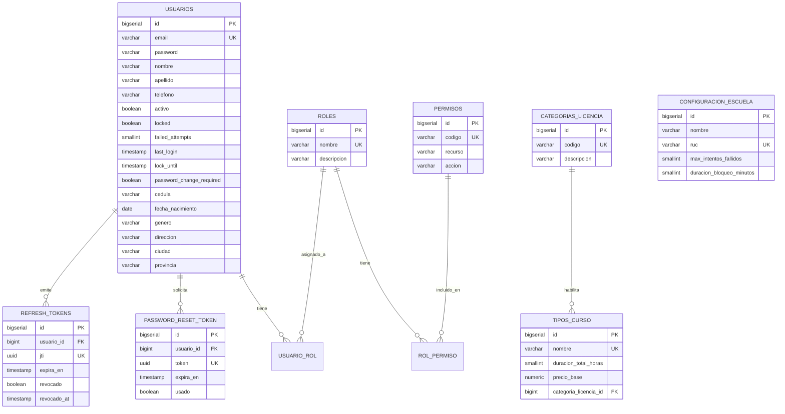

### Tablas

#### `usuarios`

| Columna | Tipo | Constraints | Notas |
|---------|------|-------------|-------|
| `id` | BIGSERIAL | PK | |
| `email` | VARCHAR(255) | UNIQUE, NOT NULL | Validar formato (CHECK + backend) |
| `password` | VARCHAR(60) | NOT NULL | BCrypt cost 10 produce hashes de 60 chars |
| `nombre` | VARCHAR(100) | NOT NULL | |
| `apellido` | VARCHAR(100) | NOT NULL | |
| `telefono` | VARCHAR(10) | | Móvil Ecuador `09XXXXXXXX` |
| `activo` | BOOLEAN | NOT NULL DEFAULT TRUE | |
| `locked` | BOOLEAN | NOT NULL DEFAULT FALSE | Tras N intentos fallidos (configurable) |
| `failed_attempts` | SMALLINT | NOT NULL DEFAULT 0 | Reset al login exitoso |
| `last_login` | TIMESTAMP | | |
| `lock_until` | TIMESTAMP | | Hasta cuándo está bloqueado |
| `password_change_required` | BOOLEAN | NOT NULL DEFAULT FALSE | V3: fuerza cambio al primer login |
| `cedula` | VARCHAR(10) | | V5: cédula Ecuador (opcional) |
| `fecha_nacimiento` | DATE | | V5 |
| `genero` | VARCHAR(1) | | V5: M/F/O |
| `direccion` | VARCHAR(255) | | V5 |
| `ciudad` | VARCHAR(100) | | V5 |
| `provincia` | VARCHAR(100) | | V5 |
| (audit fields + `deleted_at`) | | | |

**Índices:**
- `idx_usuarios_email` ON `email` (búsqueda en login)
- `idx_usuarios_activo_locked` ON `(activo, locked) WHERE deleted_at IS NULL`

#### `roles`

| Columna | Tipo | Constraints |
|---------|------|-------------|
| `id` | BIGSERIAL | PK |
| `nombre` | VARCHAR(50) | UNIQUE, NOT NULL |
| `descripcion` | VARCHAR(255) | |
| (audit fields + `deleted_at`) | | |

**Datos seed:** ADMIN, STAFF, INSTRUCTOR, ESTUDIANTE.

#### `permisos`

| Columna | Tipo | Constraints |
|---------|------|-------------|
| `id` | BIGSERIAL | PK |
| `codigo` | VARCHAR(100) | UNIQUE, NOT NULL |
| `recurso` | VARCHAR(50) | NOT NULL |
| `accion` | VARCHAR(50) | NOT NULL |
| `descripcion` | VARCHAR(255) | |
| (audit fields + `deleted_at`) | | |

**Ejemplos:** `ESTUDIANTES_READ`, `ESTUDIANTES_WRITE`, `COBROS_READ`, `REPORTES_FINANCIEROS_READ`.

#### `usuario_rol` (junction many-to-many)

| Columna | Tipo | Constraints |
|---------|------|-------------|
| `usuario_id` | BIGINT | PK, FK → usuarios(id) |
| `rol_id` | BIGINT | PK, FK → roles(id) |
| `created_at` | TIMESTAMP | NOT NULL DEFAULT NOW() |
| `created_by` | VARCHAR(50) | |

**PK compuesta:** `(usuario_id, rol_id)`.

#### `rol_permiso` (junction many-to-many)

Estructura simétrica a `usuario_rol`, entre `roles` y `permisos`.

#### `password_reset_token`

| Columna | Tipo | Constraints |
|---------|------|-------------|
| `id` | BIGSERIAL | PK |
| `usuario_id` | BIGINT | FK → usuarios(id), NOT NULL |
| `token` | UUID | UNIQUE, NOT NULL DEFAULT `uuid_generate_v4()` |
| `expira_en` | TIMESTAMP | NOT NULL |
| `usado` | BOOLEAN | NOT NULL DEFAULT FALSE |
| `created_at` | TIMESTAMP | NOT NULL DEFAULT NOW() |

**Índice:** `idx_password_reset_token_token` ON `token`.

#### `refresh_tokens` (V2)

> No usa BaseEntity. Soporta refresh token rotation (cada uso genera uno nuevo y revoca el anterior, detección de tokens robados).

| Columna | Tipo | Constraints |
|---------|------|-------------|
| `id` | BIGSERIAL | PK |
| `usuario_id` | BIGINT | NOT NULL, FK → usuarios(id) ON DELETE CASCADE |
| `jti` | UUID | UNIQUE, NOT NULL |
| `expira_en` | TIMESTAMP | NOT NULL |
| `revocado` | BOOLEAN | NOT NULL DEFAULT FALSE |
| `created_at` | TIMESTAMP | NOT NULL DEFAULT NOW() |
| `revocado_at` | TIMESTAMP | |

**Índices:**
- `idx_refresh_tokens_usuario_revocado` ON `(usuario_id, revocado)`
- `idx_refresh_tokens_expira` ON `expira_en WHERE revocado = FALSE`

#### `configuracion_escuela` (single-tenant configurable)

> Tabla con UNA SOLA fila. Contiene los parámetros configurables de la escuela cliente.

| Columna | Tipo | Constraints | Notas |
|---------|------|-------------|-------|
| `id` | BIGSERIAL | PK | |
| `nombre` | VARCHAR(255) | NOT NULL | Nombre comercial de la escuela |
| `ruc` | VARCHAR(13) | UNIQUE, NOT NULL | RUC Ecuador |
| `direccion` | TEXT | | |
| `telefono` | VARCHAR(20) | | |
| `email` | VARCHAR(255) | | |
| `logo_url` | VARCHAR(500) | | URL en MinIO |
| `color_primario` | VARCHAR(7) | | Hex color |
| `color_secundario` | VARCHAR(7) | | Hex color |
| `duracion_clase_default_min` | SMALLINT | NOT NULL DEFAULT 60 | |
| `horario_apertura` | TIME | | |
| `horario_cierre` | TIME | | |
| `horas_recordatorio_clase` | SMALLINT | NOT NULL DEFAULT 24 | |
| `dias_alerta_soat` | SMALLINT | NOT NULL DEFAULT 30 | |
| `max_intentos_fallidos` | SMALLINT | NOT NULL DEFAULT 3, CHECK 1-10 | V4 |
| `duracion_bloqueo_minutos` | SMALLINT | NOT NULL DEFAULT 15, CHECK 1-1440 | V4 |
| `expiracion_token_reset_minutos` | SMALLINT | NOT NULL DEFAULT 60, CHECK 5-1440 | V4 |
| (audit fields) | | | |

#### `tipos_curso`

| Columna | Tipo | Constraints |
|---------|------|-------------|
| `id` | BIGSERIAL | PK |
| `nombre` | VARCHAR(100) | UNIQUE, NOT NULL |
| `descripcion` | TEXT | |
| `duracion_total_horas` | SMALLINT | NOT NULL |
| `precio_base` | NUMERIC(10,2) | NOT NULL CHECK (`precio_base > 0`) |
| `categoria_licencia_id` | BIGINT | FK → categorias_licencia(id) |
| `activo` | BOOLEAN | NOT NULL DEFAULT TRUE |
| (audit fields + `deleted_at`) | | |

#### `conceptos_facturacion`

| Columna | Tipo | Constraints |
|---------|------|-------------|
| `id` | BIGSERIAL | PK |
| `nombre` | VARCHAR(100) | UNIQUE, NOT NULL |
| `monto_base` | NUMERIC(10,2) | NOT NULL CHECK (`monto_base > 0`) |
| `descripcion` | TEXT | |
| `activo` | BOOLEAN | NOT NULL DEFAULT TRUE |
| (audit fields + `deleted_at`) | | |

#### `categorias_licencia`

| Columna | Tipo | Constraints |
|---------|------|-------------|
| `id` | BIGSERIAL | PK |
| `codigo` | VARCHAR(20) | UNIQUE, NOT NULL |
| `descripcion` | VARCHAR(255) | NOT NULL |
| `activa` | BOOLEAN | NOT NULL DEFAULT TRUE |
| (audit fields + `deleted_at`) | | |

#### `plantillas_email`

| Columna | Tipo | Constraints |
|---------|------|-------------|
| `id` | BIGSERIAL | PK |
| `codigo` | VARCHAR(100) | UNIQUE, NOT NULL |
| `asunto` | VARCHAR(255) | NOT NULL |
| `cuerpo_html` | TEXT | NOT NULL |
| `variables` | JSONB | Variables disponibles |
| `activa` | BOOLEAN | NOT NULL DEFAULT TRUE |
| (audit fields + `deleted_at`) | | |

---

## 8. Schema: `estudiantes_schema`

**Microservicio:** MS-Estudiantes (puerto 8082)
**Responsabilidad:** Gestión completa de estudiantes: matrícula, documentos, contactos, progreso académico, asistencia. Mantiene `situacion_pago` sincronizada desde MS-Cobros vía evento `pago.registrado` y `minutos_completados` sincronizado desde MS-Asignaciones cuando se finaliza una clase.

### Diagrama ER

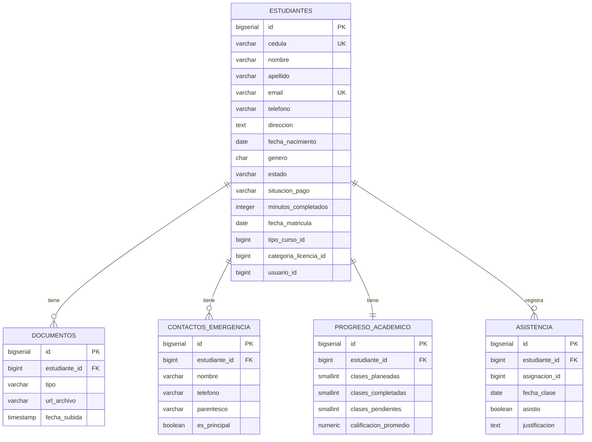

### Tablas

#### `estudiantes`

| Columna | Tipo | Constraints | Notas |
|---------|------|-------------|-------|
| `id` | BIGSERIAL | PK | |
| `cedula` | VARCHAR(10) | UNIQUE, NOT NULL, CHECK formato | Cédula Ecuador |
| `nombre` | VARCHAR(100) | NOT NULL | |
| `apellido` | VARCHAR(100) | NOT NULL | |
| `email` | VARCHAR(255) | UNIQUE, NOT NULL | |
| `telefono` | VARCHAR(10) | NOT NULL | Móvil `09XXXXXXXX` |
| `direccion` | TEXT | | |
| `fecha_nacimiento` | DATE | NOT NULL | |
| `genero` | CHAR(1) | CHECK (`genero IN ('M','F','O')`) | |
| `estado` | VARCHAR(20) | NOT NULL CHECK | Ver enum más abajo |
| `situacion_pago` | VARCHAR(30) | NOT NULL DEFAULT `'PENDIENTE_FACTURACION'`, CHECK | V2/V3/V4 |
| `minutos_completados` | INTEGER | NOT NULL DEFAULT 0, CHECK ≥ 0 | V5 |
| `fecha_matricula` | DATE | | Se setea cuando pasa a MATRICULADO |
| `tipo_curso_id` | BIGINT | | Ref `auth_schema.tipos_curso` |
| `categoria_licencia_id` | BIGINT | | Ref `auth_schema.categorias_licencia` |
| `usuario_id` | BIGINT | | Ref `auth_schema.usuarios` (si tiene login) |
| `observaciones` | TEXT | | |
| (audit fields + `deleted_at`) | | | |

**Enum `estado` (V2):**

```
PRE_MATRICULADO  -> registrado, aún no paga la matrícula
MATRICULADO      -> primera factura emitida y pagada total (o crédito emitido)
CURSANDO         -> primera asignación completada
COMPLETADO       -> minutos_completados >= duracion_total_horas * 60
RETIRADO         -> abandono (transición manual desde cualquier estado)
```

**Enum `situacion_pago` (V4, simplificado):**

```
PENDIENTE_FACTURACION  -> sin factura emitida
PENDIENTE_PAGO         -> factura CONTADO emitida, $0 pagado
PAGO_PARCIAL           -> factura CONTADO con saldo
PAGADO_TOTAL           -> todo saldado (CONTADO) o crédito emitido (asume cobro automático)
```

**Regla de negocio:** un estudiante solo puede recibir asignaciones de clase cuando está en `MATRICULADO` o `CURSANDO`, lo cual ocurre cuando `situacion_pago = 'PAGADO_TOTAL'`.

**Índices:**
- `idx_estudiantes_cedula` ON `cedula`
- `idx_estudiantes_email` ON `email`
- `idx_estudiantes_estado` ON `estado WHERE deleted_at IS NULL`
- `idx_estudiantes_situacion_pago` ON `situacion_pago WHERE deleted_at IS NULL`
- `idx_estudiantes_apellido_nombre` ON `(apellido, nombre)`

#### `documentos`

| Columna | Tipo | Constraints |
|---------|------|-------------|
| `id` | BIGSERIAL | PK |
| `estudiante_id` | BIGINT | FK → estudiantes(id) ON DELETE CASCADE, NOT NULL |
| `tipo` | VARCHAR(30) | NOT NULL CHECK (`CEDULA_FRENTE/CEDULA_REVERSO/FOTO/EXAMEN_MEDICO/OTRO`) |
| `url_archivo` | VARCHAR(500) | NOT NULL |
| `fecha_subida` | TIMESTAMP | NOT NULL DEFAULT NOW() |
| `mime_type` | VARCHAR(100) | |
| `tamano_bytes` | BIGINT | |
| (audit fields + `deleted_at`) | | |

#### `contactos_emergencia`

| Columna | Tipo | Constraints |
|---------|------|-------------|
| `id` | BIGSERIAL | PK |
| `estudiante_id` | BIGINT | FK → estudiantes(id) ON DELETE CASCADE, NOT NULL |
| `nombre` | VARCHAR(200) | NOT NULL |
| `telefono` | VARCHAR(15) | NOT NULL |
| `parentesco` | VARCHAR(50) | |
| `es_principal` | BOOLEAN | NOT NULL DEFAULT FALSE |
| (audit fields + `deleted_at`) | | |

#### `progreso_academico`

> Una fila por estudiante. Se actualiza vía consumo de eventos `asignacion.completada` y vía cálculo on-the-fly contra `tipo_curso`.

| Columna | Tipo | Constraints |
|---------|------|-------------|
| `id` | BIGSERIAL | PK |
| `estudiante_id` | BIGINT | UNIQUE, FK → estudiantes(id) ON DELETE CASCADE, NOT NULL |
| `clases_planeadas` | SMALLINT | NOT NULL DEFAULT 0 |
| `clases_completadas` | SMALLINT | NOT NULL DEFAULT 0 |
| `clases_pendientes` | SMALLINT | NOT NULL DEFAULT 0 |
| `clases_canceladas` | SMALLINT | NOT NULL DEFAULT 0 |
| `calificacion_promedio` | NUMERIC(4,2) | CHECK 0–100 |
| `aprobado` | BOOLEAN | |
| (audit fields) | | |

#### `asistencia`

| Columna | Tipo | Constraints |
|---------|------|-------------|
| `id` | BIGSERIAL | PK |
| `estudiante_id` | BIGINT | FK → estudiantes(id), NOT NULL |
| `asignacion_id` | BIGINT | NOT NULL — Ref `asignaciones_schema.asignaciones` |
| `fecha_clase` | DATE | NOT NULL |
| `asistio` | BOOLEAN | NOT NULL |
| `justificacion` | TEXT | |
| `observaciones` | TEXT | |
| (audit fields) | | |

**Índices:**
- `idx_asistencia_estudiante_fecha` ON `(estudiante_id, fecha_clase)`
- `uq_asistencia_estudiante_asignacion` UNIQUE ON `(estudiante_id, asignacion_id)`

---

## 9. Schema: `instructores_schema`

**Microservicio:** MS-Instructores (puerto 8083)
**Responsabilidad:** Gestión de instructores, certificaciones, disponibilidad horaria, contratos.

### Diagrama ER

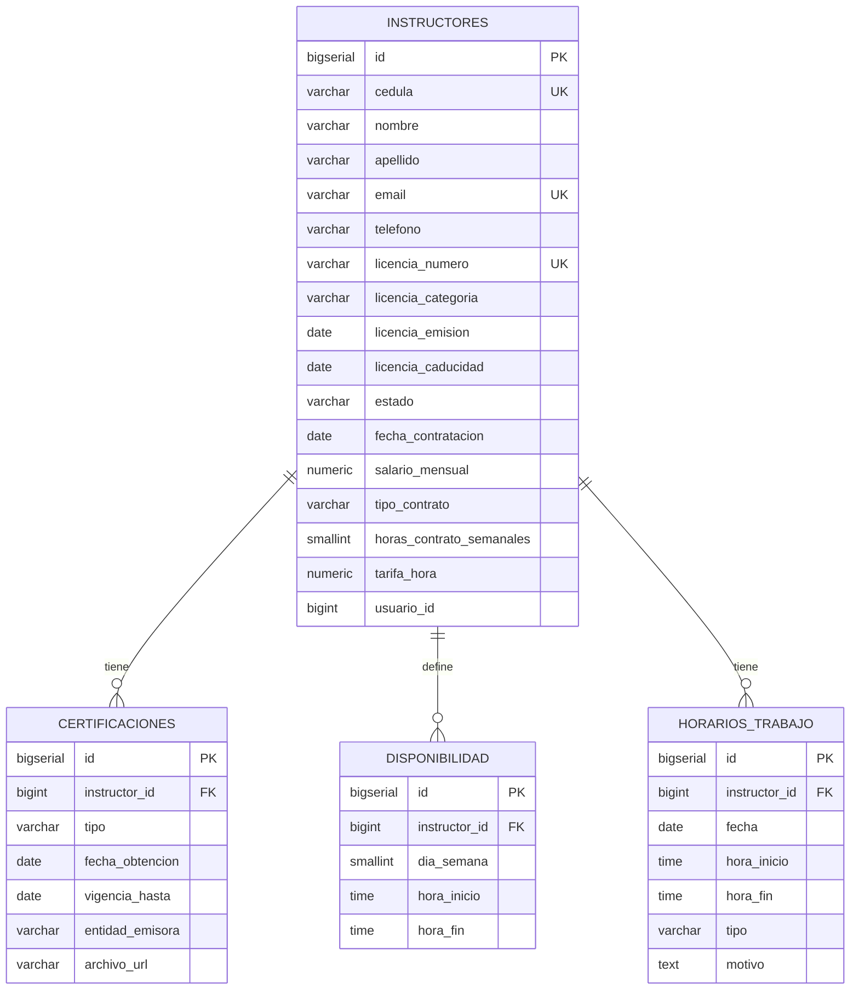

### Tablas

#### `instructores`

| Columna | Tipo | Constraints |
|---------|------|-------------|
| `id` | BIGSERIAL | PK |
| `cedula` | VARCHAR(10) | UNIQUE, NOT NULL, CHECK formato |
| `nombre` | VARCHAR(100) | NOT NULL |
| `apellido` | VARCHAR(100) | NOT NULL |
| `email` | VARCHAR(255) | UNIQUE, NOT NULL |
| `telefono` | VARCHAR(10) | NOT NULL |
| `direccion` | TEXT | |
| `fecha_nacimiento` | DATE | |
| `licencia_numero` | VARCHAR(50) | UNIQUE, NOT NULL |
| `licencia_categoria` | VARCHAR(20) | NOT NULL |
| `licencia_emision` | DATE | NOT NULL |
| `licencia_caducidad` | DATE | NOT NULL |
| `estado` | VARCHAR(20) | NOT NULL CHECK (`ACTIVO/INACTIVO/SUSPENDIDO`) |
| `fecha_contratacion` | DATE | |
| `salario_mensual` | NUMERIC(10,2) | CHECK ≥ 0 |
| `tipo_contrato` | VARCHAR(20) | NOT NULL DEFAULT `'TIEMPO_COMPLETO'`, CHECK | V2 |
| `horas_contrato_semanales` | SMALLINT | NOT NULL DEFAULT 40, CHECK 1–60 | V2 |
| `tarifa_hora` | NUMERIC(8,2) | CHECK (NULL OR > 0) | V2 |
| `usuario_id` | BIGINT | Ref `auth_schema.usuarios` |
| `observaciones` | TEXT | |
| (audit fields + `deleted_at`) | | |

**Constraint compuesto V2:** `CHECK (tipo_contrato <> 'POR_HORAS' OR tarifa_hora IS NOT NULL)` — si el contrato es POR_HORAS, la tarifa es obligatoria.

**Enum `tipo_contrato`:**

```
TIEMPO_COMPLETO  -> default, 40h/semana, sin tarifa_hora obligatoria
MEDIO_TIEMPO     -> ~20h/semana, sin tarifa obligatoria
POR_HORAS        -> hasta el máximo configurado, tarifa_hora obligatoria
```

**Índices:**
- `idx_instructores_cedula` ON `cedula`
- `idx_instructores_licencia` ON `licencia_numero`
- `idx_instructores_estado` ON `estado WHERE deleted_at IS NULL`
- `idx_instructores_tipo_contrato` ON `tipo_contrato WHERE deleted_at IS NULL`

#### `certificaciones`

| Columna | Tipo | Constraints |
|---------|------|-------------|
| `id` | BIGSERIAL | PK |
| `instructor_id` | BIGINT | FK → instructores(id), NOT NULL |
| `tipo` | VARCHAR(100) | NOT NULL |
| `fecha_obtencion` | DATE | NOT NULL |
| `vigencia_hasta` | DATE | |
| `entidad_emisora` | VARCHAR(255) | |
| `archivo_url` | VARCHAR(500) | |
| `observaciones` | TEXT | |
| (audit fields + `deleted_at`) | | |

#### `disponibilidad`

> Disponibilidad recurrente semanal del instructor.

| Columna | Tipo | Constraints |
|---------|------|-------------|
| `id` | BIGSERIAL | PK |
| `instructor_id` | BIGINT | FK → instructores(id), NOT NULL |
| `dia_semana` | SMALLINT | NOT NULL CHECK 1–7 (1=Lun, 7=Dom) |
| `hora_inicio` | TIME | NOT NULL |
| `hora_fin` | TIME | NOT NULL CHECK (`hora_fin > hora_inicio`) |
| (audit fields + `deleted_at`) | | |

**Índice único:** `uq_disponibilidad_instructor_dia_hora` ON `(instructor_id, dia_semana, hora_inicio) WHERE deleted_at IS NULL`.

#### `horarios_trabajo`

> Excepciones a la disponibilidad semanal: turnos extra o ausencias específicas.

| Columna | Tipo | Constraints |
|---------|------|-------------|
| `id` | BIGSERIAL | PK |
| `instructor_id` | BIGINT | FK → instructores(id), NOT NULL |
| `fecha` | DATE | NOT NULL |
| `hora_inicio` | TIME | |
| `hora_fin` | TIME | |
| `tipo` | VARCHAR(20) | NOT NULL CHECK (`EXTRA/AUSENCIA`) |
| `motivo` | TEXT | |
| (audit fields + `deleted_at`) | | |

> MS-Asignaciones consulta esta tabla vía Feign para validar que el instructor no esté en `AUSENCIA` al crear una asignación (ver [17. Validaciones obligatorias al crear asignación](#17-validaciones-obligatorias-al-crear-asignación)).

---

## 10. Schema: `vehiculos_schema`

**Microservicio:** MS-Vehículos (puerto 8084)
**Responsabilidad:** Flota vehicular, mantenimientos, combustible, inspecciones, documentación, catálogo de tipos de combustible.

### Diagrama ER

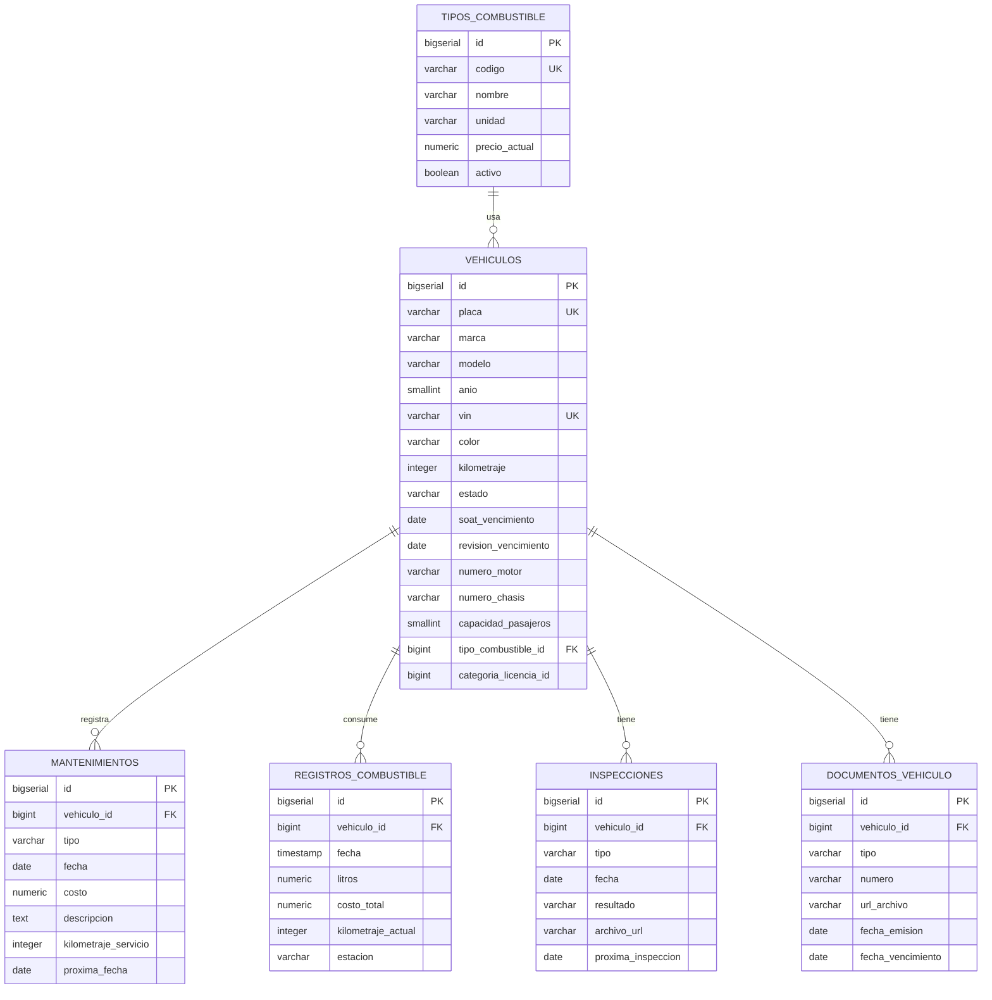

### Tablas

#### `vehiculos`

| Columna | Tipo | Constraints |
|---------|------|-------------|
| `id` | BIGSERIAL | PK |
| `placa` | VARCHAR(8) | UNIQUE, NOT NULL, CHECK formato |
| `marca` | VARCHAR(50) | NOT NULL |
| `modelo` | VARCHAR(50) | NOT NULL |
| `anio` | SMALLINT | NOT NULL CHECK 1990–2050 |
| `vin` | VARCHAR(17) | UNIQUE |
| `color` | VARCHAR(30) | |
| `kilometraje` | INTEGER | NOT NULL DEFAULT 0, CHECK ≥ 0 |
| `estado` | VARCHAR(20) | NOT NULL CHECK (`ACTIVO/MANTENIMIENTO/FUERA_SERVICIO`) |
| `soat_vencimiento` | DATE | |
| `revision_vencimiento` | DATE | RTV (revisión técnica vehicular) |
| `fecha_compra` | DATE | |
| `valor_compra` | NUMERIC(10,2) | CHECK ≥ 0 |
| `categoria_licencia_id` | BIGINT | Ref `auth_schema.categorias_licencia` |
| `numero_motor` | VARCHAR(50) | V2 — aparece en matrícula |
| `numero_chasis` | VARCHAR(50) | V2 — puede coincidir con VIN |
| `capacidad_pasajeros` | SMALLINT | V2, CHECK NULL OR 1–100 |
| `tipo_combustible_id` | BIGINT | V2, FK → tipos_combustible(id) |
| `observaciones` | TEXT | |
| (audit fields + `deleted_at`) | | |

**Índices:**
- `idx_vehiculos_placa` ON `placa`
- `idx_vehiculos_estado` ON `estado WHERE deleted_at IS NULL`
- `idx_vehiculos_soat_proximo` ON `soat_vencimiento WHERE deleted_at IS NULL` (alertas)
- `idx_vehiculos_tipo_combustible` ON `tipo_combustible_id WHERE deleted_at IS NULL`

#### `tipos_combustible` (V2)

> Catálogo configurable. Cuando el precio público cambia, el admin actualiza `precio_actual` y los siguientes registros de combustible toman el valor nuevo.

| Columna | Tipo | Constraints |
|---------|------|-------------|
| `id` | BIGSERIAL | PK |
| `codigo` | VARCHAR(20) | UNIQUE, NOT NULL |
| `nombre` | VARCHAR(100) | NOT NULL |
| `unidad` | VARCHAR(20) | NOT NULL DEFAULT `'GALON'`, CHECK (`GALON/LITRO/KWH`) |
| `precio_actual` | NUMERIC(8,4) | NOT NULL CHECK > 0 |
| `activo` | BOOLEAN | NOT NULL DEFAULT TRUE |
| `observaciones` | TEXT | |
| (audit fields parciales) | | |

**Índice:** `idx_tipos_combustible_activo` ON `activo`.

**Datos seed (precios referenciales 2026):**

| Código | Nombre | Unidad | Precio |
|--------|--------|--------|--------|
| EXTRA | Gasolina Extra (87 octanos) | GALON | 2.4600 |
| ECOPAIS | Gasolina Ecopaís (87 oct + etanol) | GALON | 2.4600 |
| SUPER | Gasolina Súper (92 octanos) | GALON | 3.8500 |
| DIESEL | Diésel Premium | GALON | 1.8000 |
| ELECTRICO | Energía eléctrica | KWH | 0.1100 |

#### `mantenimientos`

| Columna | Tipo | Constraints |
|---------|------|-------------|
| `id` | BIGSERIAL | PK |
| `vehiculo_id` | BIGINT | FK → vehiculos(id), NOT NULL |
| `tipo` | VARCHAR(20) | NOT NULL CHECK (`PREVENTIVO/CORRECTIVO`) |
| `fecha` | DATE | NOT NULL |
| `costo` | NUMERIC(10,2) | NOT NULL CHECK ≥ 0 |
| `descripcion` | TEXT | NOT NULL |
| `taller` | VARCHAR(255) | |
| `kilometraje_servicio` | INTEGER | |
| `proxima_fecha` | DATE | |
| `proximo_kilometraje` | INTEGER | |
| `archivo_factura_url` | VARCHAR(500) | |
| (audit fields + `deleted_at`) | | |

#### `registros_combustible`

| Columna | Tipo | Constraints |
|---------|------|-------------|
| `id` | BIGSERIAL | PK |
| `vehiculo_id` | BIGINT | FK → vehiculos(id), NOT NULL |
| `fecha` | TIMESTAMP | NOT NULL |
| `litros` | NUMERIC(8,2) | NOT NULL CHECK > 0 |
| `costo_total` | NUMERIC(10,2) | NOT NULL CHECK > 0 |
| `costo_por_litro` | NUMERIC(8,4) | GENERATED ALWAYS AS (`costo_total / litros`) STORED |
| `kilometraje_actual` | INTEGER | NOT NULL |
| `estacion` | VARCHAR(255) | |
| (audit fields) | | |

**Índice:** `idx_combustible_vehiculo_fecha` ON `(vehiculo_id, fecha DESC)`.

#### `inspecciones`

| Columna | Tipo | Constraints |
|---------|------|-------------|
| `id` | BIGSERIAL | PK |
| `vehiculo_id` | BIGINT | FK → vehiculos(id), NOT NULL |
| `tipo` | VARCHAR(20) | NOT NULL CHECK (`TECNICA/SOAT/INTERNA`) |
| `fecha` | DATE | NOT NULL |
| `resultado` | VARCHAR(20) | NOT NULL CHECK (`APROBADA/REPROBADA/CONDICIONADA`) |
| `archivo_url` | VARCHAR(500) | |
| `observaciones` | TEXT | |
| `proxima_inspeccion` | DATE | |
| (audit fields + `deleted_at`) | | |

#### `documentos_vehiculo`

| Columna | Tipo | Constraints |
|---------|------|-------------|
| `id` | BIGSERIAL | PK |
| `vehiculo_id` | BIGINT | FK → vehiculos(id), NOT NULL |
| `tipo` | VARCHAR(50) | NOT NULL |
| `numero` | VARCHAR(100) | |
| `url_archivo` | VARCHAR(500) | NOT NULL |
| `fecha_emision` | DATE | |
| `fecha_vencimiento` | DATE | |
| (audit fields + `deleted_at`) | | |

---

## 11. Schema: `asignaciones_schema`

**Microservicio:** MS-Asignaciones (puerto 8085)
**Responsabilidad:** Programación tripartita de clases (instructor + estudiante + vehículo + horario), reprogramaciones, historial, registro de kilometraje E2E.

### Diagrama ER

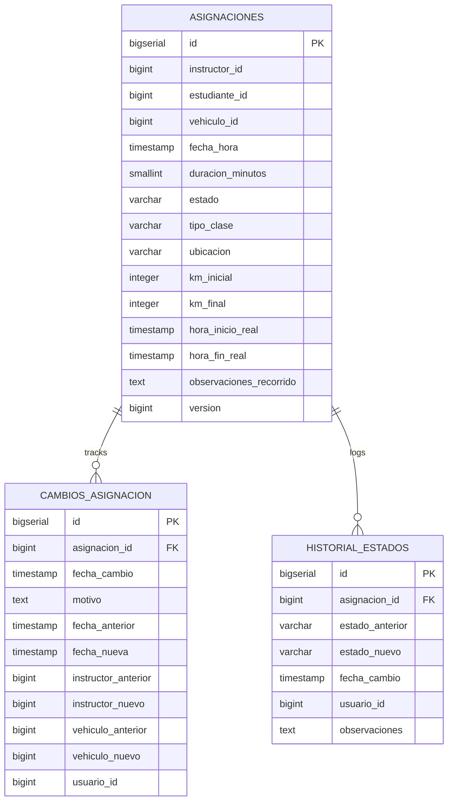

> Las columnas `instructor_id`, `estudiante_id` y `vehiculo_id` en `asignaciones` son referencias cross-schema (sin FK física). Ver [16. Relaciones cross-microservicio](#16-relaciones-cross-microservicio).

### Tablas

#### `asignaciones`

| Columna | Tipo | Constraints |
|---------|------|-------------|
| `id` | BIGSERIAL | PK |
| `instructor_id` | BIGINT | NOT NULL | Ref `instructores_schema.instructores` |
| `estudiante_id` | BIGINT | NOT NULL | Ref `estudiantes_schema.estudiantes` |
| `vehiculo_id` | BIGINT | NOT NULL | Ref `vehiculos_schema.vehiculos` |
| `fecha_hora` | TIMESTAMP | NOT NULL |
| `duracion_minutos` | SMALLINT | NOT NULL DEFAULT 60, CHECK > 0 |
| `estado` | VARCHAR(20) | NOT NULL CHECK (`PROGRAMADA/CONFIRMADA/EN_CURSO/COMPLETADA/CANCELADA/NO_ASISTIO`) |
| `tipo_clase` | VARCHAR(20) | NOT NULL CHECK (`TEORICA/PRACTICA/EXAMEN`) |
| `ubicacion` | VARCHAR(255) | |
| `observaciones` | TEXT | |
| `motivo_cancelacion` | TEXT | |
| `km_inicial` | INTEGER | V2, CHECK NULL OR ≥ 0 |
| `km_final` | INTEGER | V2, CHECK NULL OR ≥ 0 |
| `hora_inicio_real` | TIMESTAMP | V2 — puede diferir de `fecha_hora` programada |
| `hora_fin_real` | TIMESTAMP | V2 |
| `observaciones_recorrido` | TEXT | V2 — notas del instructor |
| `version` | BIGINT | NOT NULL DEFAULT 0 | Optimistic locking |
| (audit fields + `deleted_at`) | | |

**Constraint V2:** `CHECK (km_final IS NULL OR km_inicial IS NULL OR km_final >= km_inicial)`.

**Flujo de kilometraje (V2):**

1. Al iniciar la clase: el instructor registra `km_inicial` + `hora_inicio_real`.
2. Al finalizar: registra `km_final` + `hora_fin_real`. Se publica `AsignacionCompletadaEvent`.
3. Consumido por MS-Vehículos (PUT del odómetro vía Feign, no PATCH por limitación de Feign HttpURLConnection).
4. Consumido por MS-Estudiantes (incremento de `minutos_completados` y recálculo de progreso vía Feign `TipoCursoClient`).

**Índices:**
- `idx_asignaciones_instructor_fecha` ON `(instructor_id, fecha_hora)`
- `idx_asignaciones_estudiante_fecha` ON `(estudiante_id, fecha_hora)`
- `idx_asignaciones_vehiculo_fecha` ON `(vehiculo_id, fecha_hora)`
- `idx_asignaciones_estado_fecha` ON `(estado, fecha_hora)`

> **Validación de no-overlap:** se ejecuta en aplicación al crear/reprogramar (no en BD por complejidad de los rangos temporales). Las 6 validaciones obligatorias completas están descritas en [17. Validaciones obligatorias al crear asignación](#17-validaciones-obligatorias-al-crear-asignación).

#### `cambios_asignacion`

| Columna | Tipo | Constraints |
|---------|------|-------------|
| `id` | BIGSERIAL | PK |
| `asignacion_id` | BIGINT | FK → asignaciones(id), NOT NULL |
| `fecha_cambio` | TIMESTAMP | NOT NULL DEFAULT NOW() |
| `motivo` | TEXT | NOT NULL |
| `fecha_anterior` | TIMESTAMP | |
| `fecha_nueva` | TIMESTAMP | |
| `instructor_anterior` | BIGINT | |
| `instructor_nuevo` | BIGINT | |
| `vehiculo_anterior` | BIGINT | |
| `vehiculo_nuevo` | BIGINT | |
| `usuario_id` | BIGINT | NOT NULL — quien hizo el cambio |
| (audit fields) | | |

#### `historial_estados`

| Columna | Tipo | Constraints |
|---------|------|-------------|
| `id` | BIGSERIAL | PK |
| `asignacion_id` | BIGINT | FK → asignaciones(id), NOT NULL |
| `estado_anterior` | VARCHAR(20) | |
| `estado_nuevo` | VARCHAR(20) | NOT NULL |
| `fecha_cambio` | TIMESTAMP | NOT NULL DEFAULT NOW() |
| `usuario_id` | BIGINT | |
| `observaciones` | TEXT | |
| (audit fields) | | |

---

## 12. Schema: `cobros_schema`

**Microservicio:** MS-Cobros (puerto 8086)
**Responsabilidad:** Facturación, pagos (parciales y a crédito), cuotas, reconciliación diaria de caja.

### Diagrama ER

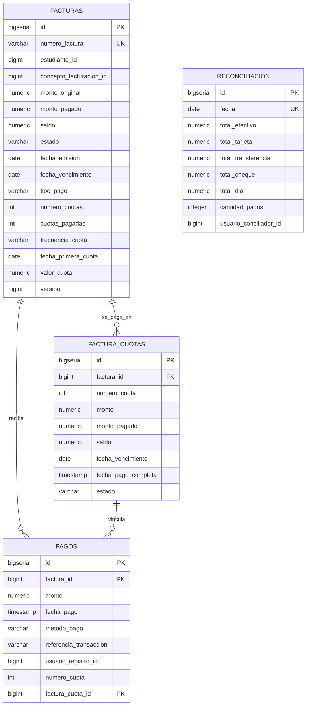

### Modelo de pago a crédito (V2)

Una factura puede emitirse en dos modalidades:

- **CONTADO:** `numero_cuotas = 1`, no se generan registros en `factura_cuotas`. Se paga directamente contra la factura.
- **CREDITO:** `numero_cuotas ≥ 2`, se genera 1 registro en `factura_cuotas` por cuota con su fecha de vencimiento y monto. Cada pago se vincula opcionalmente a una cuota específica vía `pagos.factura_cuota_id`.

El campo `valor_cuota = monto_original / numero_cuotas` se persiste para evitar recálculos. El estado de la factura se deriva del estado conjunto de sus cuotas.

### Tablas

#### `facturas`

| Columna | Tipo | Constraints |
|---------|------|-------------|
| `id` | BIGSERIAL | PK |
| `numero_factura` | VARCHAR(20) | UNIQUE, NOT NULL — formato `YYYYMM-####` |
| `estudiante_id` | BIGINT | NOT NULL | Ref `estudiantes_schema.estudiantes` |
| `concepto_facturacion_id` | BIGINT | NOT NULL | Ref `auth_schema.conceptos_facturacion` |
| `descripcion` | VARCHAR(255) | |
| `monto_original` | NUMERIC(10,2) | NOT NULL CHECK > 0 |
| `monto_pagado` | NUMERIC(10,2) | NOT NULL DEFAULT 0, CHECK ≥ 0 |
| `saldo` | NUMERIC(10,2) | GENERATED ALWAYS AS (`monto_original - monto_pagado`) STORED |
| `estado` | VARCHAR(20) | NOT NULL CHECK (`PENDIENTE/PARCIAL/PAGADA/PAGADO/VENCIDA/ANULADA`) |
| `fecha_emision` | DATE | NOT NULL DEFAULT CURRENT_DATE |
| `fecha_vencimiento` | DATE | NOT NULL |
| `motivo_anulacion` | TEXT | |
| `tipo_pago` | VARCHAR(20) | NOT NULL DEFAULT `'CONTADO'`, CHECK | V2 |
| `numero_cuotas` | INT | NOT NULL DEFAULT 1, CHECK 1–24 | V2 |
| `cuotas_pagadas` | INT | NOT NULL DEFAULT 0, CHECK 0–`numero_cuotas` | V2 |
| `frecuencia_cuota` | VARCHAR(20) | CHECK NULL OR `MENSUAL/QUINCENAL/SEMANAL` | V2 |
| `fecha_primera_cuota` | DATE | | V2 |
| `valor_cuota` | NUMERIC(10,2) | `monto_original / numero_cuotas` | V2 |
| `version` | BIGINT | NOT NULL DEFAULT 0 | Optimistic locking |
| (audit fields + `deleted_at`) | | |

**Constraint clave V2:**
```sql
CHECK (
    (tipo_pago = 'CONTADO'  AND numero_cuotas = 1)
 OR (tipo_pago = 'CREDITO'  AND numero_cuotas >= 2
                            AND frecuencia_cuota IS NOT NULL
                            AND fecha_primera_cuota IS NOT NULL)
)
```

**Constraint adicional:** `CHECK (monto_pagado <= monto_original)`.

**Índices:**
- `idx_facturas_numero` ON `numero_factura`
- `idx_facturas_estudiante` ON `estudiante_id`
- `idx_facturas_estado_vencimiento` ON `(estado, fecha_vencimiento) WHERE deleted_at IS NULL`

#### `factura_cuotas` (V2)

> Fuente de verdad de las cuotas cuando `facturas.tipo_pago = 'CREDITO'`. No se pueblan si la factura es CONTADO.

| Columna | Tipo | Constraints |
|---------|------|-------------|
| `id` | BIGSERIAL | PK |
| `factura_id` | BIGINT | NOT NULL, FK → facturas(id) ON DELETE CASCADE |
| `numero_cuota` | INT | NOT NULL CHECK ≥ 1 |
| `monto` | NUMERIC(10,2) | NOT NULL CHECK > 0 |
| `monto_pagado` | NUMERIC(10,2) | NOT NULL DEFAULT 0, CHECK 0–`monto` |
| `saldo` | NUMERIC(10,2) | GENERATED ALWAYS AS (`monto - monto_pagado`) STORED |
| `fecha_vencimiento` | DATE | NOT NULL |
| `fecha_pago_completa` | TIMESTAMP | |
| `estado` | VARCHAR(20) | NOT NULL DEFAULT `'PENDIENTE'`, CHECK (`PENDIENTE/PARCIAL/PAGADA/VENCIDA`) |
| `created_at` | TIMESTAMP | NOT NULL DEFAULT NOW() |
| `updated_at` | TIMESTAMP | |

**Constraint único:** `uq_factura_cuotas_numero` UNIQUE ON `(factura_id, numero_cuota)`.

**Índices:**
- `idx_factura_cuotas_factura` ON `factura_id`
- `idx_factura_cuotas_estado_venc` ON `(estado, fecha_vencimiento)`
- `idx_factura_cuotas_pendientes` ON `(factura_id, numero_cuota) WHERE estado IN ('PENDIENTE', 'PARCIAL')`

#### `pagos`

> **NO tiene `deleted_at` ni `updated_at`** — los pagos NUNCA se borran (auditoría contable).

| Columna | Tipo | Constraints |
|---------|------|-------------|
| `id` | BIGSERIAL | PK |
| `factura_id` | BIGINT | NOT NULL, FK → facturas(id) |
| `monto` | NUMERIC(10,2) | NOT NULL CHECK > 0 |
| `fecha_pago` | TIMESTAMP | NOT NULL DEFAULT NOW() |
| `metodo_pago` | VARCHAR(20) | NOT NULL CHECK (`EFECTIVO/TARJETA/TRANSFERENCIA/CHEQUE`) |
| `referencia_transaccion` | VARCHAR(100) | |
| `observaciones` | TEXT | |
| `usuario_registro_id` | BIGINT | NOT NULL | Ref `auth_schema.usuarios` |
| `numero_cuota` | INT | V2 — NULL si pago a factura CONTADO o pago libre |
| `factura_cuota_id` | BIGINT | V2, FK → factura_cuotas(id) |
| `created_at` | TIMESTAMP | NOT NULL DEFAULT NOW() |
| `created_by` | VARCHAR(50) | |

**Índices:**
- `idx_pagos_factura` ON `factura_id`
- `idx_pagos_fecha` ON `fecha_pago` (para reconciliación)
- `idx_pagos_factura_cuota` ON `factura_cuota_id` (V2)

#### `reconciliacion`

> Cierre diario de caja. 1 fila por día.

| Columna | Tipo | Constraints |
|---------|------|-------------|
| `id` | BIGSERIAL | PK |
| `fecha` | DATE | UNIQUE, NOT NULL |
| `total_efectivo` | NUMERIC(10,2) | NOT NULL DEFAULT 0 |
| `total_tarjeta` | NUMERIC(10,2) | NOT NULL DEFAULT 0 |
| `total_transferencia` | NUMERIC(10,2) | NOT NULL DEFAULT 0 |
| `total_cheque` | NUMERIC(10,2) | NOT NULL DEFAULT 0 |
| `total_dia` | NUMERIC(10,2) | GENERATED ALWAYS AS (suma) STORED |
| `cantidad_pagos` | INTEGER | NOT NULL DEFAULT 0 |
| `usuario_conciliador_id` | BIGINT | |
| `observaciones` | TEXT | |
| (audit fields) | | |

---

## 13. Schema: `notificaciones_schema`

**Microservicio:** MS-Notificaciones (puerto 8088)
**Responsabilidad:** Notificaciones in-app (campanita), log de emails enviados, preferencias por usuario. Consumer de eventos del Grupo A vía RabbitMQ.

### Diagrama ER

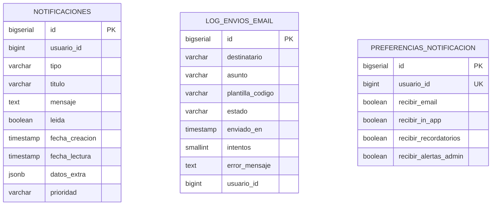

> Las tres tablas son independientes (no hay FK entre ellas). Todas referencian `auth_schema.usuarios` vía `usuario_id` cross-schema.

### Tablas

#### `notificaciones`

| Columna | Tipo | Constraints |
|---------|------|-------------|
| `id` | BIGSERIAL | PK |
| `usuario_id` | BIGINT | NOT NULL | Ref `auth_schema.usuarios` |
| `tipo` | VARCHAR(50) | NOT NULL |
| `titulo` | VARCHAR(255) | NOT NULL |
| `mensaje` | TEXT | NOT NULL |
| `leida` | BOOLEAN | NOT NULL DEFAULT FALSE |
| `fecha_creacion` | TIMESTAMP | NOT NULL DEFAULT NOW() |
| `fecha_lectura` | TIMESTAMP | |
| `datos_extra` | JSONB | Para deep-linking (ej. `{"asignacion_id": 42}`) |
| `prioridad` | VARCHAR(10) | NOT NULL DEFAULT `'NORMAL'`, CHECK (`BAJA/NORMAL/ALTA`) |
| (audit fields + `deleted_at`) | | |

**Índices:**
- `idx_notificaciones_usuario_no_leidas` ON `(usuario_id, leida) WHERE leida = FALSE AND deleted_at IS NULL`
- `idx_notificaciones_fecha` ON `fecha_creacion DESC`

#### `log_envios_email`

| Columna | Tipo | Constraints |
|---------|------|-------------|
| `id` | BIGSERIAL | PK |
| `destinatario` | VARCHAR(255) | NOT NULL |
| `asunto` | VARCHAR(255) | NOT NULL |
| `plantilla_codigo` | VARCHAR(100) | |
| `estado` | VARCHAR(20) | NOT NULL CHECK (`PENDIENTE/ENVIADO/FALLIDO`) |
| `enviado_en` | TIMESTAMP | |
| `intentos` | SMALLINT | NOT NULL DEFAULT 0 |
| `error_mensaje` | TEXT | |
| `usuario_id` | BIGINT | Si aplica |
| (audit fields) | | |

#### `preferencias_notificacion`

| Columna | Tipo | Constraints |
|---------|------|-------------|
| `id` | BIGSERIAL | PK |
| `usuario_id` | BIGINT | UNIQUE, NOT NULL | Ref `auth_schema.usuarios` |
| `recibir_email` | BOOLEAN | NOT NULL DEFAULT TRUE |
| `recibir_in_app` | BOOLEAN | NOT NULL DEFAULT TRUE |
| `recibir_recordatorios` | BOOLEAN | NOT NULL DEFAULT TRUE |
| `recibir_alertas_admin` | BOOLEAN | NOT NULL DEFAULT TRUE |
| (audit fields) | | |

---

## 14. Schema: `reportes_schema`

**Microservicio:** MS-Reportes (puerto 8087)
**Responsabilidad:** Cache de reportes generados, log de ejecuciones, auditoría de generación.

> Schema declarado; el MS aún no tiene controllers REST implementados (pendiente del Sprint 9 reorganizado).

### Diagrama ER

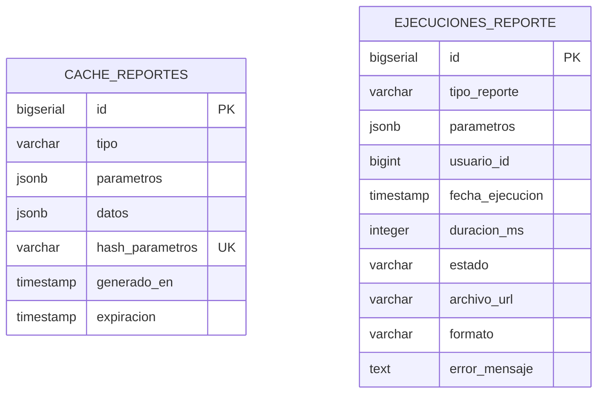

> Las dos tablas son independientes. `ejecuciones_reporte` registra cada generación; `cache_reportes` almacena resultados reutilizables identificados por hash de parámetros.

### Tablas

#### `cache_reportes`

| Columna | Tipo | Constraints |
|---------|------|-------------|
| `id` | BIGSERIAL | PK |
| `tipo` | VARCHAR(50) | NOT NULL |
| `parametros` | JSONB | NOT NULL |
| `datos` | JSONB | NOT NULL |
| `hash_parametros` | VARCHAR(64) | UNIQUE — SHA-256 de `parametros` (lookup) |
| `generado_en` | TIMESTAMP | NOT NULL DEFAULT NOW() |
| `expiracion` | TIMESTAMP | NOT NULL |
| (audit fields) | | |

**Índices:**
- `idx_cache_reportes_hash` ON `hash_parametros`
- `idx_cache_reportes_expiracion` ON `expiracion` (para limpieza)

#### `ejecuciones_reporte`

| Columna | Tipo | Constraints |
|---------|------|-------------|
| `id` | BIGSERIAL | PK |
| `tipo_reporte` | VARCHAR(50) | NOT NULL |
| `parametros` | JSONB | NOT NULL |
| `usuario_id` | BIGINT | NOT NULL | Ref `auth_schema.usuarios` |
| `fecha_ejecucion` | TIMESTAMP | NOT NULL DEFAULT NOW() |
| `duracion_ms` | INTEGER | |
| `estado` | VARCHAR(20) | NOT NULL CHECK (`EXITO/ERROR`) |
| `archivo_url` | VARCHAR(500) | |
| `formato` | VARCHAR(10) | CHECK (`PDF/EXCEL`) |
| `error_mensaje` | TEXT | |
| (audit fields) | | |

---

## 15. Schema: `shared_schema`

**Microservicio:** Compartido entre todos. La migración V1 de MS-Auth lo crea.
**Responsabilidad:** Auditoría centralizada del sistema completo + idempotencia de eventos RabbitMQ.

### Diagrama ER

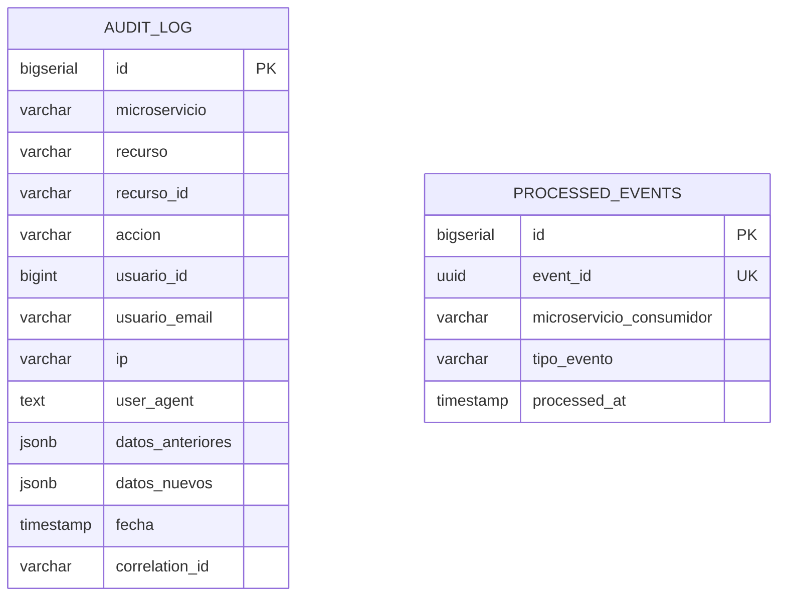

> Las dos tablas son independientes (no hay FK entre ellas). Cada microservicio del sistema escribe en `audit_log` cuando registra una acción auditable, y escribe en `processed_events` cuando procesa un evento RabbitMQ por primera vez.

### Tablas

#### `audit_log`

> **NUNCA se borra ni se actualiza** — append-only.

| Columna | Tipo | Constraints |
|---------|------|-------------|
| `id` | BIGSERIAL | PK |
| `microservicio` | VARCHAR(50) | NOT NULL |
| `recurso` | VARCHAR(100) | NOT NULL |
| `recurso_id` | VARCHAR(50) | |
| `accion` | VARCHAR(50) | NOT NULL CHECK (`CREATE/UPDATE/DELETE/READ/LOGIN/LOGOUT`) |
| `usuario_id` | BIGINT | |
| `usuario_email` | VARCHAR(255) | |
| `ip` | VARCHAR(45) | |
| `user_agent` | TEXT | |
| `datos_anteriores` | JSONB | Para UPDATE/DELETE |
| `datos_nuevos` | JSONB | Para CREATE/UPDATE |
| `fecha` | TIMESTAMP | NOT NULL DEFAULT NOW() |
| `correlation_id` | VARCHAR(100) | Trazabilidad cross-MS |

**Índices:**
- `idx_audit_log_microservicio_fecha` ON `(microservicio, fecha DESC)`
- `idx_audit_log_usuario_fecha` ON `(usuario_id, fecha DESC)`
- `idx_audit_log_recurso` ON `(recurso, recurso_id)`

#### `processed_events`

> Tabla de idempotencia para consumidores RabbitMQ. Antes de procesar un evento, validar que su `event_id` no esté en esta tabla.

| Columna | Tipo | Constraints |
|---------|------|-------------|
| `id` | BIGSERIAL | PK |
| `event_id` | UUID | UNIQUE, NOT NULL |
| `microservicio_consumidor` | VARCHAR(50) | NOT NULL |
| `tipo_evento` | VARCHAR(100) | NOT NULL |
| `processed_at` | TIMESTAMP | NOT NULL DEFAULT NOW() |

**Índice:** `idx_processed_events_microservicio_fecha` ON `(microservicio_consumidor, processed_at DESC)`.

> **Limitación conocida (deuda registrada en `DECISIONES.md §25`):** la restricción `UNIQUE (event_id)` impide que dos consumers del mismo MS procesen el mismo evento. El listener de progreso académico fue exento por este motivo. Fix futuro: ampliar a `UNIQUE (event_id, microservicio_consumidor)` o introducir `consumer_scope`.

**Mantenimiento:** registros con `processed_at < NOW() - INTERVAL '30 days'` se pueden eliminar (limpieza periódica programada).

---

## 16. Relaciones cross-microservicio

> Mapa de referencias entre microservicios y eventos RabbitMQ que mantienen la consistencia eventual.

### Principio

Las foreign keys solo existen DENTRO del mismo schema. Entre microservicios se almacenan IDs de referencia **sin** restricción FK a nivel BD.

La consistencia eventual entre microservicios se gestiona vía:

1. **Eventos RabbitMQ** para propagación asincrónica (notificaciones, progreso, auditoría).
2. **Llamadas Feign** para validaciones síncronas en tiempo de creación/modificación (ver [17. Validaciones obligatorias al crear asignación](#17-validaciones-obligatorias-al-crear-asignación)).

### Mapa de referencias entre MS

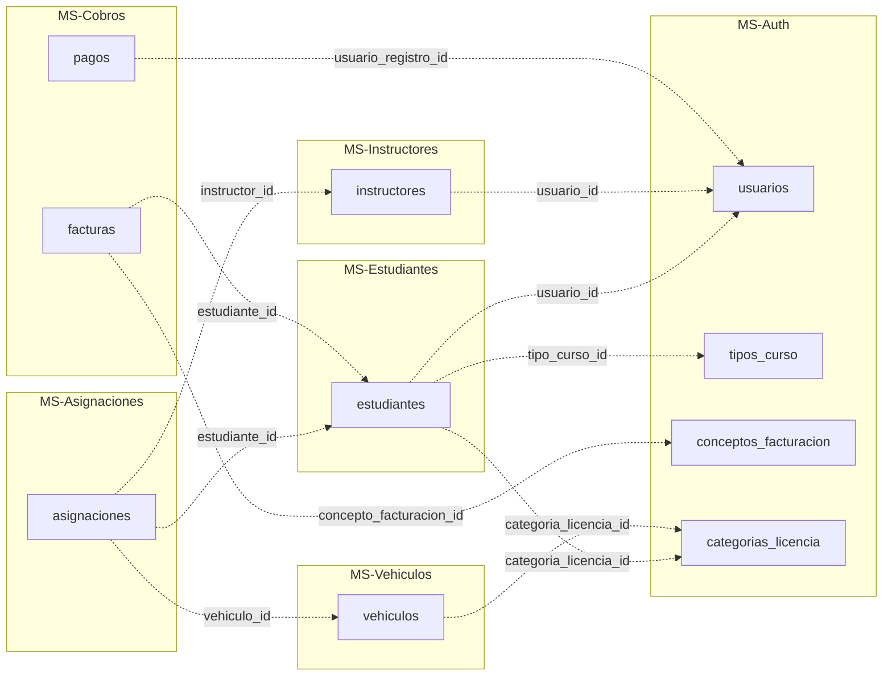

### Eventos críticos cross-MS (RabbitMQ)

| Evento | Publica | Consume | Propósito |
|--------|---------|---------|-----------|
| `auth.usuario.creado` | MS-Auth | MS-Notificaciones | Crear preferencias default |
| `estudiantes.creado` | MS-Estudiantes | MS-Cobros, MS-Auth (audit), MS-Notificaciones | Factura automática de matrícula |
| `estudiantes.matriculado` | MS-Estudiantes | MS-Cobros, MS-Notificaciones | Notificar matrícula |
| `asignacion.creada` | MS-Asignaciones | MS-Estudiantes (progreso), MS-Notificaciones | Notificar nueva clase |
| `asignacion.completada` | MS-Asignaciones | MS-Estudiantes (incremento `minutos_completados`), MS-Vehículos (sync odómetro vía PUT Feign), MS-Notificaciones | Sincronizar contadores cross-MS |
| `asignacion.reprogramada` | MS-Asignaciones | MS-Notificaciones | Email + in-app a alumno |
| `asignacion.cancelada` | MS-Asignaciones | MS-Notificaciones | Email + in-app a alumno |
| `pago.registrado` | MS-Cobros | MS-Estudiantes (update `situacion_pago`), MS-Notificaciones (recibo), MS-Reportes (invalidar cache) | Actualizar estado financiero y recibo |
| `factura.emitida` | MS-Cobros | MS-Notificaciones | Email con factura |
| `factura.pagada` | MS-Cobros | MS-Notificaciones | Email de confirmación final |

### Validación de existencia entre MS (Feign)

Cuando un MS necesita validar que un ID en otro MS existe, usa **OpenFeign clients** con circuit breaker Resilience4j configurado.

Flujo típico para crear una asignación:

1. Cliente envía `POST /asignaciones` al API Gateway.
2. Gateway propaga al MS-Asignaciones (con headers `X-User-Id`, `X-User-Email`, `X-User-Roles`).
3. MS-Asignaciones ejecuta validaciones via Feign clients:
   - `InstructorClient` → consulta `instructores_schema.instructores` + `disponibilidad` + `horarios_trabajo`
   - `EstudianteClient` → consulta estado + situación de pago + categoría del curso
   - `VehiculoClient` → consulta categoría + SOAT + RTV
4. Si cualquier validación falla, devuelve `409 Conflict` con `ProblemDetail` específico.
5. Si todo OK, persiste la asignación y publica `asignacion.creada`.

El detalle de las 6 validaciones obligatorias está en [17. Validaciones obligatorias al crear asignación](#17-validaciones-obligatorias-al-crear-asignación).

---

## 17. Validaciones obligatorias al crear asignación

> Reglas de negocio cross-microservicio que se ejecutan al ejecutar `POST /asignaciones`. Introducidas en Sprint 10. Cualquier falla devuelve `409 Conflict` con `ProblemDetail` (RFC 7807).

### Las 6 validaciones obligatorias

| # | Validación | MS consultado | Mecanismo |
|---|------------|---------------|-----------|
| 1 | La categoría de licencia del **instructor** habilita la categoría que el estudiante está cursando | MS-Instructores + MS-Estudiantes | Feign |
| 2 | La categoría del **vehículo** coincide con la categoría que el estudiante está cursando | MS-Vehículos + MS-Estudiantes | Feign |
| 3 | El vehículo tiene **SOAT vigente** a la fecha de la asignación | MS-Vehículos | Feign |
| 4 | El vehículo tiene **RTV (revisión técnica vehicular) vigente** a la fecha | MS-Vehículos | Feign |
| 5 | El **horario semanal del instructor** cubre el rango horario solicitado | MS-Instructores | Feign (`disponibilidad` + `horarios_trabajo`) |
| 6 | El instructor no está en **AUSENCIA** (vacaciones/licencia) en esa fecha | MS-Instructores | Feign (`horarios_trabajo` con `tipo='AUSENCIA'`) |

### Validaciones adicionales

Además de las 6 cross-MS, el sistema valida:

- El **estudiante** está en estado `MATRICULADO` o `CURSANDO` (no se puede asignar clase a `PRE_MATRICULADO` o `RETIRADO`).
- La `situacion_pago` del estudiante es `PAGADO_TOTAL`.
- No hay **conflicto de horario** entre el mismo instructor o el mismo vehículo (búsqueda en `asignaciones` con `estado IN ('PROGRAMADA', 'CONFIRMADA', 'EN_CURSO')`).
- La fecha de la asignación es **futura** (no se pueden crear asignaciones retroactivas).
- La duración solicitada es coherente con el `duracion_clase_default_min` configurado en la escuela (o se indica explícitamente).

### Formato de error (RFC 7807)

Cuando una validación falla, la respuesta sigue el estándar Problem Details:

```json
{
  "type": "https://api.escuela.com/errors/instructor-sin-categoria",
  "title": "Instructor no habilitado para esta categoría",
  "status": 409,
  "detail": "El instructor 42 tiene licencia categoría B, pero el estudiante 87 está cursando categoría C",
  "instance": "/asignaciones",
  "timestamp": "2026-05-26T10:30:00",
  "errors": []
}
```

Cada validación tiene su propio `type` URI:

| Validación | Type URI |
|------------|----------|
| #1 Instructor sin categoría | `/errors/instructor-sin-categoria` |
| #2 Vehículo sin categoría | `/errors/vehiculo-sin-categoria` |
| #3 SOAT vencido | `/errors/vehiculo-soat-vencido` |
| #4 RTV vencida | `/errors/vehiculo-rtv-vencida` |
| #5 Fuera de horario instructor | `/errors/instructor-fuera-horario` |
| #6 Instructor en ausencia | `/errors/instructor-ausencia` |

### Referencia ADR

Esta sección consolida lo decidido en `DECISIONES.md §24.4` (ADR Sprint 10: Refactor de dominio y endurecimiento operativo del Grupo A).

---

## 18. Datos seed iniciales

> Datos insertados automáticamente al ejecutar las migraciones `V1_5__Seed_Data.sql` y equivalentes por microservicio. Permiten que el sistema sea usable desde el primer arranque sin intervención manual.

### `auth_schema`

#### Roles

| Código | Descripción |
|--------|-------------|
| `ADMIN` | Administrador del sistema, acceso total |
| `STAFF` | Personal administrativo (CRUD operacional sin configuración) |
| `INSTRUCTOR` | Docente del curso, acceso a sus asignaciones y estudiantes |
| `ESTUDIANTE` | Alumno, acceso a su perfil, clases y saldo |

#### Permisos (ejemplos)

- `USUARIOS_READ`, `USUARIOS_WRITE`
- `ESTUDIANTES_READ`, `ESTUDIANTES_WRITE`, `ESTUDIANTES_DELETE`
- `INSTRUCTORES_READ`, `INSTRUCTORES_WRITE`
- `VEHICULOS_READ`, `VEHICULOS_WRITE`
- `ASIGNACIONES_READ`, `ASIGNACIONES_WRITE`
- `COBROS_READ`, `COBROS_WRITE`
- `REPORTES_READ`, `REPORTES_FINANCIEROS_READ`
- `CONFIGURACION_READ`, `CONFIGURACION_WRITE`

#### Usuario administrador inicial

- **Email:** `admin@escuela.local`
- **Password:** `Admin123!` (hash bcrypt cost 10, fijado correctamente en V6 — ver `DECISIONES.md §25.4`)
- **Rol:** ADMIN

#### `categorias_licencia`

| Código | Descripción |
|--------|-------------|
| A | Motocicletas hasta 200 cc |
| A1 | Motocicletas mayores de 200 cc |
| B | Vehículo particular auto pequeño |
| C | Vehículo particular auto grande / Pick-up |
| C1 | Camionetas hasta 3.5 toneladas |
| D | Buses |
| D1 | Camiones medianos |
| E | Camiones pesados / Tráiler |
| F | Vehículos especiales / Discapacitados |
| PROFESIONAL_C | Categoría C profesional |
| PROFESIONAL_D | Categoría D profesional |
| PROFESIONAL_E | Categoría E profesional |

#### `conceptos_facturacion`

- Curso Básico
- Examen
- Repetición de examen
- Material didáctico

#### `tipos_curso`

- Curso Básico Auto
- Curso Profesional
- Curso Moto

#### `plantillas_email`

- `RECUPERAR_PASSWORD`
- `MATRICULA_CONFIRMADA`
- `RECIBO_PAGO`
- `RECORDATORIO_CLASE`
- `CLASE_REPROGRAMADA`
- `CLASE_CANCELADA`

#### `configuracion_escuela` (única fila)

| Campo | Valor |
|-------|-------|
| `nombre` | "Escuela de Conducción Demo" |
| `ruc` | `1791234567001` |
| `duracion_clase_default_min` | 60 |
| `horas_recordatorio_clase` | 24 |
| `dias_alerta_soat` | 30 |
| `max_intentos_fallidos` | 3 (V4) |
| `duracion_bloqueo_minutos` | 15 (V4) |
| `expiracion_token_reset_minutos` | 60 (V4) |

### `vehiculos_schema`

#### `tipos_combustible` (V2 — precios referenciales Ecuador 2026)

| Código | Nombre | Unidad | Precio |
|--------|--------|--------|--------|
| EXTRA | Gasolina Extra (87 octanos) | GALON | 2.4600 |
| ECOPAIS | Gasolina Ecopaís (87 oct + etanol) | GALON | 2.4600 |
| SUPER | Gasolina Súper (92 octanos) | GALON | 3.8500 |
| DIESEL | Diésel Premium | GALON | 1.8000 |
| ELECTRICO | Energía eléctrica | KWH | 0.1100 |

> El administrador puede actualizar `precio_actual` cuando suba o baje el precio público.

### Demo data (opcional con perfil `demo`)

Solo se insertan si se levanta el sistema con el perfil Spring `demo` activo:

- 2 usuarios staff demo
- 3 instructores demo
- 5 vehículos demo
- 10 estudiantes demo
- Facturas y pagos de ejemplo para validar reportería

> En producción, este seed **no se ejecuta** para evitar datos basura en la BD del cliente.

---

## 19. Referencias

> Enlaces a documentación complementaria, decisiones técnicas y código fuente relacionado con el modelo de datos.

### Documentos del proyecto

| Documento | Propósito |
|-----------|-----------|
| [DECISIONES.md](../../DECISIONES.md) | Decisiones técnicas formales del proyecto |
| [CLAUDE.md](../../CLAUDE.md) | Contexto general del proyecto y guía operativa |
| [PLAN_FASES.md](../../PLAN_FASES.md) | Plan vigente de sprints (5–12) |
| [er-diagram.dbml](./er-diagram.dbml) | Modelo de BD en formato DBML para dbdiagram.io |
| [secciones/](./secciones/) | Versión partida del modelo (un archivo por tema) |

### Secciones relevantes de `DECISIONES.md`

| Sección | Tema |
|---------|------|
| §2 | Stack técnico (incluye PostgreSQL 15) |
| §4 | Bases de Datos (estrategia general: 1 instancia, 9 schemas) |
| §11 | Validaciones específicas Ecuador (cédula, RUC, placa, teléfono) |
| §15 | API Design + formato de errores RFC 7807 |
| §24 | ADR Sprint 10: refactor de dominio Grupo A (estados extendidos, factura_cuotas, kilometraje, 6 validaciones) |
| §25 | ADR Sprint 10: estabilización CI/CD y plataforma (TZ JVM, V6 bcrypt fix, ProblemDetail global, IdempotencyStore deuda) |

### Código fuente

| Ruta | Contenido |
|------|-----------|
| `backend/<ms>/src/main/resources/db/migration/V*.sql` | Migraciones Flyway por microservicio |
| `backend/<ms>/src/main/java/com/escuela/<ms>/entity/` | Entidades JPA correspondientes a las tablas |
| `backend/<ms>/src/main/java/com/escuela/<ms>/repository/` | Repositorios Spring Data JPA |
| `backend/shared/common-events/` | DTOs de eventos RabbitMQ |
| `backend/shared/common-security/` | `BaseEntity`, `AuditorAware`, audit fields automáticos |
| `backend/shared/common-validation/` | Custom validators (`@CedulaEcuador`, `@PlacaEcuador`, etc.) |
| `infrastructure/postgres/init-schemas.sql` | Script que crea los 9 schemas al primer arranque del contenedor |

### Referencias externas

- **[PostgreSQL 15 docs](https://www.postgresql.org/docs/15/)** — Referencia oficial del motor de BD
- **[Flyway docs](https://documentation.red-gate.com/flyway/)** — Herramienta de versionado de schema
- **[Mermaid.js](https://mermaid.js.org/syntax/entityRelationshipDiagram.html)** — Sintaxis de diagramas ER
- **[dbdiagram.io](https://dbdiagram.io)** — Visor del archivo `er-diagram.dbml`
- **[RFC 7807](https://datatracker.ietf.org/doc/html/rfc7807)** — Problem Details for HTTP APIs (formato de errores)

### Convenciones de versionado del documento

Este documento se versiona junto con el código en el mismo repositorio:

- Cuando se agrega una migración nueva (`V*`), actualizar la sección 6 (Migraciones Flyway aplicadas) y la sección del schema afectado.
- Cuando se cambia un constraint o se agrega/quita una columna, actualizar la sección de tablas del schema afectado.
- Cuando se modifica un evento RabbitMQ o se agrega una validación cross-MS, actualizar [16. Relaciones cross-microservicio](#16-relaciones-cross-microservicio) y [17. Validaciones obligatorias al crear asignación](#17-validaciones-obligatorias-al-crear-asignación).
- Cuando se agrega un schema nuevo, crear una sección nueva en este documento (y opcionalmente un archivo en `secciones/`).

---

*Documento generado: 2026-05-22 (v1.0 — diseño inicial)*
*Reescrito: 2026-05-26 (v2.0 — consolidación con MODELO_BD_COMPLETO.md + estado real Sprint 10)*
*Partido en secciones: 2026-05-26 (v2.1 — 19 archivos independientes en `secciones/`)*
*Reconsolidado: 2026-05-26 (v3.1 — vista monolítica completa con las 19 secciones)*
