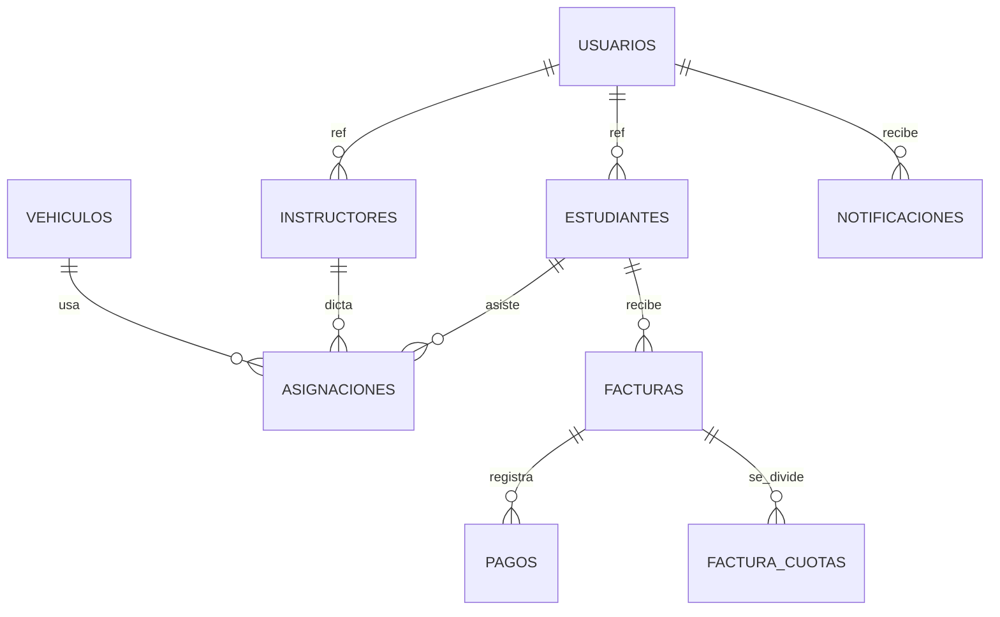
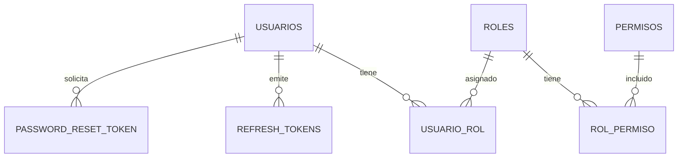
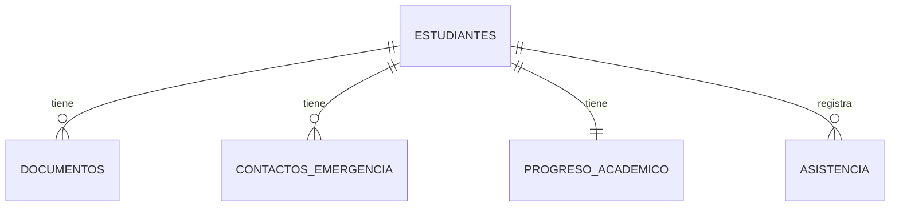
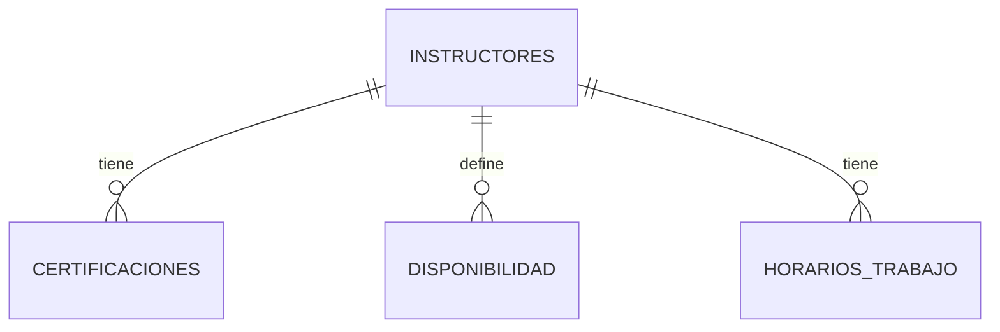
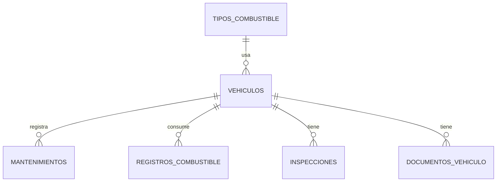
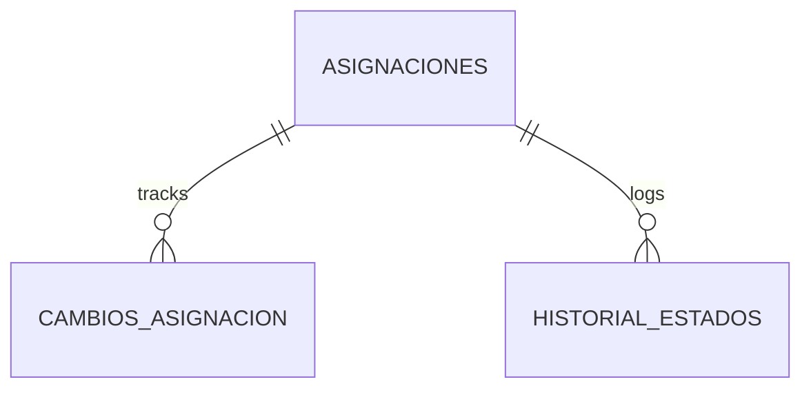
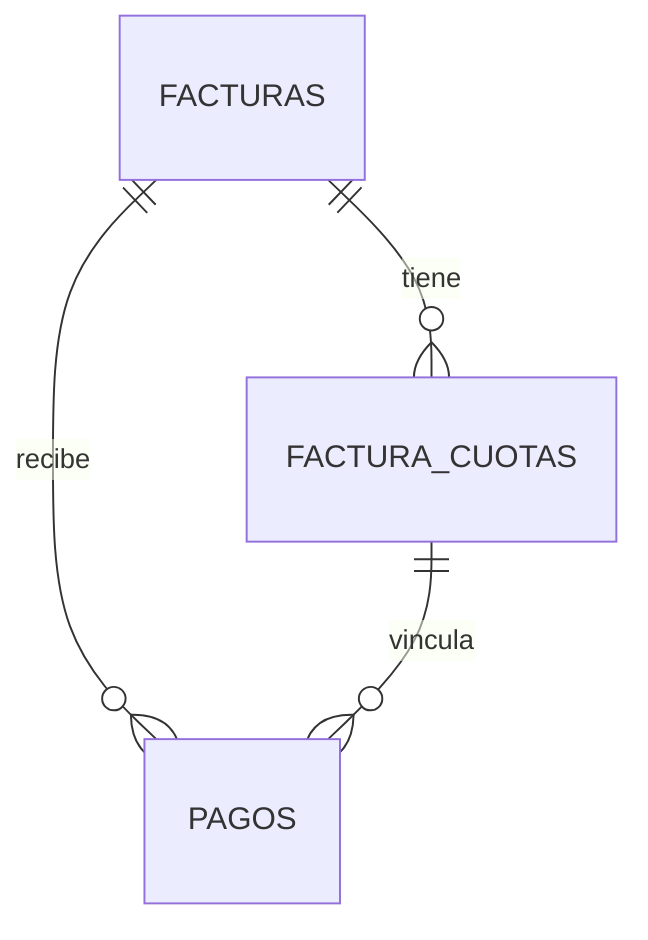
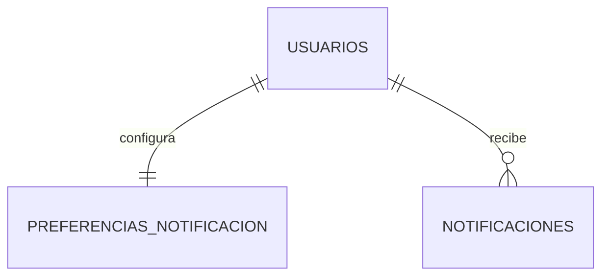

# 5. Diagrama ER global

[← Volver al índice](../schema.md)

> Vista de conjunto: todas las entidades del sistema y sus relaciones. Para el detalle de atributos de cada entidad, ver el archivo de su schema correspondiente.

---

## Diagrama Mermaid — Vista de núcleo (entidades principales)

> Diagrama simplificado con las 9 entidades centrales del sistema y sus relaciones principales. Para el detalle exhaustivo de tablas y FKs dentro de cada schema, ver el archivo de cada schema individual.

### Diagrama detallado por sub-dominio

Para no sobrecargar un solo diagrama (los renderers Mermaid tienen problemas con +30 nodos), el ER completo está dividido por sub-dominios:

**Sub-dominio Auth + Usuarios:**

**Sub-dominio Estudiantes:**

**Sub-dominio Instructores:**

**Sub-dominio Vehículos:**

**Sub-dominio Asignaciones:**

**Sub-dominio Cobros:**

**Sub-dominio Notificaciones:**

---

## Interpretación

- Las relaciones con label `ref_*` (ej. `ref_usuario_id`, `ref_estudiante_id`) representan **referencias cross-schema** entre microservicios. Estas relaciones NO tienen FK física a nivel BD; la consistencia se gestiona mediante eventos RabbitMQ y/o llamadas Feign.
- El resto de relaciones son **FKs reales** dentro del mismo schema, con `ON DELETE CASCADE` cuando aplica.
- Las cardinalidades usan notación crow's foot:
  - `||--||` uno a uno (ej. estudiante ↔ progreso académico)
  - `||--o{` uno a muchos (ej. estudiante → documentos)

---

## Versión alternativa en DBML

Si el renderer Mermaid local no funciona, está disponible el modelo equivalente en formato DBML para [dbdiagram.io](https://dbdiagram.io):

- Archivo: [`../er-diagram.dbml`](../er-diagram.dbml)
- Uso: copiar contenido del archivo, pegar en dbdiagram.io, exportar a PNG/SVG/PDF.
