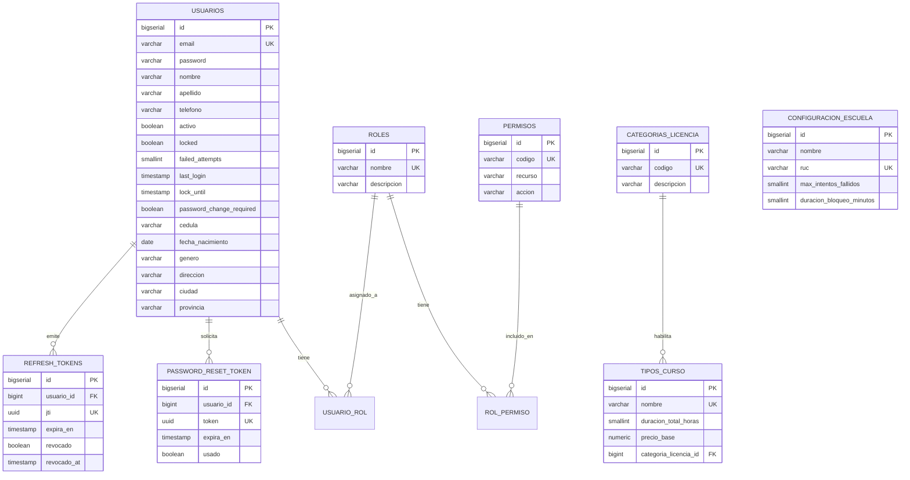

# 7. Schema: `auth_schema`

[← Volver al índice](../schema.md)

**Microservicio:** MS-Auth (puerto 8081)
**Responsabilidad:** Autenticación, autorización, gestión de usuarios/roles/permisos, recuperación de contraseña, configuración del sistema (single-tenant configurable), catálogos compartidos (tipos de curso, categorías de licencia, conceptos de facturación, plantillas de email).

---

## Diagrama ER

---

## Tablas

### `usuarios`

| Columna | Tipo | Constraints | Notas |
|---------|------|-------------|-------|
| `id` | BIGSERIAL | PK | |
| `email` | VARCHAR(255) | UNIQUE, NOT NULL | Validar formato (CHECK + backend) |
| `password` | VARCHAR(60) | NOT NULL | BCrypt cost 10 produce hashes de 60 chars |
| `nombre` | VARCHAR(100) | NOT NULL | |
| `apellido` | VARCHAR(100) | NOT NULL | |
| `telefono` | VARCHAR(10) | | Móvil Ecuador `09XXXXXXXX` |
| `activo` | BOOLEAN | NOT NULL DEFAULT TRUE | |
| `locked` | BOOLEAN | NOT NULL DEFAULT FALSE | Tras N intentos fallidos (configurable) |
| `failed_attempts` | SMALLINT | NOT NULL DEFAULT 0 | Reset al login exitoso |
| `last_login` | TIMESTAMP | | |
| `lock_until` | TIMESTAMP | | Hasta cuándo está bloqueado |
| `password_change_required` | BOOLEAN | NOT NULL DEFAULT FALSE | V3: fuerza cambio al primer login |
| `cedula` | VARCHAR(10) | | V5: cédula Ecuador (opcional) |
| `fecha_nacimiento` | DATE | | V5 |
| `genero` | VARCHAR(1) | | V5: M/F/O |
| `direccion` | VARCHAR(255) | | V5 |
| `ciudad` | VARCHAR(100) | | V5 |
| `provincia` | VARCHAR(100) | | V5 |
| (audit fields + `deleted_at`) | | | |

**Índices:**
- `idx_usuarios_email` ON `email` (búsqueda en login)
- `idx_usuarios_activo_locked` ON `(activo, locked) WHERE deleted_at IS NULL`

---

### `roles`

| Columna | Tipo | Constraints |
|---------|------|-------------|
| `id` | BIGSERIAL | PK |
| `nombre` | VARCHAR(50) | UNIQUE, NOT NULL |
| `descripcion` | VARCHAR(255) | |
| (audit fields + `deleted_at`) | | |

**Datos seed:** ADMIN, STAFF, INSTRUCTOR, ESTUDIANTE.

---

### `permisos`

| Columna | Tipo | Constraints |
|---------|------|-------------|
| `id` | BIGSERIAL | PK |
| `codigo` | VARCHAR(100) | UNIQUE, NOT NULL |
| `recurso` | VARCHAR(50) | NOT NULL |
| `accion` | VARCHAR(50) | NOT NULL |
| `descripcion` | VARCHAR(255) | |
| (audit fields + `deleted_at`) | | |

**Ejemplos:** `ESTUDIANTES_READ`, `ESTUDIANTES_WRITE`, `COBROS_READ`, `REPORTES_FINANCIEROS_READ`.

---

### `usuario_rol` (junction many-to-many)

| Columna | Tipo | Constraints |
|---------|------|-------------|
| `usuario_id` | BIGINT | PK, FK → usuarios(id) |
| `rol_id` | BIGINT | PK, FK → roles(id) |
| `created_at` | TIMESTAMP | NOT NULL DEFAULT NOW() |
| `created_by` | VARCHAR(50) | |

**PK compuesta:** `(usuario_id, rol_id)`.

---

### `rol_permiso` (junction many-to-many)

Estructura simétrica a `usuario_rol`, entre `roles` y `permisos`.

---

### `password_reset_token`

| Columna | Tipo | Constraints |
|---------|------|-------------|
| `id` | BIGSERIAL | PK |
| `usuario_id` | BIGINT | FK → usuarios(id), NOT NULL |
| `token` | UUID | UNIQUE, NOT NULL DEFAULT `uuid_generate_v4()` |
| `expira_en` | TIMESTAMP | NOT NULL |
| `usado` | BOOLEAN | NOT NULL DEFAULT FALSE |
| `created_at` | TIMESTAMP | NOT NULL DEFAULT NOW() |

**Índice:** `idx_password_reset_token_token` ON `token`.

---

### `refresh_tokens` (V2)

> No usa BaseEntity. Soporta refresh token rotation (cada uso genera uno nuevo y revoca el anterior, detección de tokens robados).

| Columna | Tipo | Constraints |
|---------|------|-------------|
| `id` | BIGSERIAL | PK |
| `usuario_id` | BIGINT | NOT NULL, FK → usuarios(id) ON DELETE CASCADE |
| `jti` | UUID | UNIQUE, NOT NULL |
| `expira_en` | TIMESTAMP | NOT NULL |
| `revocado` | BOOLEAN | NOT NULL DEFAULT FALSE |
| `created_at` | TIMESTAMP | NOT NULL DEFAULT NOW() |
| `revocado_at` | TIMESTAMP | |

**Índices:**
- `idx_refresh_tokens_usuario_revocado` ON `(usuario_id, revocado)`
- `idx_refresh_tokens_expira` ON `expira_en WHERE revocado = FALSE`

---

### `configuracion_escuela` (single-tenant configurable)

> Tabla con UNA SOLA fila. Contiene los parámetros configurables de la escuela cliente.

| Columna | Tipo | Constraints | Notas |
|---------|------|-------------|-------|
| `id` | BIGSERIAL | PK | |
| `nombre` | VARCHAR(255) | NOT NULL | Nombre comercial de la escuela |
| `ruc` | VARCHAR(13) | UNIQUE, NOT NULL | RUC Ecuador |
| `direccion` | TEXT | | |
| `telefono` | VARCHAR(20) | | |
| `email` | VARCHAR(255) | | |
| `logo_url` | VARCHAR(500) | | URL en MinIO |
| `color_primario` | VARCHAR(7) | | Hex color |
| `color_secundario` | VARCHAR(7) | | Hex color |
| `duracion_clase_default_min` | SMALLINT | NOT NULL DEFAULT 60 | |
| `horario_apertura` | TIME | | |
| `horario_cierre` | TIME | | |
| `horas_recordatorio_clase` | SMALLINT | NOT NULL DEFAULT 24 | |
| `dias_alerta_soat` | SMALLINT | NOT NULL DEFAULT 30 | |
| `max_intentos_fallidos` | SMALLINT | NOT NULL DEFAULT 3, CHECK 1-10 | V4 |
| `duracion_bloqueo_minutos` | SMALLINT | NOT NULL DEFAULT 15, CHECK 1-1440 | V4 |
| `expiracion_token_reset_minutos` | SMALLINT | NOT NULL DEFAULT 60, CHECK 5-1440 | V4 |
| (audit fields) | | | |

---

### `tipos_curso`

| Columna | Tipo | Constraints |
|---------|------|-------------|
| `id` | BIGSERIAL | PK |
| `nombre` | VARCHAR(100) | UNIQUE, NOT NULL |
| `descripcion` | TEXT | |
| `duracion_total_horas` | SMALLINT | NOT NULL |
| `precio_base` | NUMERIC(10,2) | NOT NULL CHECK (`precio_base > 0`) |
| `categoria_licencia_id` | BIGINT | FK → categorias_licencia(id) |
| `activo` | BOOLEAN | NOT NULL DEFAULT TRUE |
| (audit fields + `deleted_at`) | | |

---

### `conceptos_facturacion`

| Columna | Tipo | Constraints |
|---------|------|-------------|
| `id` | BIGSERIAL | PK |
| `nombre` | VARCHAR(100) | UNIQUE, NOT NULL |
| `monto_base` | NUMERIC(10,2) | NOT NULL CHECK (`monto_base > 0`) |
| `descripcion` | TEXT | |
| `activo` | BOOLEAN | NOT NULL DEFAULT TRUE |
| (audit fields + `deleted_at`) | | |

---

### `categorias_licencia`

| Columna | Tipo | Constraints |
|---------|------|-------------|
| `id` | BIGSERIAL | PK |
| `codigo` | VARCHAR(20) | UNIQUE, NOT NULL |
| `descripcion` | VARCHAR(255) | NOT NULL |
| `activa` | BOOLEAN | NOT NULL DEFAULT TRUE |
| (audit fields + `deleted_at`) | | |

---

### `plantillas_email`

| Columna | Tipo | Constraints |
|---------|------|-------------|
| `id` | BIGSERIAL | PK |
| `codigo` | VARCHAR(100) | UNIQUE, NOT NULL |
| `asunto` | VARCHAR(255) | NOT NULL |
| `cuerpo_html` | TEXT | NOT NULL |
| `variables` | JSONB | Variables disponibles |
| `activa` | BOOLEAN | NOT NULL DEFAULT TRUE |
| (audit fields + `deleted_at`) | | |
