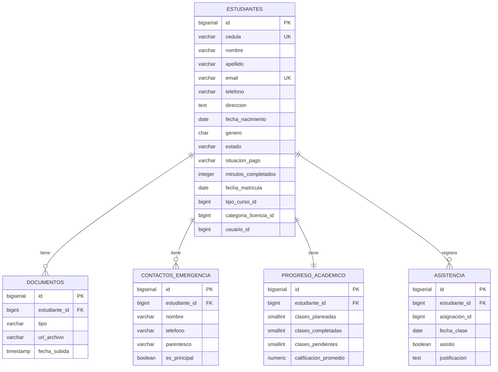

# 8. Schema: `estudiantes_schema`

[← Volver al índice](../schema.md)

**Microservicio:** MS-Estudiantes (puerto 8082)
**Responsabilidad:** Gestión completa de estudiantes: matrícula, documentos, contactos, progreso académico, asistencia. Mantiene `situacion_pago` sincronizada desde MS-Cobros vía evento `pago.registrado` y `minutos_completados` sincronizado desde MS-Asignaciones cuando se finaliza una clase.

---

## Diagrama ER



---

## Tablas

### `estudiantes`

| Columna | Tipo | Constraints | Notas |
|---------|------|-------------|-------|
| `id` | BIGSERIAL | PK | |
| `cedula` | VARCHAR(10) | UNIQUE, NOT NULL, CHECK formato | Cédula Ecuador |
| `nombre` | VARCHAR(100) | NOT NULL | |
| `apellido` | VARCHAR(100) | NOT NULL | |
| `email` | VARCHAR(255) | UNIQUE, NOT NULL | |
| `telefono` | VARCHAR(10) | NOT NULL | Móvil `09XXXXXXXX` |
| `direccion` | TEXT | | |
| `fecha_nacimiento` | DATE | NOT NULL | |
| `genero` | CHAR(1) | CHECK (`genero IN ('M','F','O')`) | |
| `estado` | VARCHAR(20) | NOT NULL CHECK | Ver enum más abajo |
| `situacion_pago` | VARCHAR(30) | NOT NULL DEFAULT `'PENDIENTE_FACTURACION'`, CHECK | V2/V3/V4 |
| `minutos_completados` | INTEGER | NOT NULL DEFAULT 0, CHECK ≥ 0 | V5 |
| `fecha_matricula` | DATE | | Se setea cuando pasa a MATRICULADO |
| `tipo_curso_id` | BIGINT | | Ref `auth_schema.tipos_curso` |
| `categoria_licencia_id` | BIGINT | | Ref `auth_schema.categorias_licencia` |
| `usuario_id` | BIGINT | | Ref `auth_schema.usuarios` (si tiene login) |
| `observaciones` | TEXT | | |
| (audit fields + `deleted_at`) | | | |

**Enum `estado` (V2):**

```
PRE_MATRICULADO  -> registrado, aún no paga la matrícula
MATRICULADO      -> primera factura emitida y pagada total (o crédito emitido)
CURSANDO         -> primera asignación completada
COMPLETADO       -> minutos_completados >= duracion_total_horas * 60
RETIRADO         -> abandono (transición manual desde cualquier estado)
```

**Enum `situacion_pago` (V4, simplificado):**

```
PENDIENTE_FACTURACION  -> sin factura emitida
PENDIENTE_PAGO         -> factura CONTADO emitida, $0 pagado
PAGO_PARCIAL           -> factura CONTADO con saldo
PAGADO_TOTAL           -> todo saldado (CONTADO) o crédito emitido (asume cobro automático)
```

**Regla de negocio:** un estudiante solo puede recibir asignaciones de clase cuando está en `MATRICULADO` o `CURSANDO`, lo cual ocurre cuando `situacion_pago = 'PAGADO_TOTAL'`.

**Índices:**
- `idx_estudiantes_cedula` ON `cedula`
- `idx_estudiantes_email` ON `email`
- `idx_estudiantes_estado` ON `estado WHERE deleted_at IS NULL`
- `idx_estudiantes_situacion_pago` ON `situacion_pago WHERE deleted_at IS NULL`
- `idx_estudiantes_apellido_nombre` ON `(apellido, nombre)`

---

### `documentos`

| Columna | Tipo | Constraints |
|---------|------|-------------|
| `id` | BIGSERIAL | PK |
| `estudiante_id` | BIGINT | FK → estudiantes(id) ON DELETE CASCADE, NOT NULL |
| `tipo` | VARCHAR(30) | NOT NULL CHECK (`CEDULA_FRENTE/CEDULA_REVERSO/FOTO/EXAMEN_MEDICO/OTRO`) |
| `url_archivo` | VARCHAR(500) | NOT NULL |
| `fecha_subida` | TIMESTAMP | NOT NULL DEFAULT NOW() |
| `mime_type` | VARCHAR(100) | |
| `tamano_bytes` | BIGINT | |
| (audit fields + `deleted_at`) | | |

---

### `contactos_emergencia`

| Columna | Tipo | Constraints |
|---------|------|-------------|
| `id` | BIGSERIAL | PK |
| `estudiante_id` | BIGINT | FK → estudiantes(id) ON DELETE CASCADE, NOT NULL |
| `nombre` | VARCHAR(200) | NOT NULL |
| `telefono` | VARCHAR(15) | NOT NULL |
| `parentesco` | VARCHAR(50) | |
| `es_principal` | BOOLEAN | NOT NULL DEFAULT FALSE |
| (audit fields + `deleted_at`) | | |

---

### `progreso_academico`

> Una fila por estudiante. Se actualiza vía consumo de eventos `asignacion.completada` y vía cálculo on-the-fly contra `tipo_curso`.

| Columna | Tipo | Constraints |
|---------|------|-------------|
| `id` | BIGSERIAL | PK |
| `estudiante_id` | BIGINT | UNIQUE, FK → estudiantes(id) ON DELETE CASCADE, NOT NULL |
| `clases_planeadas` | SMALLINT | NOT NULL DEFAULT 0 |
| `clases_completadas` | SMALLINT | NOT NULL DEFAULT 0 |
| `clases_pendientes` | SMALLINT | NOT NULL DEFAULT 0 |
| `clases_canceladas` | SMALLINT | NOT NULL DEFAULT 0 |
| `calificacion_promedio` | NUMERIC(4,2) | CHECK 0–100 |
| `aprobado` | BOOLEAN | |
| (audit fields) | | |

---

### `asistencia`

| Columna | Tipo | Constraints |
|---------|------|-------------|
| `id` | BIGSERIAL | PK |
| `estudiante_id` | BIGINT | FK → estudiantes(id), NOT NULL |
| `asignacion_id` | BIGINT | NOT NULL — Ref `asignaciones_schema.asignaciones` |
| `fecha_clase` | DATE | NOT NULL |
| `asistio` | BOOLEAN | NOT NULL |
| `justificacion` | TEXT | |
| `observaciones` | TEXT | |
| (audit fields) | | |

**Índices:**
- `idx_asistencia_estudiante_fecha` ON `(estudiante_id, fecha_clase)`
- `uq_asistencia_estudiante_asignacion` UNIQUE ON `(estudiante_id, asignacion_id)`
