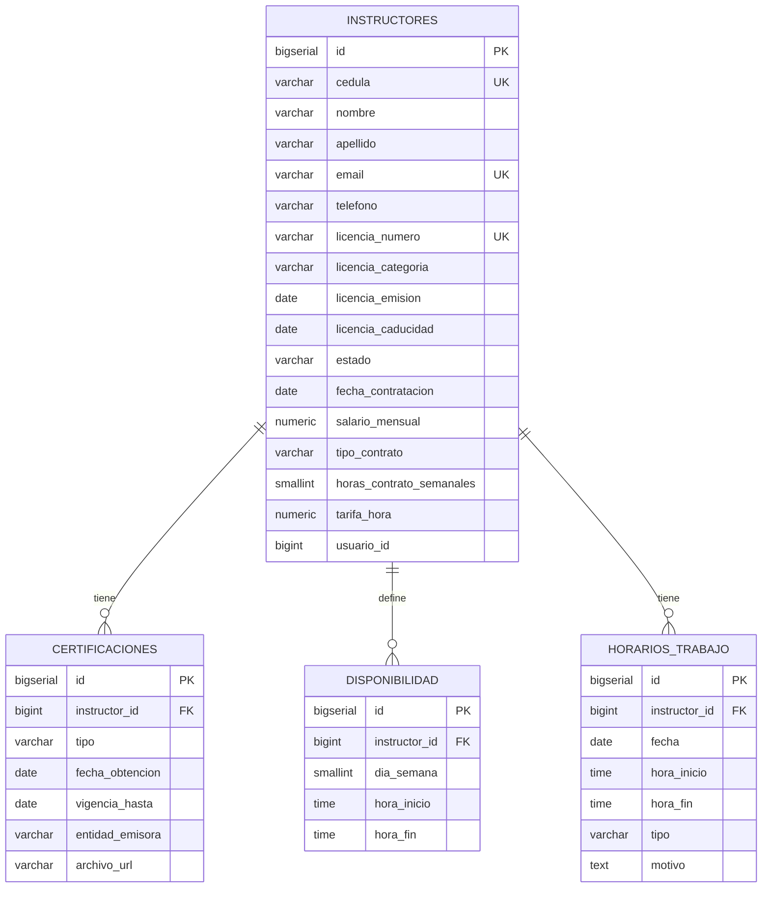

# 9. Schema: `instructores_schema`

[← Volver al índice](../schema.md)

**Microservicio:** MS-Instructores (puerto 8083)
**Responsabilidad:** Gestión de instructores, certificaciones, disponibilidad horaria, contratos.

---

## Diagrama ER



---

## Tablas

### `instructores`

| Columna | Tipo | Constraints |
|---------|------|-------------|
| `id` | BIGSERIAL | PK |
| `cedula` | VARCHAR(10) | UNIQUE, NOT NULL, CHECK formato |
| `nombre` | VARCHAR(100) | NOT NULL |
| `apellido` | VARCHAR(100) | NOT NULL |
| `email` | VARCHAR(255) | UNIQUE, NOT NULL |
| `telefono` | VARCHAR(10) | NOT NULL |
| `direccion` | TEXT | |
| `fecha_nacimiento` | DATE | |
| `licencia_numero` | VARCHAR(50) | UNIQUE, NOT NULL |
| `licencia_categoria` | VARCHAR(20) | NOT NULL |
| `licencia_emision` | DATE | NOT NULL |
| `licencia_caducidad` | DATE | NOT NULL |
| `estado` | VARCHAR(20) | NOT NULL CHECK (`ACTIVO/INACTIVO/SUSPENDIDO`) |
| `fecha_contratacion` | DATE | |
| `salario_mensual` | NUMERIC(10,2) | CHECK ≥ 0 |
| `tipo_contrato` | VARCHAR(20) | NOT NULL DEFAULT `'TIEMPO_COMPLETO'`, CHECK | V2 |
| `horas_contrato_semanales` | SMALLINT | NOT NULL DEFAULT 40, CHECK 1–60 | V2 |
| `tarifa_hora` | NUMERIC(8,2) | CHECK (NULL OR > 0) | V2 |
| `usuario_id` | BIGINT | Ref `auth_schema.usuarios` |
| `observaciones` | TEXT | |
| (audit fields + `deleted_at`) | | |

**Constraint compuesto V2:** `CHECK (tipo_contrato <> 'POR_HORAS' OR tarifa_hora IS NOT NULL)` — si el contrato es POR_HORAS, la tarifa es obligatoria.

**Enum `tipo_contrato`:**

```
TIEMPO_COMPLETO  -> default, 40h/semana, sin tarifa_hora obligatoria
MEDIO_TIEMPO     -> ~20h/semana, sin tarifa obligatoria
POR_HORAS        -> hasta el máximo configurado, tarifa_hora obligatoria
```

**Índices:**
- `idx_instructores_cedula` ON `cedula`
- `idx_instructores_licencia` ON `licencia_numero`
- `idx_instructores_estado` ON `estado WHERE deleted_at IS NULL`
- `idx_instructores_tipo_contrato` ON `tipo_contrato WHERE deleted_at IS NULL`

---

### `certificaciones`

| Columna | Tipo | Constraints |
|---------|------|-------------|
| `id` | BIGSERIAL | PK |
| `instructor_id` | BIGINT | FK → instructores(id), NOT NULL |
| `tipo` | VARCHAR(100) | NOT NULL |
| `fecha_obtencion` | DATE | NOT NULL |
| `vigencia_hasta` | DATE | |
| `entidad_emisora` | VARCHAR(255) | |
| `archivo_url` | VARCHAR(500) | |
| `observaciones` | TEXT | |
| (audit fields + `deleted_at`) | | |

---

### `disponibilidad`

> Disponibilidad recurrente semanal del instructor.

| Columna | Tipo | Constraints |
|---------|------|-------------|
| `id` | BIGSERIAL | PK |
| `instructor_id` | BIGINT | FK → instructores(id), NOT NULL |
| `dia_semana` | SMALLINT | NOT NULL CHECK 1–7 (1=Lun, 7=Dom) |
| `hora_inicio` | TIME | NOT NULL |
| `hora_fin` | TIME | NOT NULL CHECK (`hora_fin > hora_inicio`) |
| (audit fields + `deleted_at`) | | |

**Índice único:** `uq_disponibilidad_instructor_dia_hora` ON `(instructor_id, dia_semana, hora_inicio) WHERE deleted_at IS NULL`.

---

### `horarios_trabajo`

> Excepciones a la disponibilidad semanal: turnos extra o ausencias específicas.

| Columna | Tipo | Constraints |
|---------|------|-------------|
| `id` | BIGSERIAL | PK |
| `instructor_id` | BIGINT | FK → instructores(id), NOT NULL |
| `fecha` | DATE | NOT NULL |
| `hora_inicio` | TIME | |
| `hora_fin` | TIME | |
| `tipo` | VARCHAR(20) | NOT NULL CHECK (`EXTRA/AUSENCIA`) |
| `motivo` | TEXT | |
| (audit fields + `deleted_at`) | | |

> MS-Asignaciones consulta esta tabla vía Feign para validar que el instructor no esté en `AUSENCIA` al crear una asignación (ver [17. Validaciones obligatorias al crear asignación](17-validaciones-obligatorias-crear-asignacion.md)).
