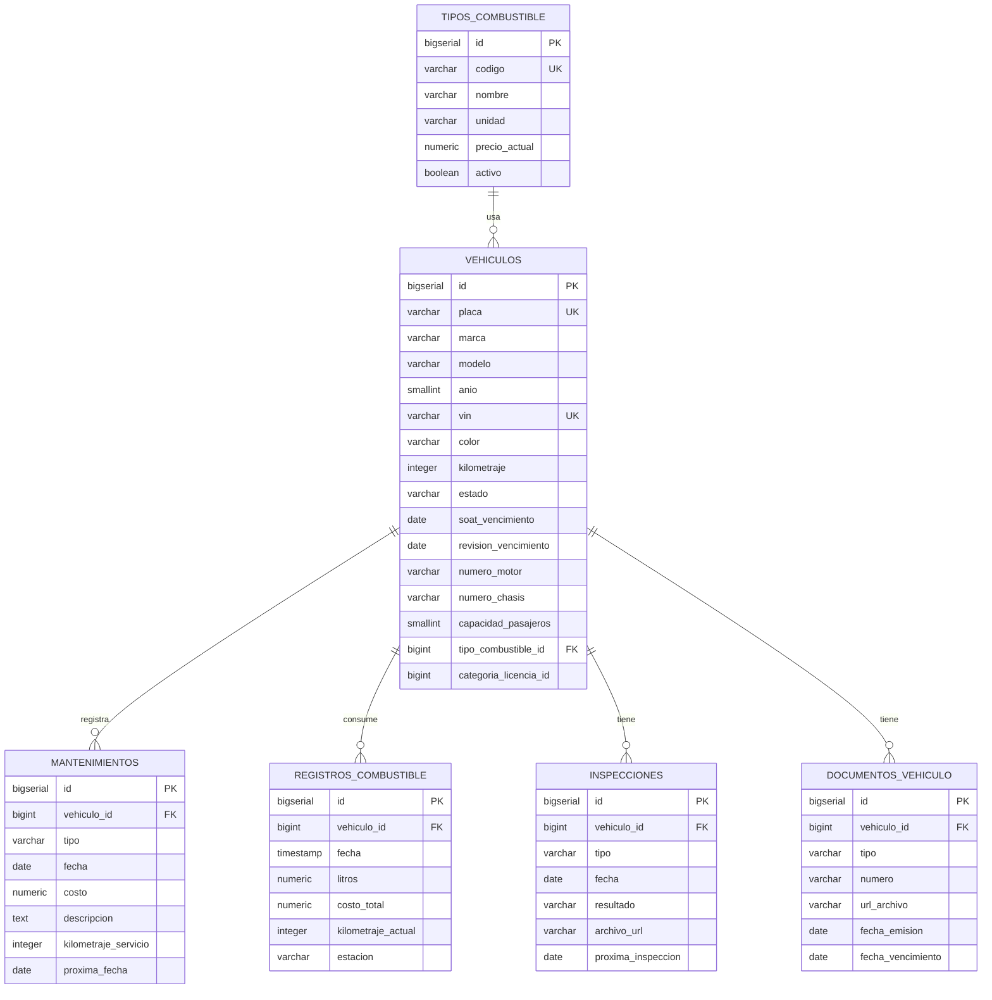

# 10. Schema: `vehiculos_schema`

[← Volver al índice](../schema.md)

**Microservicio:** MS-Vehículos (puerto 8084)
**Responsabilidad:** Flota vehicular, mantenimientos, combustible, inspecciones, documentación, catálogo de tipos de combustible.

---

## Diagrama ER

---

## Tablas

### `vehiculos`

| Columna | Tipo | Constraints |
|---------|------|-------------|
| `id` | BIGSERIAL | PK |
| `placa` | VARCHAR(8) | UNIQUE, NOT NULL, CHECK formato |
| `marca` | VARCHAR(50) | NOT NULL |
| `modelo` | VARCHAR(50) | NOT NULL |
| `anio` | SMALLINT | NOT NULL CHECK 1990–2050 |
| `vin` | VARCHAR(17) | UNIQUE |
| `color` | VARCHAR(30) | |
| `kilometraje` | INTEGER | NOT NULL DEFAULT 0, CHECK ≥ 0 |
| `estado` | VARCHAR(20) | NOT NULL CHECK (`ACTIVO/MANTENIMIENTO/FUERA_SERVICIO`) |
| `soat_vencimiento` | DATE | |
| `revision_vencimiento` | DATE | RTV (revisión técnica vehicular) |
| `fecha_compra` | DATE | |
| `valor_compra` | NUMERIC(10,2) | CHECK ≥ 0 |
| `categoria_licencia_id` | BIGINT | Ref `auth_schema.categorias_licencia` |
| `numero_motor` | VARCHAR(50) | V2 — aparece en matrícula |
| `numero_chasis` | VARCHAR(50) | V2 — puede coincidir con VIN |
| `capacidad_pasajeros` | SMALLINT | V2, CHECK NULL OR 1–100 |
| `tipo_combustible_id` | BIGINT | V2, FK → tipos_combustible(id) |
| `observaciones` | TEXT | |
| (audit fields + `deleted_at`) | | |

**Índices:**
- `idx_vehiculos_placa` ON `placa`
- `idx_vehiculos_estado` ON `estado WHERE deleted_at IS NULL`
- `idx_vehiculos_soat_proximo` ON `soat_vencimiento WHERE deleted_at IS NULL` (alertas)
- `idx_vehiculos_tipo_combustible` ON `tipo_combustible_id WHERE deleted_at IS NULL`

---

### `tipos_combustible` (V2)

> Catálogo configurable. Cuando el precio público cambia, el admin actualiza `precio_actual` y los siguientes registros de combustible toman el valor nuevo.

| Columna | Tipo | Constraints |
|---------|------|-------------|
| `id` | BIGSERIAL | PK |
| `codigo` | VARCHAR(20) | UNIQUE, NOT NULL |
| `nombre` | VARCHAR(100) | NOT NULL |
| `unidad` | VARCHAR(20) | NOT NULL DEFAULT `'GALON'`, CHECK (`GALON/LITRO/KWH`) |
| `precio_actual` | NUMERIC(8,4) | NOT NULL CHECK > 0 |
| `activo` | BOOLEAN | NOT NULL DEFAULT TRUE |
| `observaciones` | TEXT | |
| (audit fields parciales) | | |

**Índice:** `idx_tipos_combustible_activo` ON `activo`.

**Datos seed (precios referenciales 2026):**

| Código | Nombre | Unidad | Precio |
|--------|--------|--------|--------|
| EXTRA | Gasolina Extra (87 octanos) | GALON | 2.4600 |
| ECOPAIS | Gasolina Ecopaís (87 oct + etanol) | GALON | 2.4600 |
| SUPER | Gasolina Súper (92 octanos) | GALON | 3.8500 |
| DIESEL | Diésel Premium | GALON | 1.8000 |
| ELECTRICO | Energía eléctrica | KWH | 0.1100 |

---

### `mantenimientos`

| Columna | Tipo | Constraints |
|---------|------|-------------|
| `id` | BIGSERIAL | PK |
| `vehiculo_id` | BIGINT | FK → vehiculos(id), NOT NULL |
| `tipo` | VARCHAR(20) | NOT NULL CHECK (`PREVENTIVO/CORRECTIVO`) |
| `fecha` | DATE | NOT NULL |
| `costo` | NUMERIC(10,2) | NOT NULL CHECK ≥ 0 |
| `descripcion` | TEXT | NOT NULL |
| `taller` | VARCHAR(255) | |
| `kilometraje_servicio` | INTEGER | |
| `proxima_fecha` | DATE | |
| `proximo_kilometraje` | INTEGER | |
| `archivo_factura_url` | VARCHAR(500) | |
| (audit fields + `deleted_at`) | | |

---

### `registros_combustible`

| Columna | Tipo | Constraints |
|---------|------|-------------|
| `id` | BIGSERIAL | PK |
| `vehiculo_id` | BIGINT | FK → vehiculos(id), NOT NULL |
| `fecha` | TIMESTAMP | NOT NULL |
| `litros` | NUMERIC(8,2) | NOT NULL CHECK > 0 |
| `costo_total` | NUMERIC(10,2) | NOT NULL CHECK > 0 |
| `costo_por_litro` | NUMERIC(8,4) | GENERATED ALWAYS AS (`costo_total / litros`) STORED |
| `kilometraje_actual` | INTEGER | NOT NULL |
| `estacion` | VARCHAR(255) | |
| (audit fields) | | |

**Índice:** `idx_combustible_vehiculo_fecha` ON `(vehiculo_id, fecha DESC)`.

---

### `inspecciones`

| Columna | Tipo | Constraints |
|---------|------|-------------|
| `id` | BIGSERIAL | PK |
| `vehiculo_id` | BIGINT | FK → vehiculos(id), NOT NULL |
| `tipo` | VARCHAR(20) | NOT NULL CHECK (`TECNICA/SOAT/INTERNA`) |
| `fecha` | DATE | NOT NULL |
| `resultado` | VARCHAR(20) | NOT NULL CHECK (`APROBADA/REPROBADA/CONDICIONADA`) |
| `archivo_url` | VARCHAR(500) | |
| `observaciones` | TEXT | |
| `proxima_inspeccion` | DATE | |
| (audit fields + `deleted_at`) | | |

---

### `documentos_vehiculo`

| Columna | Tipo | Constraints |
|---------|------|-------------|
| `id` | BIGSERIAL | PK |
| `vehiculo_id` | BIGINT | FK → vehiculos(id), NOT NULL |
| `tipo` | VARCHAR(50) | NOT NULL |
| `numero` | VARCHAR(100) | |
| `url_archivo` | VARCHAR(500) | NOT NULL |
| `fecha_emision` | DATE | |
| `fecha_vencimiento` | DATE | |
| (audit fields + `deleted_at`) | | |
