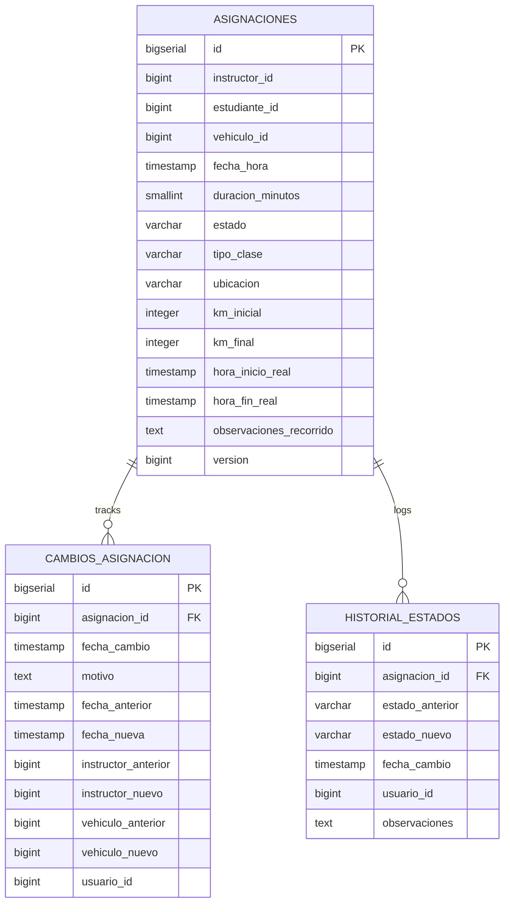

# 11. Schema: `asignaciones_schema`

[← Volver al índice](../schema.md)

**Microservicio:** MS-Asignaciones (puerto 8085)
**Responsabilidad:** Programación tripartita de clases (instructor + estudiante + vehículo + horario), reprogramaciones, historial, registro de kilometraje E2E.

---

## Diagrama ER

> Las columnas `instructor_id`, `estudiante_id` y `vehiculo_id` en `asignaciones` son referencias cross-schema (sin FK física). Ver [16. Relaciones cross-microservicio](16-relaciones-cross-microservicio.md).

---

## Tablas

### `asignaciones`

| Columna | Tipo | Constraints |
|---------|------|-------------|
| `id` | BIGSERIAL | PK |
| `instructor_id` | BIGINT | NOT NULL | Ref `instructores_schema.instructores` |
| `estudiante_id` | BIGINT | NOT NULL | Ref `estudiantes_schema.estudiantes` |
| `vehiculo_id` | BIGINT | NOT NULL | Ref `vehiculos_schema.vehiculos` |
| `fecha_hora` | TIMESTAMP | NOT NULL |
| `duracion_minutos` | SMALLINT | NOT NULL DEFAULT 60, CHECK > 0 |
| `estado` | VARCHAR(20) | NOT NULL CHECK (`PROGRAMADA/CONFIRMADA/EN_CURSO/COMPLETADA/CANCELADA/NO_ASISTIO`) |
| `tipo_clase` | VARCHAR(20) | NOT NULL CHECK (`TEORICA/PRACTICA/EXAMEN`) |
| `ubicacion` | VARCHAR(255) | |
| `observaciones` | TEXT | |
| `motivo_cancelacion` | TEXT | |
| `km_inicial` | INTEGER | V2, CHECK NULL OR ≥ 0 |
| `km_final` | INTEGER | V2, CHECK NULL OR ≥ 0 |
| `hora_inicio_real` | TIMESTAMP | V2 — puede diferir de `fecha_hora` programada |
| `hora_fin_real` | TIMESTAMP | V2 |
| `observaciones_recorrido` | TEXT | V2 — notas del instructor |
| `version` | BIGINT | NOT NULL DEFAULT 0 | Optimistic locking |
| (audit fields + `deleted_at`) | | |

**Constraint V2:** `CHECK (km_final IS NULL OR km_inicial IS NULL OR km_final >= km_inicial)`.

**Flujo de kilometraje (V2):**

1. Al iniciar la clase: el instructor registra `km_inicial` + `hora_inicio_real`.
2. Al finalizar: registra `km_final` + `hora_fin_real`. Se publica `AsignacionCompletadaEvent`.
3. Consumido por MS-Vehículos (PUT del odómetro vía Feign, no PATCH por limitación de Feign HttpURLConnection).
4. Consumido por MS-Estudiantes (incremento de `minutos_completados` y recálculo de progreso vía Feign `TipoCursoClient`).

**Índices:**
- `idx_asignaciones_instructor_fecha` ON `(instructor_id, fecha_hora)`
- `idx_asignaciones_estudiante_fecha` ON `(estudiante_id, fecha_hora)`
- `idx_asignaciones_vehiculo_fecha` ON `(vehiculo_id, fecha_hora)`
- `idx_asignaciones_estado_fecha` ON `(estado, fecha_hora)`

> **Validación de no-overlap:** se ejecuta en aplicación al crear/reprogramar (no en BD por complejidad de los rangos temporales). Las 6 validaciones obligatorias completas están descritas en [17. Validaciones obligatorias al crear asignación](17-validaciones-obligatorias-crear-asignacion.md).

---

### `cambios_asignacion`

| Columna | Tipo | Constraints |
|---------|------|-------------|
| `id` | BIGSERIAL | PK |
| `asignacion_id` | BIGINT | FK → asignaciones(id), NOT NULL |
| `fecha_cambio` | TIMESTAMP | NOT NULL DEFAULT NOW() |
| `motivo` | TEXT | NOT NULL |
| `fecha_anterior` | TIMESTAMP | |
| `fecha_nueva` | TIMESTAMP | |
| `instructor_anterior` | BIGINT | |
| `instructor_nuevo` | BIGINT | |
| `vehiculo_anterior` | BIGINT | |
| `vehiculo_nuevo` | BIGINT | |
| `usuario_id` | BIGINT | NOT NULL — quien hizo el cambio |
| (audit fields) | | |

---

### `historial_estados`

| Columna | Tipo | Constraints |
|---------|------|-------------|
| `id` | BIGSERIAL | PK |
| `asignacion_id` | BIGINT | FK → asignaciones(id), NOT NULL |
| `estado_anterior` | VARCHAR(20) | |
| `estado_nuevo` | VARCHAR(20) | NOT NULL |
| `fecha_cambio` | TIMESTAMP | NOT NULL DEFAULT NOW() |
| `usuario_id` | BIGINT | |
| `observaciones` | TEXT | |
| (audit fields) | | |
