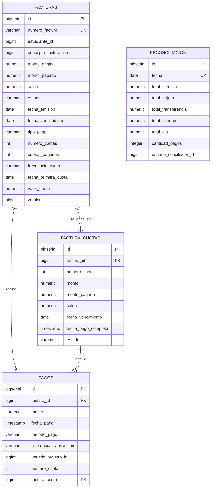

# 12. Schema: `cobros_schema`

[← Volver al índice](../schema.md)

**Microservicio:** MS-Cobros (puerto 8086)
**Responsabilidad:** Facturación, pagos (parciales y a crédito), cuotas, reconciliación diaria de caja.

---

## Diagrama ER



---

## Modelo de pago a crédito (V2)

Una factura puede emitirse en dos modalidades:

- **CONTADO:** `numero_cuotas = 1`, no se generan registros en `factura_cuotas`. Se paga directamente contra la factura.
- **CREDITO:** `numero_cuotas ≥ 2`, se genera 1 registro en `factura_cuotas` por cuota con su fecha de vencimiento y monto. Cada pago se vincula opcionalmente a una cuota específica vía `pagos.factura_cuota_id`.

El campo `valor_cuota = monto_original / numero_cuotas` se persiste para evitar recálculos. El estado de la factura se deriva del estado conjunto de sus cuotas.

---

## Tablas

### `facturas`

| Columna | Tipo | Constraints |
|---------|------|-------------|
| `id` | BIGSERIAL | PK |
| `numero_factura` | VARCHAR(20) | UNIQUE, NOT NULL — formato `YYYYMM-####` |
| `estudiante_id` | BIGINT | NOT NULL | Ref `estudiantes_schema.estudiantes` |
| `concepto_facturacion_id` | BIGINT | NOT NULL | Ref `auth_schema.conceptos_facturacion` |
| `descripcion` | VARCHAR(255) | |
| `monto_original` | NUMERIC(10,2) | NOT NULL CHECK > 0 |
| `monto_pagado` | NUMERIC(10,2) | NOT NULL DEFAULT 0, CHECK ≥ 0 |
| `saldo` | NUMERIC(10,2) | GENERATED ALWAYS AS (`monto_original - monto_pagado`) STORED |
| `estado` | VARCHAR(20) | NOT NULL CHECK (`PENDIENTE/PARCIAL/PAGADA/PAGADO/VENCIDA/ANULADA`) |
| `fecha_emision` | DATE | NOT NULL DEFAULT CURRENT_DATE |
| `fecha_vencimiento` | DATE | NOT NULL |
| `motivo_anulacion` | TEXT | |
| `tipo_pago` | VARCHAR(20) | NOT NULL DEFAULT `'CONTADO'`, CHECK | V2 |
| `numero_cuotas` | INT | NOT NULL DEFAULT 1, CHECK 1–24 | V2 |
| `cuotas_pagadas` | INT | NOT NULL DEFAULT 0, CHECK 0–`numero_cuotas` | V2 |
| `frecuencia_cuota` | VARCHAR(20) | CHECK NULL OR `MENSUAL/QUINCENAL/SEMANAL` | V2 |
| `fecha_primera_cuota` | DATE | | V2 |
| `valor_cuota` | NUMERIC(10,2) | `monto_original / numero_cuotas` | V2 |
| `version` | BIGINT | NOT NULL DEFAULT 0 | Optimistic locking |
| (audit fields + `deleted_at`) | | |

**Constraint clave V2:**
```sql
CHECK (
    (tipo_pago = 'CONTADO'  AND numero_cuotas = 1)
 OR (tipo_pago = 'CREDITO'  AND numero_cuotas >= 2
                            AND frecuencia_cuota IS NOT NULL
                            AND fecha_primera_cuota IS NOT NULL)
)
```

**Constraint adicional:** `CHECK (monto_pagado <= monto_original)`.

**Índices:**
- `idx_facturas_numero` ON `numero_factura`
- `idx_facturas_estudiante` ON `estudiante_id`
- `idx_facturas_estado_vencimiento` ON `(estado, fecha_vencimiento) WHERE deleted_at IS NULL`

---

### `factura_cuotas` (V2)

> Fuente de verdad de las cuotas cuando `facturas.tipo_pago = 'CREDITO'`. No se pueblan si la factura es CONTADO.

| Columna | Tipo | Constraints |
|---------|------|-------------|
| `id` | BIGSERIAL | PK |
| `factura_id` | BIGINT | NOT NULL, FK → facturas(id) ON DELETE CASCADE |
| `numero_cuota` | INT | NOT NULL CHECK ≥ 1 |
| `monto` | NUMERIC(10,2) | NOT NULL CHECK > 0 |
| `monto_pagado` | NUMERIC(10,2) | NOT NULL DEFAULT 0, CHECK 0–`monto` |
| `saldo` | NUMERIC(10,2) | GENERATED ALWAYS AS (`monto - monto_pagado`) STORED |
| `fecha_vencimiento` | DATE | NOT NULL |
| `fecha_pago_completa` | TIMESTAMP | |
| `estado` | VARCHAR(20) | NOT NULL DEFAULT `'PENDIENTE'`, CHECK (`PENDIENTE/PARCIAL/PAGADA/VENCIDA`) |
| `created_at` | TIMESTAMP | NOT NULL DEFAULT NOW() |
| `updated_at` | TIMESTAMP | |

**Constraint único:** `uq_factura_cuotas_numero` UNIQUE ON `(factura_id, numero_cuota)`.

**Índices:**
- `idx_factura_cuotas_factura` ON `factura_id`
- `idx_factura_cuotas_estado_venc` ON `(estado, fecha_vencimiento)`
- `idx_factura_cuotas_pendientes` ON `(factura_id, numero_cuota) WHERE estado IN ('PENDIENTE', 'PARCIAL')`

---

### `pagos`

> **NO tiene `deleted_at` ni `updated_at`** — los pagos NUNCA se borran (auditoría contable).

| Columna | Tipo | Constraints |
|---------|------|-------------|
| `id` | BIGSERIAL | PK |
| `factura_id` | BIGINT | NOT NULL, FK → facturas(id) |
| `monto` | NUMERIC(10,2) | NOT NULL CHECK > 0 |
| `fecha_pago` | TIMESTAMP | NOT NULL DEFAULT NOW() |
| `metodo_pago` | VARCHAR(20) | NOT NULL CHECK (`EFECTIVO/TARJETA/TRANSFERENCIA/CHEQUE`) |
| `referencia_transaccion` | VARCHAR(100) | |
| `observaciones` | TEXT | |
| `usuario_registro_id` | BIGINT | NOT NULL | Ref `auth_schema.usuarios` |
| `numero_cuota` | INT | V2 — NULL si pago a factura CONTADO o pago libre |
| `factura_cuota_id` | BIGINT | V2, FK → factura_cuotas(id) |
| `created_at` | TIMESTAMP | NOT NULL DEFAULT NOW() |
| `created_by` | VARCHAR(50) | |

**Índices:**
- `idx_pagos_factura` ON `factura_id`
- `idx_pagos_fecha` ON `fecha_pago` (para reconciliación)
- `idx_pagos_factura_cuota` ON `factura_cuota_id` (V2)

---

### `reconciliacion`

> Cierre diario de caja. 1 fila por día.

| Columna | Tipo | Constraints |
|---------|------|-------------|
| `id` | BIGSERIAL | PK |
| `fecha` | DATE | UNIQUE, NOT NULL |
| `total_efectivo` | NUMERIC(10,2) | NOT NULL DEFAULT 0 |
| `total_tarjeta` | NUMERIC(10,2) | NOT NULL DEFAULT 0 |
| `total_transferencia` | NUMERIC(10,2) | NOT NULL DEFAULT 0 |
| `total_cheque` | NUMERIC(10,2) | NOT NULL DEFAULT 0 |
| `total_dia` | NUMERIC(10,2) | GENERATED ALWAYS AS (suma) STORED |
| `cantidad_pagos` | INTEGER | NOT NULL DEFAULT 0 |
| `usuario_conciliador_id` | BIGINT | |
| `observaciones` | TEXT | |
| (audit fields) | | |
