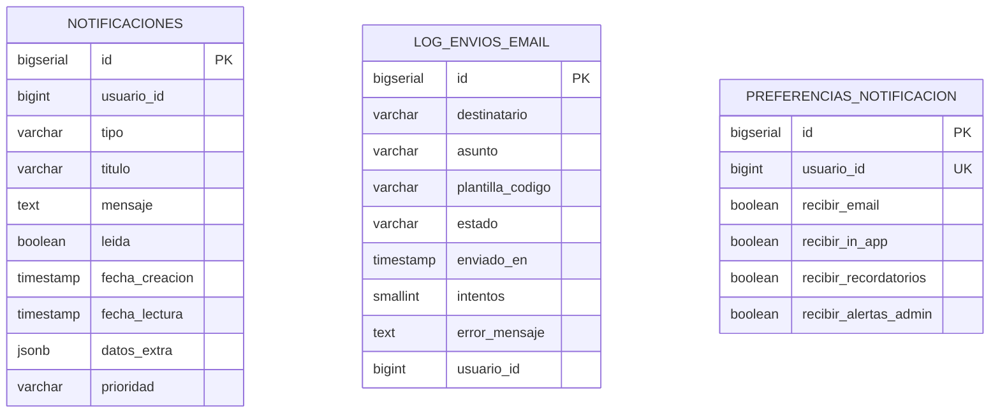

# 13. Schema: `notificaciones_schema`

[← Volver al índice](../schema.md)

**Microservicio:** MS-Notificaciones (puerto 8088)
**Responsabilidad:** Notificaciones in-app (campanita), log de emails enviados, preferencias por usuario. Consumer de eventos del Grupo A vía RabbitMQ.

---

## Diagrama ER

> Las tres tablas son independientes (no hay FK entre ellas). Todas referencian `auth_schema.usuarios` vía `usuario_id` cross-schema.

---

## Tablas

### `notificaciones`

| Columna | Tipo | Constraints |
|---------|------|-------------|
| `id` | BIGSERIAL | PK |
| `usuario_id` | BIGINT | NOT NULL | Ref `auth_schema.usuarios` |
| `tipo` | VARCHAR(50) | NOT NULL |
| `titulo` | VARCHAR(255) | NOT NULL |
| `mensaje` | TEXT | NOT NULL |
| `leida` | BOOLEAN | NOT NULL DEFAULT FALSE |
| `fecha_creacion` | TIMESTAMP | NOT NULL DEFAULT NOW() |
| `fecha_lectura` | TIMESTAMP | |
| `datos_extra` | JSONB | Para deep-linking (ej. `{"asignacion_id": 42}`) |
| `prioridad` | VARCHAR(10) | NOT NULL DEFAULT `'NORMAL'`, CHECK (`BAJA/NORMAL/ALTA`) |
| (audit fields + `deleted_at`) | | |

**Índices:**
- `idx_notificaciones_usuario_no_leidas` ON `(usuario_id, leida) WHERE leida = FALSE AND deleted_at IS NULL`
- `idx_notificaciones_fecha` ON `fecha_creacion DESC`

---

### `log_envios_email`

| Columna | Tipo | Constraints |
|---------|------|-------------|
| `id` | BIGSERIAL | PK |
| `destinatario` | VARCHAR(255) | NOT NULL |
| `asunto` | VARCHAR(255) | NOT NULL |
| `plantilla_codigo` | VARCHAR(100) | |
| `estado` | VARCHAR(20) | NOT NULL CHECK (`PENDIENTE/ENVIADO/FALLIDO`) |
| `enviado_en` | TIMESTAMP | |
| `intentos` | SMALLINT | NOT NULL DEFAULT 0 |
| `error_mensaje` | TEXT | |
| `usuario_id` | BIGINT | Si aplica |
| (audit fields) | | |

---

### `preferencias_notificacion`

| Columna | Tipo | Constraints |
|---------|------|-------------|
| `id` | BIGSERIAL | PK |
| `usuario_id` | BIGINT | UNIQUE, NOT NULL | Ref `auth_schema.usuarios` |
| `recibir_email` | BOOLEAN | NOT NULL DEFAULT TRUE |
| `recibir_in_app` | BOOLEAN | NOT NULL DEFAULT TRUE |
| `recibir_recordatorios` | BOOLEAN | NOT NULL DEFAULT TRUE |
| `recibir_alertas_admin` | BOOLEAN | NOT NULL DEFAULT TRUE |
| (audit fields) | | |
