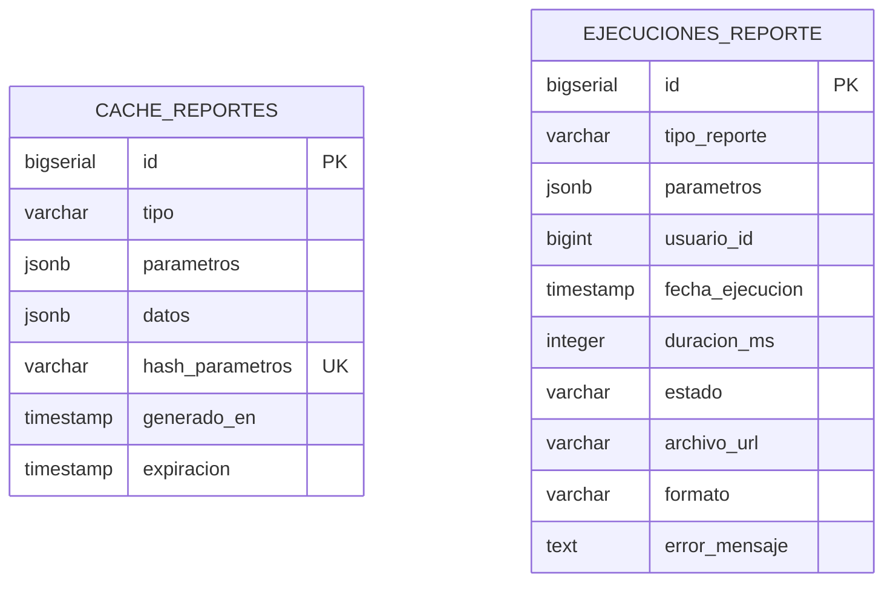

# 14. Schema: `reportes_schema`

[← Volver al índice](../schema.md)

**Microservicio:** MS-Reportes (puerto 8087)
**Responsabilidad:** Cache de reportes generados, log de ejecuciones, auditoría de generación.

> Schema declarado; el MS aún no tiene controllers REST implementados (pendiente del Sprint 9 reorganizado).

---

## Diagrama ER

> Las dos tablas son independientes. `ejecuciones_reporte` registra cada generación; `cache_reportes` almacena resultados reutilizables identificados por hash de parámetros.

---

## Tablas

### `cache_reportes`

| Columna | Tipo | Constraints |
|---------|------|-------------|
| `id` | BIGSERIAL | PK |
| `tipo` | VARCHAR(50) | NOT NULL |
| `parametros` | JSONB | NOT NULL |
| `datos` | JSONB | NOT NULL |
| `hash_parametros` | VARCHAR(64) | UNIQUE — SHA-256 de `parametros` (lookup) |
| `generado_en` | TIMESTAMP | NOT NULL DEFAULT NOW() |
| `expiracion` | TIMESTAMP | NOT NULL |
| (audit fields) | | |

**Índices:**
- `idx_cache_reportes_hash` ON `hash_parametros`
- `idx_cache_reportes_expiracion` ON `expiracion` (para limpieza)

---

### `ejecuciones_reporte`

| Columna | Tipo | Constraints |
|---------|------|-------------|
| `id` | BIGSERIAL | PK |
| `tipo_reporte` | VARCHAR(50) | NOT NULL |
| `parametros` | JSONB | NOT NULL |
| `usuario_id` | BIGINT | NOT NULL | Ref `auth_schema.usuarios` |
| `fecha_ejecucion` | TIMESTAMP | NOT NULL DEFAULT NOW() |
| `duracion_ms` | INTEGER | |
| `estado` | VARCHAR(20) | NOT NULL CHECK (`EXITO/ERROR`) |
| `archivo_url` | VARCHAR(500) | |
| `formato` | VARCHAR(10) | CHECK (`PDF/EXCEL`) |
| `error_mensaje` | TEXT | |
| (audit fields) | | |
