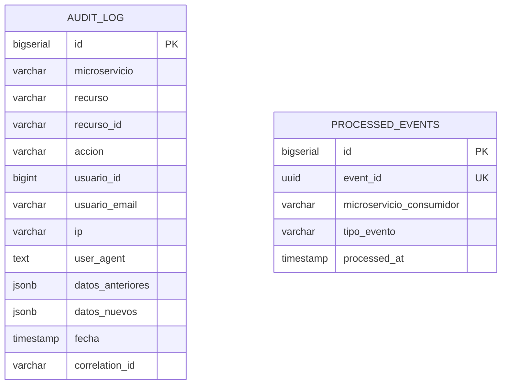

# 15. Schema: `shared_schema`

[← Volver al índice](../schema.md)

**Microservicio:** Compartido entre todos. La migración V1 de MS-Auth lo crea.
**Responsabilidad:** Auditoría centralizada del sistema completo + idempotencia de eventos RabbitMQ.

---

## Diagrama ER

> Las dos tablas son independientes (no hay FK entre ellas). Cada microservicio del sistema escribe en `audit_log` cuando registra una acción auditable, y escribe en `processed_events` cuando procesa un evento RabbitMQ por primera vez.

---

## Tablas

### `audit_log`

> **NUNCA se borra ni se actualiza** — append-only.

| Columna | Tipo | Constraints |
|---------|------|-------------|
| `id` | BIGSERIAL | PK |
| `microservicio` | VARCHAR(50) | NOT NULL |
| `recurso` | VARCHAR(100) | NOT NULL |
| `recurso_id` | VARCHAR(50) | |
| `accion` | VARCHAR(50) | NOT NULL CHECK (`CREATE/UPDATE/DELETE/READ/LOGIN/LOGOUT`) |
| `usuario_id` | BIGINT | |
| `usuario_email` | VARCHAR(255) | |
| `ip` | VARCHAR(45) | |
| `user_agent` | TEXT | |
| `datos_anteriores` | JSONB | Para UPDATE/DELETE |
| `datos_nuevos` | JSONB | Para CREATE/UPDATE |
| `fecha` | TIMESTAMP | NOT NULL DEFAULT NOW() |
| `correlation_id` | VARCHAR(100) | Trazabilidad cross-MS |

**Índices:**
- `idx_audit_log_microservicio_fecha` ON `(microservicio, fecha DESC)`
- `idx_audit_log_usuario_fecha` ON `(usuario_id, fecha DESC)`
- `idx_audit_log_recurso` ON `(recurso, recurso_id)`

---

### `processed_events`

> Tabla de idempotencia para consumidores RabbitMQ. Antes de procesar un evento, validar que su `event_id` no esté en esta tabla.

| Columna | Tipo | Constraints |
|---------|------|-------------|
| `id` | BIGSERIAL | PK |
| `event_id` | UUID | UNIQUE, NOT NULL |
| `microservicio_consumidor` | VARCHAR(50) | NOT NULL |
| `tipo_evento` | VARCHAR(100) | NOT NULL |
| `processed_at` | TIMESTAMP | NOT NULL DEFAULT NOW() |

**Índice:** `idx_processed_events_microservicio_fecha` ON `(microservicio_consumidor, processed_at DESC)`.

> **Limitación conocida (deuda registrada en `DECISIONES.md §25`):** la restricción `UNIQUE (event_id)` impide que dos consumers del mismo MS procesen el mismo evento. El listener de progreso académico fue exento por este motivo. Fix futuro: ampliar a `UNIQUE (event_id, microservicio_consumidor)` o introducir `consumer_scope`.

**Mantenimiento:** registros con `processed_at < NOW() - INTERVAL '30 days'` se pueden eliminar (limpieza periódica programada).
