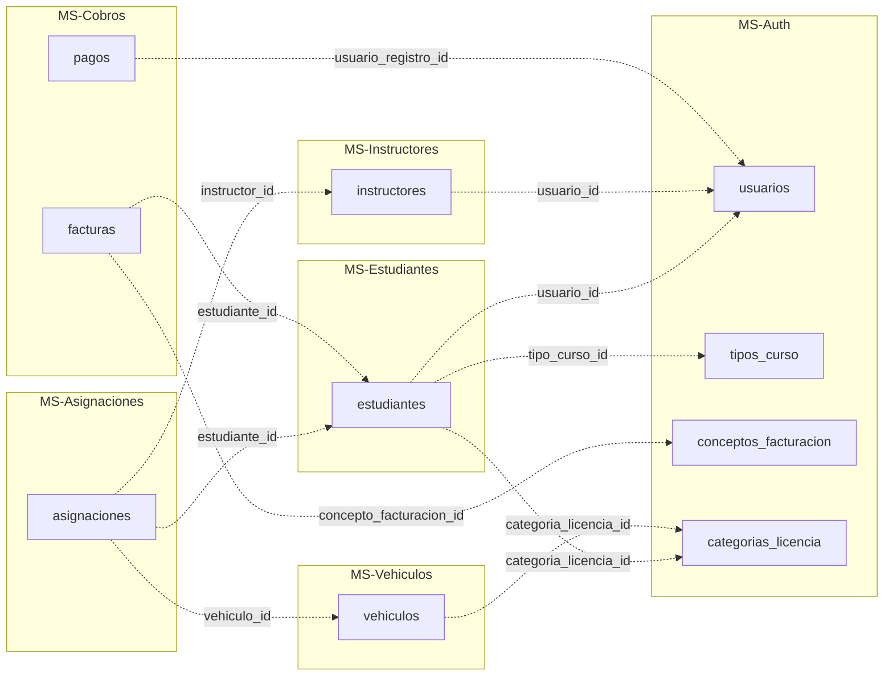

# 16. Relaciones cross-microservicio

[← Volver al índice](../schema.md)

> Mapa de referencias entre microservicios y eventos RabbitMQ que mantienen la consistencia eventual.

---

## Principio

Las foreign keys solo existen DENTRO del mismo schema. Entre microservicios se almacenan IDs de referencia **sin** restricción FK a nivel BD.

La consistencia eventual entre microservicios se gestiona vía:

1. **Eventos RabbitMQ** para propagación asincrónica (notificaciones, progreso, auditoría).
2. **Llamadas Feign** para validaciones síncronas en tiempo de creación/modificación (ver [17. Validaciones obligatorias al crear asignación](17-validaciones-obligatorias-crear-asignacion.md)).

---

## Mapa de referencias entre MS

---

## Eventos críticos cross-MS (RabbitMQ)

| Evento | Publica | Consume | Propósito |
|--------|---------|---------|-----------|
| `auth.usuario.creado` | MS-Auth | MS-Notificaciones | Crear preferencias default |
| `estudiantes.creado` | MS-Estudiantes | MS-Cobros, MS-Auth (audit), MS-Notificaciones | Factura automática de matrícula |
| `estudiantes.matriculado` | MS-Estudiantes | MS-Cobros, MS-Notificaciones | Notificar matrícula |
| `asignacion.creada` | MS-Asignaciones | MS-Estudiantes (progreso), MS-Notificaciones | Notificar nueva clase |
| `asignacion.completada` | MS-Asignaciones | MS-Estudiantes (incremento `minutos_completados`), MS-Vehículos (sync odómetro vía PUT Feign), MS-Notificaciones | Sincronizar contadores cross-MS |
| `asignacion.reprogramada` | MS-Asignaciones | MS-Notificaciones | Email + in-app a alumno |
| `asignacion.cancelada` | MS-Asignaciones | MS-Notificaciones | Email + in-app a alumno |
| `pago.registrado` | MS-Cobros | MS-Estudiantes (update `situacion_pago`), MS-Notificaciones (recibo), MS-Reportes (invalidar cache) | Actualizar estado financiero y recibo |
| `factura.emitida` | MS-Cobros | MS-Notificaciones | Email con factura |
| `factura.pagada` | MS-Cobros | MS-Notificaciones | Email de confirmación final |

---

## Validación de existencia entre MS (Feign)

Cuando un MS necesita validar que un ID en otro MS existe, usa **OpenFeign clients** con circuit breaker Resilience4j configurado.

Flujo típico para crear una asignación:

1. Cliente envía `POST /asignaciones` al API Gateway.
2. Gateway propaga al MS-Asignaciones (con headers `X-User-Id`, `X-User-Email`, `X-User-Roles`).
3. MS-Asignaciones ejecuta validaciones via Feign clients:
   - `InstructorClient` → consulta `instructores_schema.instructores` + `disponibilidad` + `horarios_trabajo`
   - `EstudianteClient` → consulta estado + situación de pago + categoría del curso
   - `VehiculoClient` → consulta categoría + SOAT + RTV
4. Si cualquier validación falla, devuelve `409 Conflict` con `ProblemDetail` específico.
5. Si todo OK, persiste la asignación y publica `asignacion.creada`.

El detalle de las 6 validaciones obligatorias está en [17. Validaciones obligatorias al crear asignación](17-validaciones-obligatorias-crear-asignacion.md).
